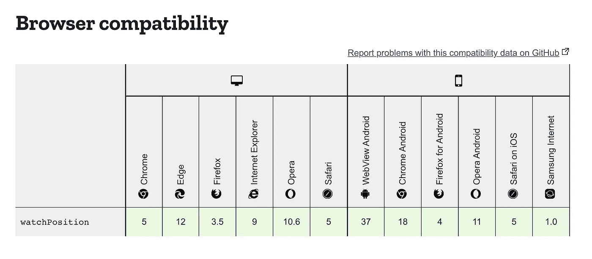
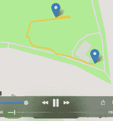
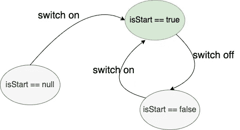
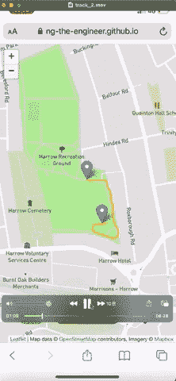

# 用地理定位 API 制作一个运行中的跟踪器

> 原文：<https://medium.com/geekculture/make-a-running-tracker-with-geolocation-api-8b2ac541196e?source=collection_archive---------13----------------------->

利用 Web API 和 Javascript 释放手机的能量

Photo by [Cameron Venti](https://unsplash.com/@ventiviews?utm_source=unsplash&utm_medium=referral&utm_content=creditCopyText) on [Unsplash](https://unsplash.com/s/photos/jogging?utm_source=unsplash&utm_medium=referral&utm_content=creditCopyText)

定位服务是移动设备的一项重要功能。在享受定向服务、网购时查看最近的库存等所有优势的同时，我总是担心我的数据被收集了多少以及有多详细。使用 VPN 或关闭定位服务不足以完全保护我们的身份，还会带来很多麻烦。

今天，我们将探索如何使用 Web API 来访问地理位置，并摆脱被技术提供商跟踪。

长话短说，让我们看看我们的最终产品。这个演示是在 iPhone X 上的 Safari 中运行的。或者如果你等不及了，在你的手机上试试[这里](https://ng-the-engineer.github.io/running-tracker/index.html)。👈

如果你不能加载应用，请点击查看浏览器兼容性[。](https://developer.mozilla.org/en-US/docs/Web/API/Geolocation_API#browser_compatibility)

# 目录

1.  如何获取地理位置
2.  跟踪公式
3.  地图视图
4.  地图平铺
5.  更新地图
6.  开始/暂停按钮
7.  日志查看器
8.  给部件接线
9.  综述

实时地理定位是这个应用的核心。我们将首先学习位和字节的编排。接下来，我们将探索如何通过摆弄配置来进行实际使用。

地图视图是应用程序的核心展示。我们将浏览地图的设置，绘制跟踪路径和当前位置。

为了简化实验，我们将构建一个实时日志查看器来更深刻地理解其中的机制。

最后，为了性能和可维护性，我们将构建一个基于事件的机制来粘合各个部分。

# 如何获取地理位置？

我们将利用`Geolocation.watchPosition()` [API](https://developer.mozilla.org/en-US/docs/Web/API/Geolocation/watchPosition) 来请求 GPS 数据。这个函数被实现为一个观察者模式。当`watchPosition()`已经执行时，它将继续监听新的事件。我们在第一个论证中接收事件，即`success`。如果 API 无法定位坐标，它将调用第二个参数`error`。`success`和`error`都被期望作为回调函数来处理个别情况。

如果浏览器支持地理定位 API[第 2 行]，我们将通过传递参数`success`、`error`和`trackOptions`来启动`watchPosition()`。我们一会儿将讨论`trackOptions`。

# 跟踪公式

这是采样频率和数据精度之间的折衷。默认情况下，它允许无限的响应时间来获得精确的数据。这种设置有利于要求高精度和等待时间的应用。跑步者希望我们的跑步跟踪器以合理的频率记录新的坐标，例如每 2-5 秒记录一次。较低的数据精度是可以接受的，因为我们关心的是整个路径而不是单个点。因此，我们专门将`trackOptions`配置为频率优先于精度。

`trackOptions`包括参数`[enableHighAccuracy](https://w3c.github.io/geolocation-api/#dom-positionoptions-enablehighaccuracy)`、`[maximumAge](https://w3c.github.io/geolocation-api/#maximumage-member)`和`[timeout](https://w3c.github.io/geolocation-api/#timeout-member)`。

`enableHighAccuracy`是用于在`**more accurate and use more power**`和`**less accurate and use less power**`之间切换模式的布尔值。我们将在教程中启用它，因为功耗不是我们主要关心的问题。

`timeout`决定了获得新位置的频率。`timeout`的默认值是无穷大，意味着当设备成功获得新坐标时，它将返回。在我们的例子中，我们将覆盖这个值为 5 秒，以体验一个急切更新的路径和距离表。

如果新坐标在超时时不可用，它将使用缓存的值。参数`maximumAge`保证坐标不会太过时。如果缓存值比`maximumAge`旧，它将寻找新的读数。在我们的例子中，我们使用 30 秒作为`maximumAge`来保持用户体验的流畅。

# 地图视图

为了远离旨在收集地理位置数据和用户身份的技术，我在这个项目中使用了开源库 leaflet.js。fleet . js 在浏览器中生成地图视图，从手机中的 GPS 芯片接收地理信息层。没有地理位置数据被发送到任何后端服务器。

我们将创建一个全屏地图视图[第 6 行]，导入`leaflet.css`【第 9 行】`leaflet.js`【第 16 行】，以及我们的自定义逻辑`tracker.js`【第 30 行】`tracker.css`【第 22 行】。然后，添加一个用`id='tracker'`指定的`
`[第 28 行]作为跟踪器的占位符。

当应用程序(字面意思是 URL)加载后，用户将看到一个显示默认地图的登录页面。我将在教程中使用伦敦中心，但你可以换到任何你想去的地方。`L`对象是传单功能入口。我们可以将视图与我们刚刚定义的 id 为`tracker`的 div 关联起来。接下来，我们将焦点定位到伦敦中心，并传递缩放级别 13，显示更少的细节，但覆盖范围更广。

# 地图平铺

为了在地图上显示地理区域，我们需要一个地图提供者。

我们将使用 [**Mapbox**](https://www.mapbox.com/) ，因为它为小批量使用提供了[免费层服务](https://www.mapbox.com/pricing/)。要使用它，

1.  注册一个 [**地图框**](https://www.mapbox.com/) 账号，
2.  创建一个 API_KEY，作用域为网站的 URL。
3.  复制下面的代码，并用您的代码替换`YOUR_API_KEY`。

# 更新地图

当新地理位置事件出现时，我们将重复三个步骤:

1.  将路径段延伸到新位置
2.  重新定位当前标记
3.  刷新测距仪

为了确保这些步骤按顺序进行，也为了代码简洁，我们使用`Promise`将这三个步骤组织成一个函数链。

## 绘制新线段

要初始化第一个路径段，小心传递一个 `**latlng**` **数组**到`[L.polyline()](https://leafletjs.com/reference-1.7.1.html#polyline)`【第 8 行】的**数组。接下来，我们将把默认的伦敦地图视图锁定在我们检测到的第一个坐标，并通过`map.setView()`【第 15 行】放大到 15 级。然后我们用`map.fitBounds()`调整到舒适的视野【16 线】。**

## 刷新测距仪

血糖仪累计线段的距离，并用 id `distance-box`更新`
`。我们将以 geoDatasource.com 提供的公式为基础。

# 开始/暂停按钮

如果用户准备好开始旅行，我们将创建一个开关来开始跟踪。`watchPosition()`开始监视，直到网页关闭。如果用户想休息一下，不在地图上绘制位置，他/她可以关闭它。

# 日志查看器

当我开始做这个项目的时候，很多时间都在测试，我在镇上到处跑，在慢跑的时候买了它。我使用半透明叠加效果创建了一个日志查看器，用于故障排除和配置调整。我保留了这个功能，因为它看起来很棒，当我们扩展更多功能时，它会很有帮助。

# 给部件接线

我们已经得到了`success`回调函数，当地理位置被接收时，它将被触发。我们还有管理地图上图形工作的`updateMap`功能。是时候把两者结合起来了。

最直接的方法是在`success`函数中调用`updateMap`。然而，有两个缺点。首先，在多任务浏览器环境中，较长的函数链更容易因响应速度较慢而受损。第二，在维护意识上改变的灵活性较差。

因此，我们将采用[事件驱动的方式](https://developer.mozilla.org/en-US/docs/Web/Events/Creating_and_triggering_events)来解耦。

## 出版者

`success`回调函数充当`dispatchEvent()`【第 22 行】的发布者。发布者负责将事件放入由某人提供服务的队列中，但它不关心这个人是谁。因此,`success`功能是轻量级的且响应迅速。

## 订户

附在 id 为`tracker`的`
`上的订户通过将第一个事件发送到`updateMap()`(第 26 行)来服务队列。

这种方法的美妙之处在于将负载分布到队列中，并使`success`和`updateMap`函数免于过载。

去慢跑你兴奋吗？在你离开之前，让我们结束吧。

# 综述

今天，我们已经完成了一个基本但完整的解决方案，来构建一个在浏览器中运行的追踪器 web 应用程序。虽然我们的目的更多的是探索 Web API，但我们可以立即享受到好处，摆脱云提供商的跟踪，在不暴露个人身份的情况下实时使用地图，最重要的是，它是免费的，有趣的。

如果你想免费将手机变成物联网设备，Web 地理定位 API 确实是一个很好的起点。

大多数流行的浏览器广泛支持 Android 和 iOS 上的 web 地理定位 API，如果我们处理地理问题，这比原生 SDK 有优势。缺点是只有纬度和经度可用，尽管其他属性如方向和速度也在接口中定义。

令人印象深刻的是，当我在测试期间试图关闭移动数据时，该 API 在低/无互联网连接的情况下工作。但是，它受到实时地图 API 的限制，当我的位置在当前图块之外时，它无法更新地图图块。如果我们用离线地图解决方案取代地图 API，这将是一个令人兴奋的探索。

感谢你阅读❤️.我希望你喜欢这个分享。

[演示](https://ng-the-engineer.github.io/running-tracker/index.html)🏃

[完整的源代码](https://github.com/ng-the-engineer/running-tracker)🔥

如果你对我的另一篇文章感兴趣，请访问我在 Medium 上的博客。