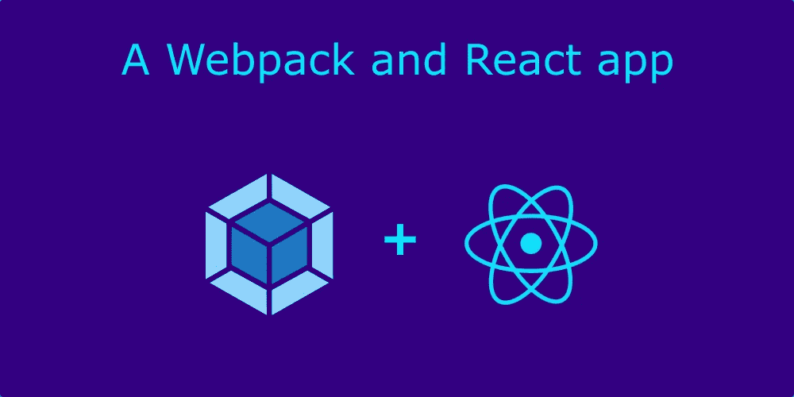
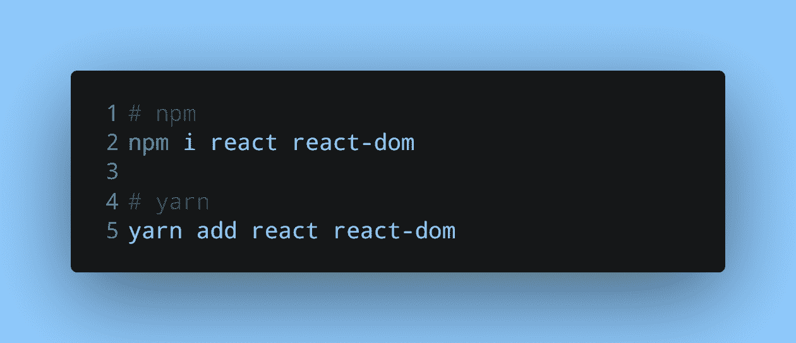
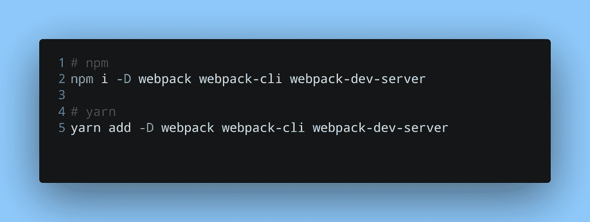
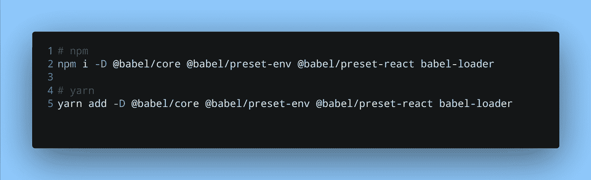
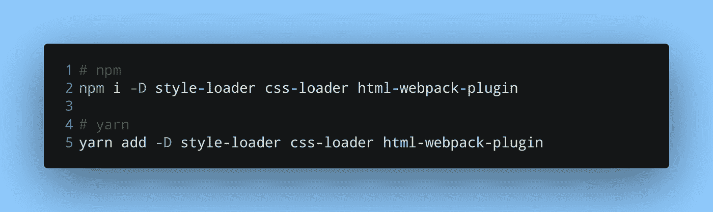
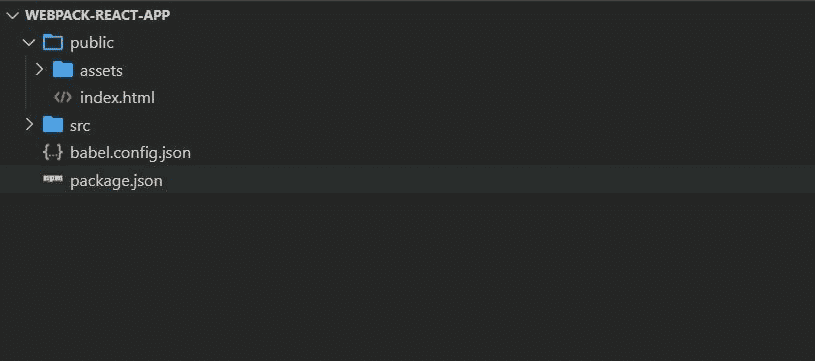
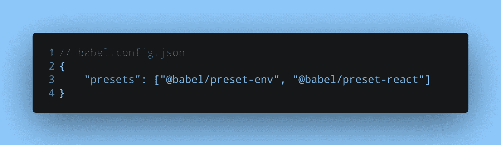
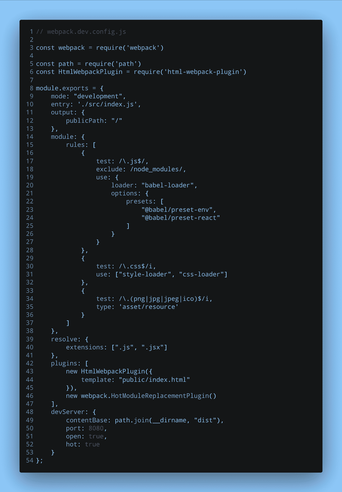
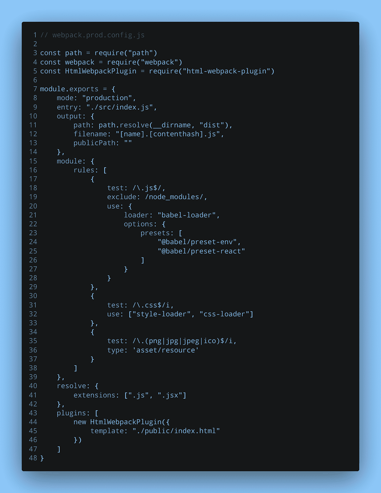
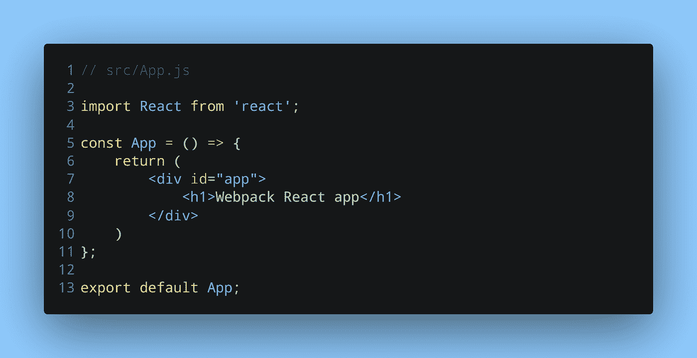

# 用 Webpack 制作一个简单的 React 应用程序——一个简单实用的指南

> 原文：<https://medium.com/geekculture/make-a-simple-react-app-with-webpack-an-easy-practical-guide-8a8839665fbd?source=collection_archive---------15----------------------->

创建 React 应用程序是大多数 React 开发人员的首选。它为我们创建了一个 React 项目，并且只需要几个命令。它的简单性和快速性也使它成为初学者的最爱。但是，也有一些方法可以创建一个没有它的 React 应用程序。

其中一种方法是使用像 Webpack 这样的模块捆绑器和像 Babel 这样的编译器。

到本文结束时，您将拥有自己的 React 应用，而无需使用`create-react-app`。

# 依赖关系和项目结构

由于这个 React 应用程序将使用 Webpack 模块捆绑器，我们需要安装相当多的依赖项。Webpack 需要这些依赖项，以便它可以检测和处理各种文件类型。

以下是我们需要安装的内容:

这两个包是我们的简单应用程序所需的依赖项。如果您的项目需要任何其他包，您可以安装它们。

有将近 10 个 devDependencies，所以让我们分组安装它们，我将解释每个依赖项的用途。首先是 webpack:

*   `webpack`:安装 webpack 模块捆绑器
*   `webpack-cli`:提供了多种命令，使得在命令行上使用 webpack 更加容易
*   `webpack-dev-server`:允许我们使用带有热重装功能的简单网络服务器

接下来，我们将安装 Babel:

*   `@babel/core`:巴别塔编译器的核心包
*   `@babel/preset-env`:智能预设，允许我们使用最新的 JavaScript 语法
*   顾名思义，它将代码转换成普通的 JavaScript
*   使 Webpack 能够与 Babel 及其预置一起工作的插件

其余的 devDependencies 用于 CSS 和 HTML:

*   `style-loader`、`css-loader`:web pack 检测`.css`文件时需要
*   `html-webpack-plugin`:通过`script`标签生成一个包含所有 Webpack 包的 HTML 文件

安装了基本 React 项目所需的一切。现在在项目的根目录下创建这些文件夹和文件:

1.  HTML 文件和资产(图像、字体等)的`public`文件夹。)
2.  用于`.js`文件和 React 组件的`src`文件夹
3.  一个`babel.config.json`巴别塔配置文件

此时，您的项目文件夹应该如下所示:

# Webpack 和 Babel 配置

让我们在 Babel 配置文件中添加预置:

建议为 Webpack 准备两个单独的配置文件，一个用于开发，一个用于生产。尽管两个文件对于加载器和任何插件都有相同的配置，但还是有细微的差别。这是用于开发的配置文件的样子:

这里，我们首先声明`mode`配置选项。有了这个，Webpack 可以相应地使用它的内置优化。接下来，`module.rules`是包含 3 个对象的数组:

1.  这条规则告诉 Webpack 寻找以`.js`结尾的文件，并使用 Babel 编译它们。`babel-loader`帮助 Webpack 与 Babel 一起工作。
2.  第二条规则告诉 Webpack 寻找以`.css`结尾的文件，并在两个加载器`style-loader`和`css-loader`的帮助下理解它们。
3.  最后一个规则帮助 Webpack 识别图像文件。不需要为此安装任何外部加载程序。

> ***注意*** *:根据 Webpack 文档，* `*style-loader*` *和* `*css-loader*` *需要按照与本配置文件完全相同的顺序使用，否则无法工作。*

加载器之后，我们有两个插件。当 Webpack 捆绑所有 JavaScript、CSS 和其他必要的文件时，它还会创建一个 HTML 文件。这就是我们使用`html-webpack-plugin`的地方。这个插件告诉 Webpack 使用我们的 HTML 文件作为模板，并将编译好的包注入其中。

因此，Webpack 没有创建自己的 HTML 文件，而是使用了*我们的* HTML 文件— `public/index.html`，并通过`<script>`标签将捆绑文件添加到其中。

我们使用的另一个插件是 webpack 包中的`HotModuleReplacementPlugin`,用于在开发模式下热重装我们的应用。

最后，`devServer`对象包含了`webpack-dev-server`使用的选项。

现在让我们来看看配置文件的生产版本:

变化不大，除了我们不再需要`HotModuleReplacementPlugin`和`devServer`，因为它们将不会用于生产。`mode`选项也进行了相应的设置。你可能已经注意到了`output`的变化。

`output.filename`具有我们从未见过的价值。方括号中的值是标记。如果我们使用代码分割，`[name]`标记允许 Webpack 以不同的方式命名文件。`[contenthash]`用于当包文件的内容改变时，包文件的名称也随之改变。

# 运行应用程序

我们的应用程序几乎准备好了。我有一个简单的`App.js`组件:

应用程序文件夹现在看起来像这样:

最后，我们需要添加脚本来运行我们的应用程序:

通过`serve`选项，Webpack 使用`webpack-dev-server`创建一个 web 服务器。让我们运行我们的应用程序。

在您的浏览器中打开`https://localhost:8080`，您的应用应该正在运行。

# 包扎

这是一个基本的 React 应用程序，我们可以手动配置 Webpack。我希望这有助于您理解 Webpack 需要的各种插件和加载器以及它的配置文件。Webpack 文档值得一读。这是我在这篇文章中使用的主要资源。

相比之下， [Parcel](https://parceljs.org/getting_started.html) 使用很少的依赖项。我写过另一篇关于用 Parcel 创建一个 [React 应用的文章。也就是说，两者各有利弊。](https://levelup.gitconnected.com/how-to-create-a-minimal-react-and-parcel-app-in-5-steps-2806fa09a371)

以下是一些附加资源的链接:

1.  [Webpack 文档](https://webpack.js.org/configuration/)关于配置文件和配置文件的各种选项
2.  关于[加载 CSS](https://webpack.js.org/guides/asset-management/#loading-css) 和其他资产的 Webpack 文档
3.  关于 [webpack-dev-server](https://webpack.js.org/guides/development/#using-webpack-dev-server) 和 [html-webpack-plugin](https://webpack.js.org/plugins/html-webpack-plugin/#basic-usage) 的 Webpack 文档
4.  卡尔·里彭的一篇文章讲述了如何创建一个[的 React 应用](https://www.carlrippon.com/creating-react-app-with-typescript-eslint-with-webpack5/)，它在 Webpack 5 中使用了 TypeScript 和 ESLint
5.  关于其[配置文件](https://babeljs.io/docs/en/configuration)的 Babel 文档

*原载于* [*我的博客*](https://niharraoteblog.netlify.app/webpack-react-app) *。*