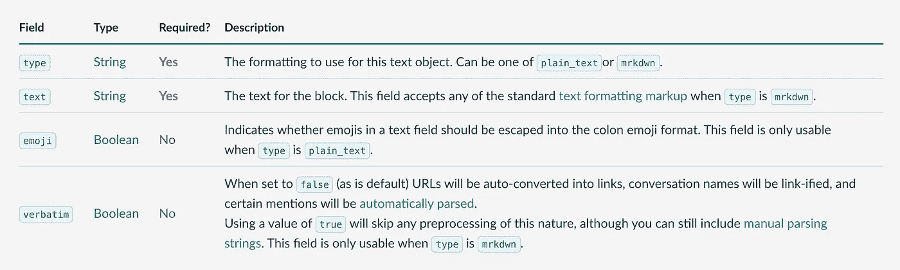
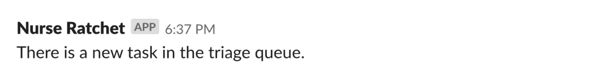
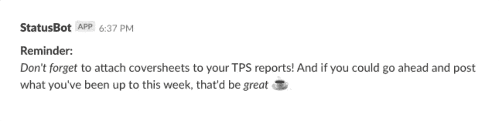
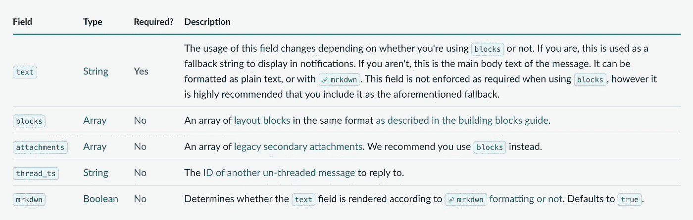
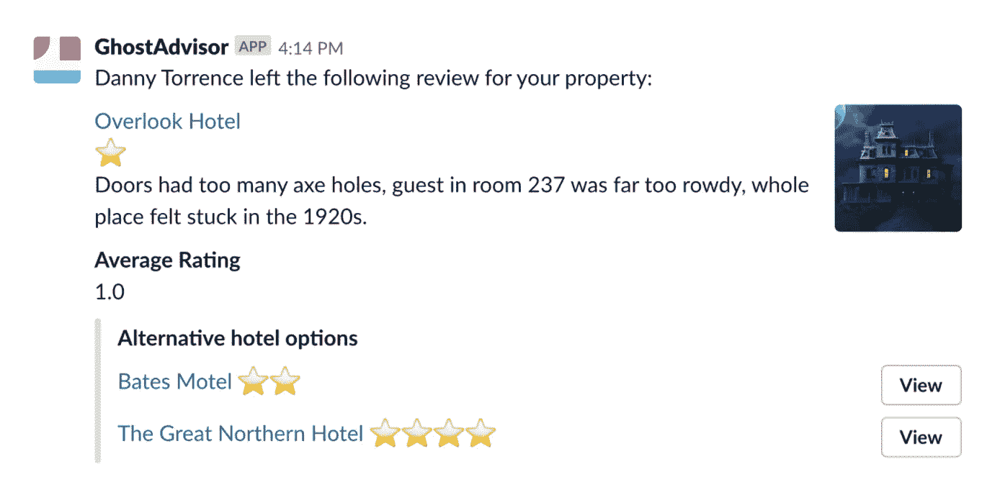

# 为你的休闲频道制作一款休闲应用

> 原文：<https://medium.com/geekculture/make-a-slack-app-for-your-slack-channel-95d3a30d2f8e?source=collection_archive---------48----------------------->

Photo by [Arif Riyanto](https://unsplash.com/@arifriyanto?utm_source=medium&utm_medium=referral) on [Unsplash](https://unsplash.com?utm_source=medium&utm_medium=referral)

## **介绍编写消息所需的核心概念之一**

在本文中，我将向您展示如何使用传入的 Webhooks 和消息传递来创建一个 Slack 应用程序。这是向 Slack 发布消息的简单方法。它发送带有消息和选项的 JSON 有效负载，您也可以使用[格式](http://formatting)和[布局块](https://api.slack.com/messaging/composing/layouts)定制这些消息和选项。

> 您可以制作并发布您的 slack 应用程序，供任何人安装，但本文没有对此进行解释。如果你对此感兴趣，请查看此[页面](https://api.slack.com/messaging/webhooks#incoming_webhooks_programmatic)。

在您开始实施之前，请检查此页面并在此设置您的应用[。如果你得到一个类似于`https://hooks.slack.come/services/...../...../.....`的 URL，你就准备好实现它了。](https://api.slack.com/messaging/webhooks#getting_started)

现在，我们将研究如何以简单的方式和互动的方式发布消息。首先，让我们向一个通道发送一个简单的消息。

## 简单消息

这是我为您准备的示例代码，您可以使用自己创建的 URL 将第一个请求发送到指定的通道。请在这两个参数中填入消息和 URL，然后运行您的脚本。一个消息应该被发布到你的频道。

你看到发布在你频道上的那条短信了吗？很简单。

然而；视觉层次在 slack 中被认为是重要的，因为 Slack 频道中的成员应该能够容易地掌握发布到频道的信息。为了处理视觉问题，Slack 提供了两种方式的可定制设计工具；*格式化*和*布局块*。

但是在解释这些之前，重要的是要注意消息中的文本基本上是基于下面显示的`Text Object`。

Text Object

`Text Object`有四个字段，文本数据有两种表达方式；`plain_text`和`mrkdwn`通称降价。`plain_text`只是文本，本身没有任何视觉元素。它是黑色的文本。

## 格式化

请看下图。

plain text

您应该对这段文本很熟悉，因为您是在用前面的示例代码测试之后得到这段纯文本的。这意味着您实际上创建了一个类型为`plain_text`的消息。

相比之下，如果你希望你的文本是**粗体**、*斜体*或者其他什么，那么类型`mrkdwn`应该会产生下面的结果。

markdown text

即使您从示例代码中发送了`plain_text`，您实际上也可以通过如下所示的[消息有效负载](https://api.slack.com/reference/messaging/payload)将其作为`mrkdwn`发送。

Message Payload, the base structure of Messages in Slack.

当您在文本字段中将值`mrkdwn`设置为`true`并带有标记时，它将成为基于标记的文本。我创造了一个例子。现在，您可以将基于降价的文本发送到您的 Slack 频道。

除了改变文本的外观，它们还提供了解析选项，用于实现对文本的触摸操作；链接到轻松的对话，或在文本中添加提及。它使文本非常有用。

> 对于详细的实现，请通读他们的[文档](http://secondary message attachments)，该文档很好地解释了如何处理视觉高亮或特殊解析。

## 布局块

为了创建交互式体验，如单击按钮和显示图像，您可以使用布局块。正如我们在消息有效载荷图像中看到的，`blocks`是布局块。如果您想在 Slack 消息中创建丰富的 UI，这很有用。

它在视觉上帮助松散成员组织信息。

An example from Slack

左下方的灰线是一个叫做`Attachment`的区域。附件允许您在不太紧急的次要消息部分包含简单的文本或复杂的块布局。

正如医生所说:

> 你可以在信息的第二部分附加一些东西，这些内容增加了更多的上下文或附加信息，但并不重要

我不打算在这篇文章中解释这一点，但是如果你有兴趣了解更多关于定制它的内容，请访问他们的[文档](https://api.slack.com/messaging/composing/layouts#attachments)。

> 他们还有一个很酷的功能，你可以在一个网站上建立互动体验。

# 结束语

我花了几个小时才明白如何创建消息请求，以及请求中可以包含哪些信息。我在这里组织了我的输入，希望它能帮助你理解文本在信息传递中的作用。看来 Slack 有更多面向开发者发布的功能。将来，如果我学会了它们，我会把它们写下来。

[***使用此链接阅读***](https://imryohei.medium.com/membership) ***我在 Medium 上的所有帖子和其他上千个帖子，您的会员费直接支持我和您阅读的其他作者。你也可以在媒体上看到所有的故事。***