# 用颤动+火焰制作电子游戏🔥👾(2 部分)

> 原文：<https://medium.com/geekculture/make-a-video-game-with-flutter-flame-2-part-9f3a985ffc69?source=collection_archive---------28----------------------->

在上一篇文章中，我们谈到了火焰实际上是如何工作的。我们添加了文本，也检查了游戏的状态。

好了，我们开始吧！

这一次，我们将使用按钮和火焰“覆盖”在视图中添加交互。

# 覆盖物

一个覆盖将帮助你连接你的游戏部件到你的其他部件。因此，您需要使用 GameWidget 的一个名为“overlayBuilderMap”的参数。

例如:我们可以创建一个小部件，我们将在我们的游戏小部件中调用它，如下所示:

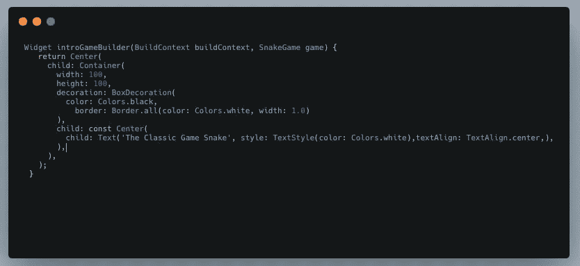

现在在您的构建方法中添加下一个:

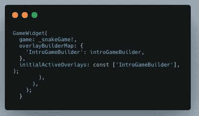

现在应该是这样的:

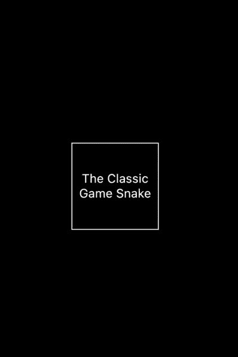

现在我们有了我们游戏的演示文稿，你可以改进它😅当然啦！

# 添加第一个按钮

在火焰中，一切都是组成部分。在我们的例子中，我们将使用一个将来可以改进的 sprite 组件。

我们还需要增加资产。火焰提供了一个文档和演示如何创建您的资产文件夹在这里:【https://flame-engine.org/docs/#/structure 

在我们的例子中，它应该是这样的

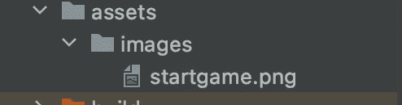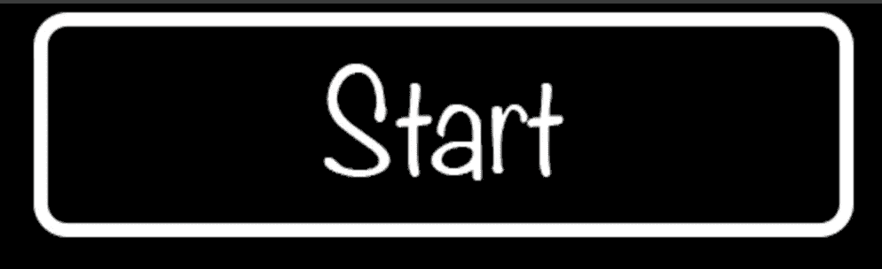

I created faster this button in photoshop

好了，现在我们可以创建一个从 SpriteComponent 扩展的 StartButton 类，如下所示:

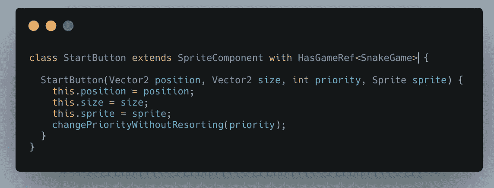

让我们快速解释给定代码中的一些重要内容:

> *Vector2* 基本上有点像 2D 方向，就像 2D 空间中的 xy 点。`*Vector2*`的大小等于`*sqrt(x^2+y^2)*`。

**优先级**用于设置 z 轴上的位置——比如将其移动到前景或背景。

HasGameRef 让我们参考一下我们的基本游戏，在这个游戏中我们可以访问几个变量和方法。

**Sprite** 是一个二维图像——我们在视频游戏中经常使用它。比如说。子画面可以只包含一个图像或多个图像(例如用于动画)。为什么我们把它放在精灵中，而不是单独添加图片？因为我们可以节省一些空间，也可以更好地组织我们的应用程序。

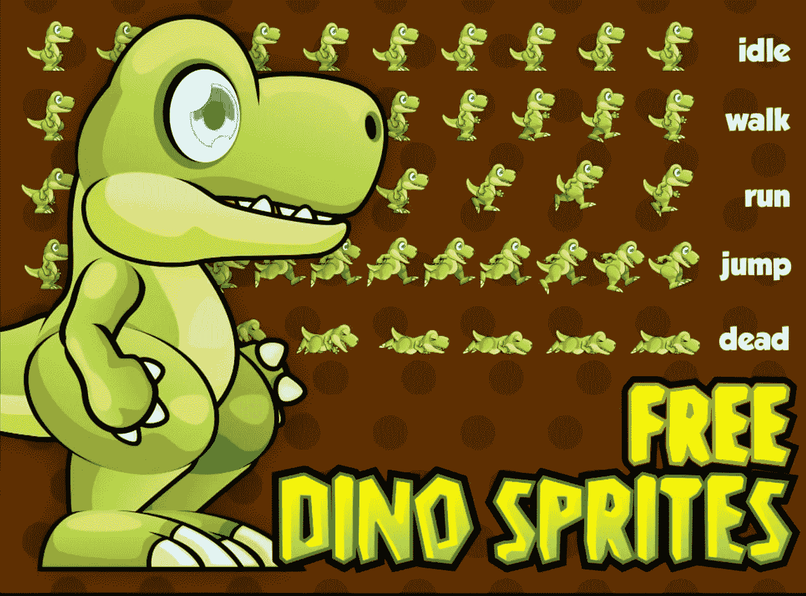

There are lots of free sprites in the internet.

现在我们不使用复杂的精灵——我们只使用单一的图像。

让我们回到我们的蛇游戏课的基础游戏。我们可以使用以下方式加载大量图像:

images . load all([资产名称])；在我们的加载方法中。(请记住: **onLoad** 在开始游戏之前加载我们所有的资产， **update** 正在为更新内容运行一个无限循环)

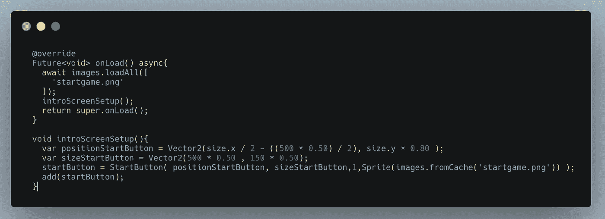

As you can see in the code, when we are using “add([component])” we can add our components to the game.

让我们再次运行我们的游戏！现在应该是这样的:

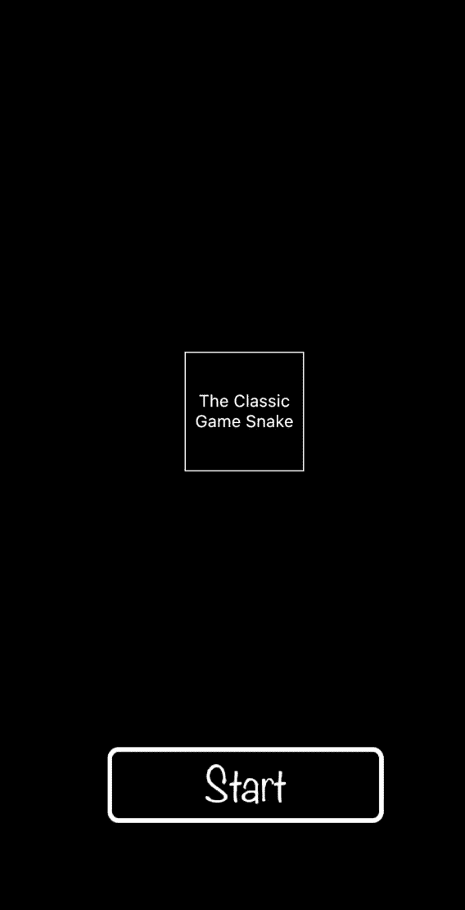

目前，我们的按钮没有做任何事情。但是不要担心——有了 flame，实现 tap 真的很容易。我们像这样使用类 Tappable 类(更多信息[https://flame-engine.org/docs/#/input](https://flame-engine.org/docs/#/input)

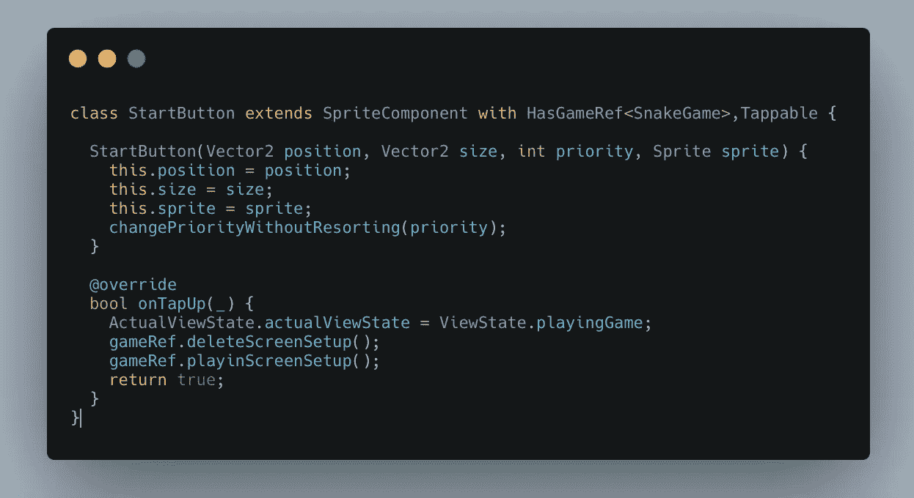

我还实现了两个方法和一个静态变量“actualViewState”。这将有助于我们将来了解我在游戏中的状态。

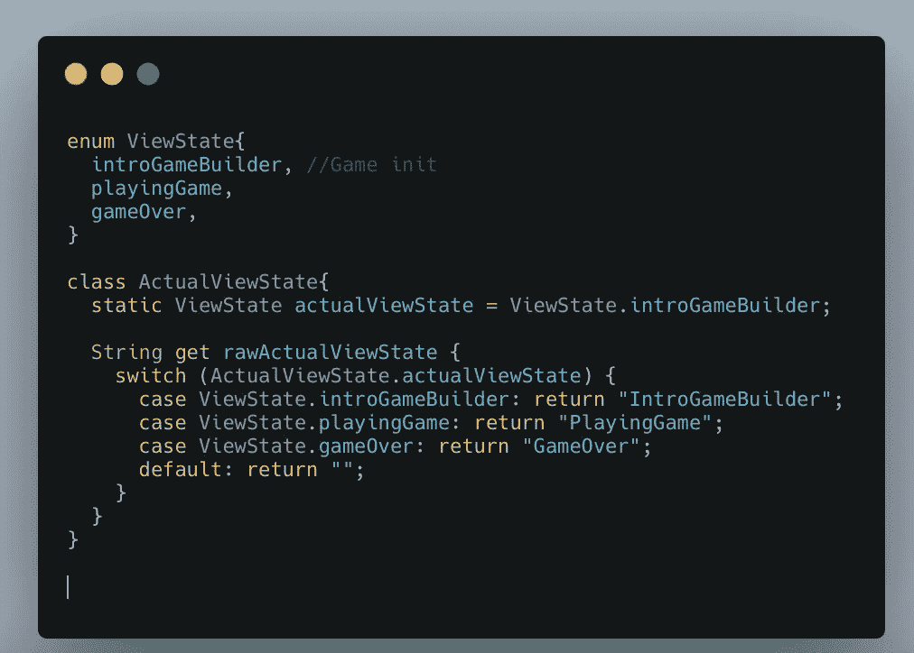

不要忘记添加 HasTappableComponents。这将有助于我们在屏幕上添加一个监听器，所有可点击的组件都将工作。

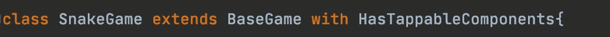

now your base game looks like this

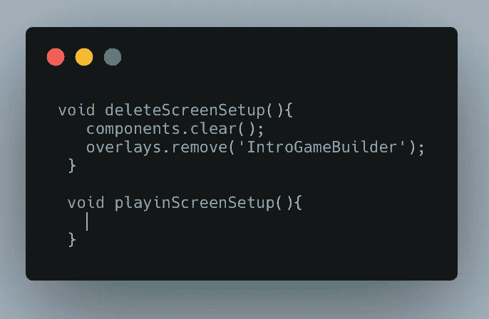

最后一点:“components.clear()”帮助我们清除实际屏幕上的所有组件和覆盖层。显然，我们也删除了我们的覆盖。

下次发货再见！🥳

我用西班牙语写了第一部分，但我会试着把它翻译成英语。这篇文章已经是英文的了，但是我也会把它翻译成西班牙文！【请有耐心🙇🏾 🥺]

维克托·m .[@维克托马努尔](https://twitter.com/VicktorManuel)

韦雷纳 [@verry_codes](https://twitter.com/verry_codes)

**谢谢韦雷纳和索菲娅！*