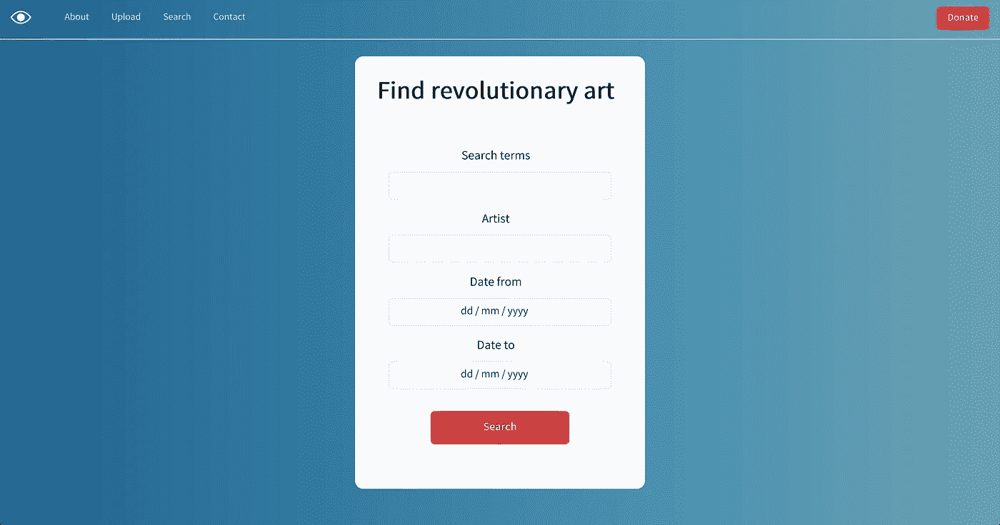

# 用 Django Rest 框架制作一个 API 搜索端点

> 原文：<https://medium.com/geekculture/make-an-api-search-endpoint-with-django-rest-framework-111f307747b8?source=collection_archive---------5----------------------->



Search API for sudan-art.com

## 介绍

我最近在做一个个人项目。这是一个帮助苏丹政变后抵抗运动的网站。这个想法是，用户上传支持革命的艺术作品，所有这些都留在一个有用的地方。如果你想了解所有这些的背景，整个代码库位于[这里](https://github.com/osintalex/sudan-art)，与本文相关的是[这里](https://github.com/osintalex/sudan-art/blob/dev/sudan-art/django-backend/sudan_art/views.py)。

我很快会写一篇更长的帖子，但现在我想分享我是如何使用[Django Rest Framework](https://www.django-rest-framework.org/)(DRF)创建一个 API 来搜索包含所有艺术的数据库的

虽然这并不复杂，因为 DRF 很棒，但我发现这很难开始，因为我在网上找不到很多好的代码示例。这就是我想用这篇博客来补救的😊。

不过，先来个大概说明！我将保持这相当简短和甜蜜，不解释太多关于姜戈或 DRF。这篇文章真正针对的是那些习惯于设置这些东西，并且真的想添加一个搜索端点的开发人员。

## 安全性

现在，这是我为搜索实现的视图。我将在文章的其余部分介绍代码的作用，你可以在 Github [这里](https://github.com/osintalex/sudan-art/blob/dev/sudan-art/django-backend/sudan_art/views.py)看到。

views.py for implementing a search API endpoint

安全第一！第 11–19 行中名为`ValidateQueryParams`的类继承自属于`rest_framework`的`serializers`对象。这是在第 6 行导入的。你说的序列化器有什么意义？嗯:

> 序列化程序允许将复杂的数据(如查询集和模型实例)转换为本地 Python 数据类型

那是相当高的水平。这意味着我可以快速使用同样来自`rest_framework`的`fields`对象，因为它有一些内置的功能，可以使用`fields.RegexField`和`fields.DateField`来验证正则表达式和日期。我还可以确保对 API 的请求失败，除非有人包含了一个搜索词；我已选择将其他字段设为可选。

这很巧妙，因为它让我创建了四个类属性(search、artist、date_from、date_to ),这四个属性与我让人们用如下请求查询 API 的不同方式相关:

> requests . get(" https://my site . com/API？search=x&artist=y&date_to=z ")

但到目前为止，我只是设计了这个类——我还没有真正利用它来验证数据。这发生在第 32–33 行:

```
query_params = ValidateQueryParams(data=self.request.query_params)                                     query_params.is_valid(raise_exception=True)
```

如果发送给 API 的数据无效，这将抛出一个异常，并确保它不会在后端得到处理。

## 基于类别的搜索视图

现在视图本身出现在第 22–44 行。第 23 行中的 class 属性— `search_fields` —指的是我在模型中为 artwork 定义的字段。

```
search_fields = ["artist", "tags", "date_uploaded"]
```

您在这里所做的基本上是定义您想要搜索的模型属性。这里，我有一个标签字段和艺术家字段，可以匹配 api 的搜索词部分的关键字，而上传日期将映射到发送到 API 的日期。

然后我在第 24 行定义 DRF 过滤搜索结果的方式；你可以使用的全部选项都在[这里](https://www.django-rest-framework.org/api-guide/filtering/)。

```
filter_backends = (filters.SearchFilter, filters.OrderingFilter)
```

最后在第 25 行，我只是确保搜索端点使用了我在别处为 artwork 定义的通用序列化类。

一旦这些类属性都定义好了，从第 34-44 行开始，我得到了 API 请求中发送的所有`query_params`，将它们解析到一个字典`filter_keyword_arguments_dict`中，并将它们映射到我想要查询数据库的不同方式上。例如，在这里:

```
if key == "date_to":                                             filter_keyword_arguments_dict["date_uploaded__lte"] = value
```

如果有人发送查询来搜索特定日期，我会确保 Django 查询数据库中小于或等于该日期的值(这就是`date_uploaded__lte`部分的意思)。

关于如何查询数据库的所有选项，请点击这里查看优秀的 Django queryset 文档[。](https://docs.djangoproject.com/en/4.0/ref/models/querysets/)

就是这样！希望有帮助。