# 制作漂亮的电子商务卡

> 原文：<https://medium.com/geekculture/make-beautiful-ecommerce-card-8cfe10e588dd?source=collection_archive---------38----------------------->

制作最好的垂直和水平电子商务卡

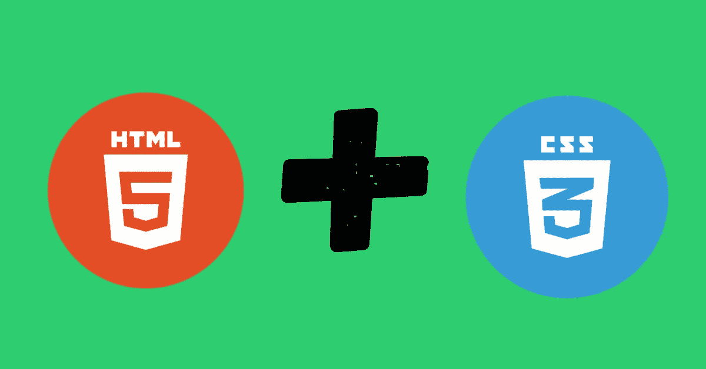

所以卡片是网站必须包含的最重要的组成部分之一，因为使用卡片你可以用你喜欢的方式显示数据。

你可以在我的 Github 库中找到所有的代码，我在文章的最后给出了链接。

因此，没有任何进一步的到期让我们开始。

今天，我们将创建 2 个不同类型的美丽的电子商务卡，你可以包括在你的电子商务项目。

一张卡是竖的，另一张卡是横的。

**1。产品卡(垂直):**

这种类型的卡可以在电子商务网站上使用，通常，你会看到他们展示产品及其说明。

所以让我们做一个吧！！！！

让我们从垂直的那张开始，我们的卡片应该是这样的:

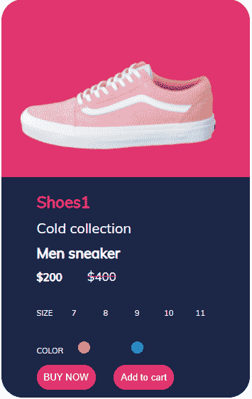

希望你喜欢这个设计，让我们开始吧，(我会给你提供所有卡设计的 GitHub 链接)

并且知道如何编码。

首先，创建一个 div，并为它指定类名“card”。

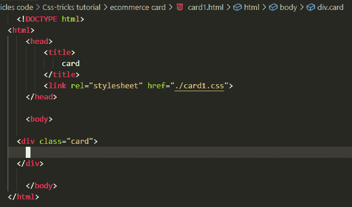

然后在其中创建两个不同的 div 标签，分别命名为“up”和“down”

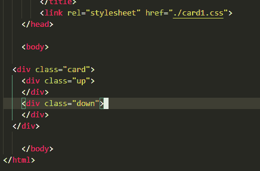

现在添加一个图像在“向上”分区。

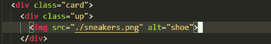

现在在“down”div 中添加一个标题、类型、产品名称和价格。

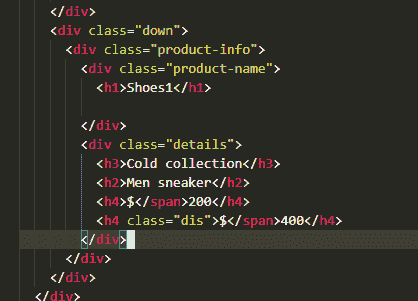

这里，我们在“down”中创建了一个“product-info”div，在“product-info”div 中，我们添加了“product-name ”,或者我们可以称之为标题。

在“down”下，创建了另一个名为“details”的 div，它包含产品类型、产品类别、折扣后价格和折扣前价格。

现在创建两个显示价格和颜色选项的列表。

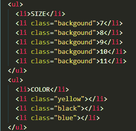

现在最后只添加按钮:

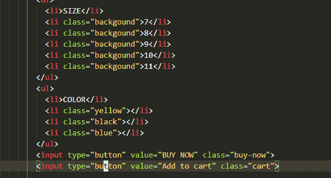

没有 CSS 的设计应该是这样的:

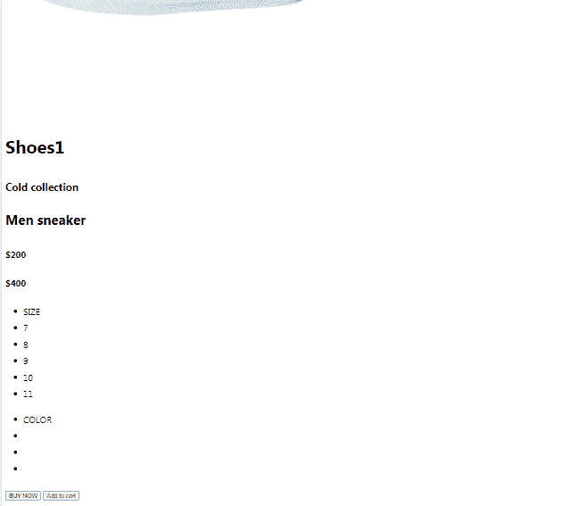

所以我们创造了斯凯尔顿，现在让我们来看看美丽的部分。

首先导入一个非常酷的字体:

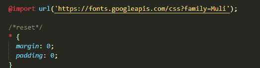

现在让我们为卡片添加 CSS，向上，向上图像，向下:

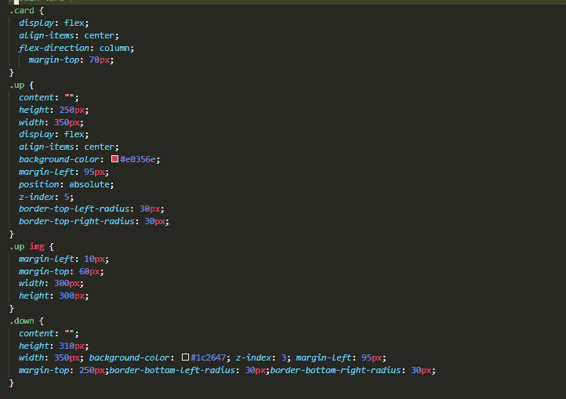

我们用 flex 和它的方向栏创建了一个卡片，并添加了一些风格到 up 和 down，这样你就可以复制粘贴我的或者玩它。

然后为“产品信息”添加 CSS:

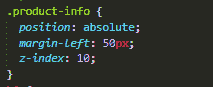

现在让我们将 CSS 添加到我们的标题中:

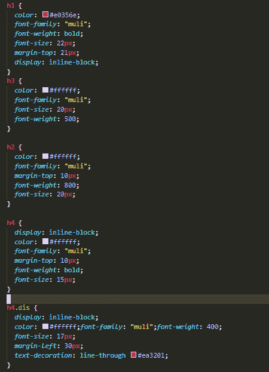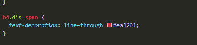

。dis 是在折扣价之前，所以不要混淆，你可以复制我的 CSS 或者你可以调整一些更多的东西。

现在让我们为颜色和尺寸列表添加 CSS。

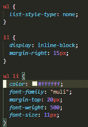

所以我们的列表已经完成，我们只需要在尺寸列表上添加一些悬停效果，在颜色列表上添加一些颜色效果。

让我们从尺寸列表开始:

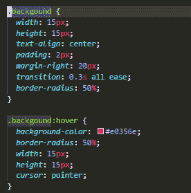

现在让我们来看看颜色列表:

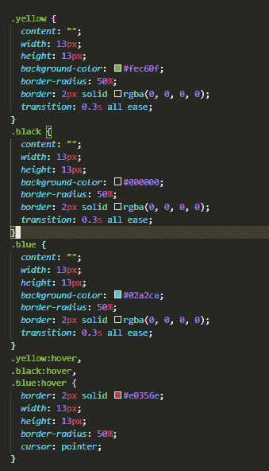

我们只是创建了一个彩色椭圆，并添加悬停效果，没有什么特别的。

现在只剩下按钮，让我们添加他们的 CSS 了。

它们 CSS 如下:

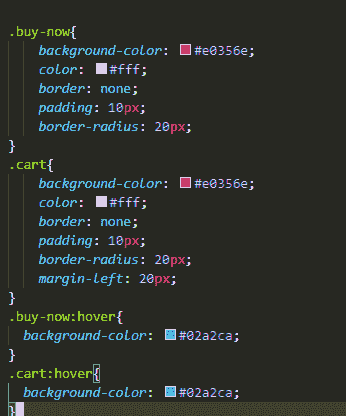

最后，我们制作了这张漂亮的卡片，准备在我们的项目中使用，如果你愿意，你可以缩小它的尺寸，玩它，并在你的项目中实现它。

希望这将有助于你现在放开我们的第二张卡的设计。

**2。产品卡片(横向):**

让我们创建另一张卡片，这次是水平的，让我们开始吧。

我们的最终结果将是这样的:

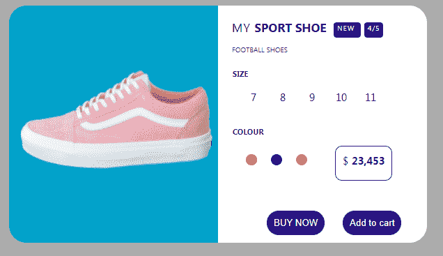

那么，让我们开始吧。

首先，创建一个 div 并将其分配给类“card ”,然后再创建两个名为“left”和“right”的 div。

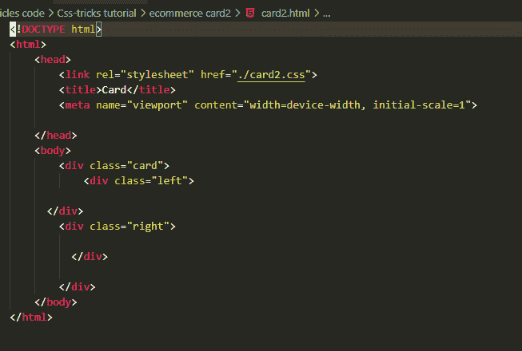

现在，在左栏中添加图像和图像标题:

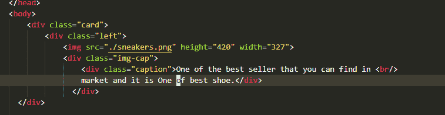

我们添加了一个标题，因为当鼠标悬停在图像上时，描述会从左边滑动。

现在

现在添加两个 div 在右边的 div，包括标题，评级，徽章，小说明:

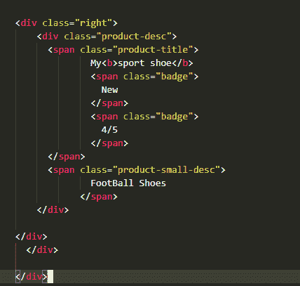

现在，最后让我们添加一个功能部分和两个按钮:

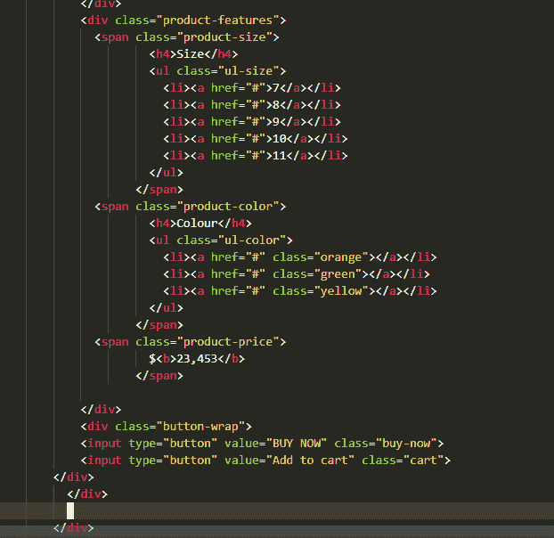

我们都完成了，现在让我们添加我们的伴侣 CSS。

我给卡片边界只是为了让它保持在中间，为了教程的目的，你可能不需要这样做。

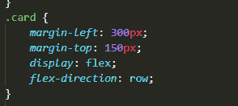

现在将 CSS 添加到我们左边的 div 和 image:

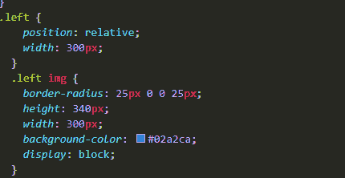

现在将 CSS 添加到我们的标题 div 中:

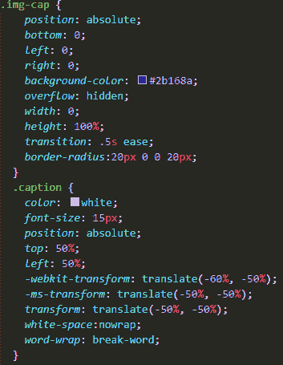

现在让我们添加最重要的悬停效果:

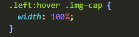

对，就是这样，只需要补充这个。

现在让我们跳到右边的 div，添加 CSS，标题和小描述:

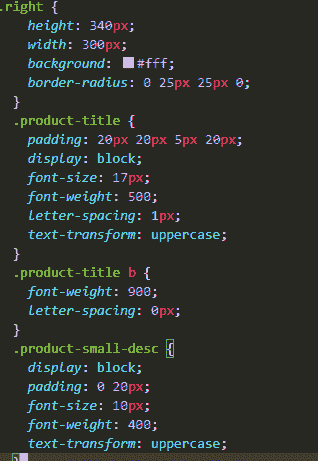

现在 CSS 到我们的徽章:

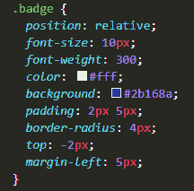

现在将 CSS 添加到我们的大小列表中:

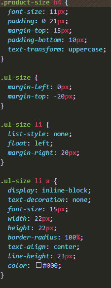

现在添加悬停效果:

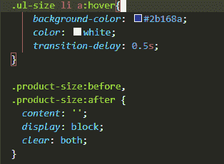

现在将 CSS 添加到我们的颜色列表中:

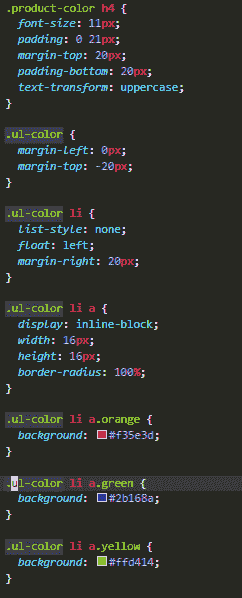

现在是将 CSS 添加到我们的价格部分和按钮的时候了:

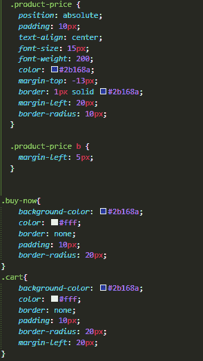

现在只剩下悬停效果了，所以也这么做吧:

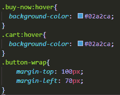

按钮包装只是为了增加利润，所以不要担心。

所以今天你看到了如何以一种简单的方式为电子商务网站制作产品卡，我知道我没有解释 CSS，但我认为代码是不言自明的，我从一些代码笔中获得灵感，所以这些组件不是 100%属于我的。

希望今天我对你的项目有所帮助，希望你会喜欢。

项目代码:[https://github . com/ath 34-tech/Best-ecommerce-card-vertical-and-horizontal-](https://github.com/ath34-tech/Best-ecommerce-card-vertical-and-horizontal-)

在 Instagram 上关注我:【https://www.instagram.com/ath_t1/ 