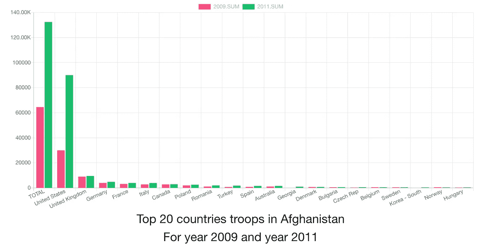
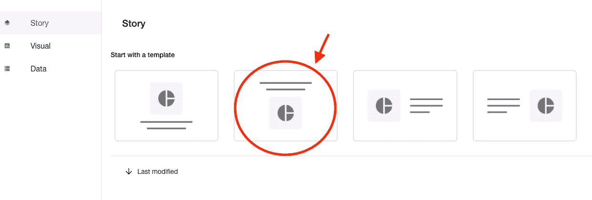
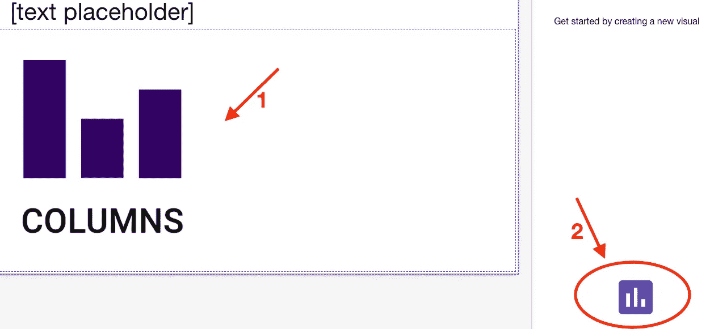
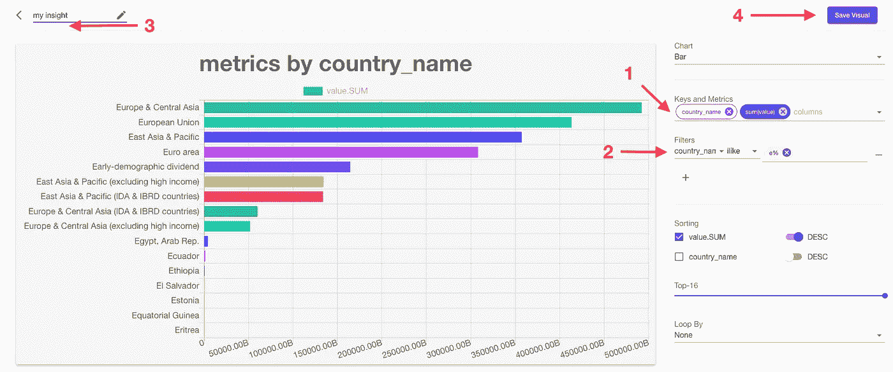
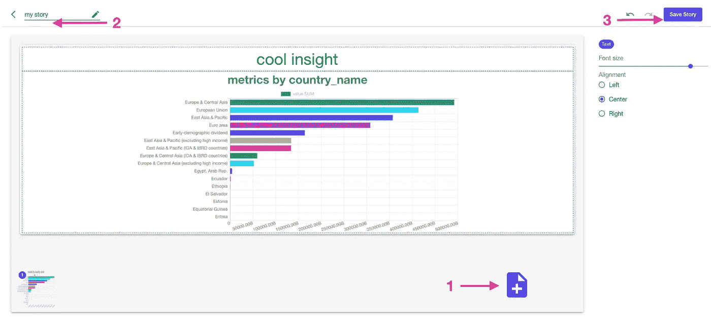
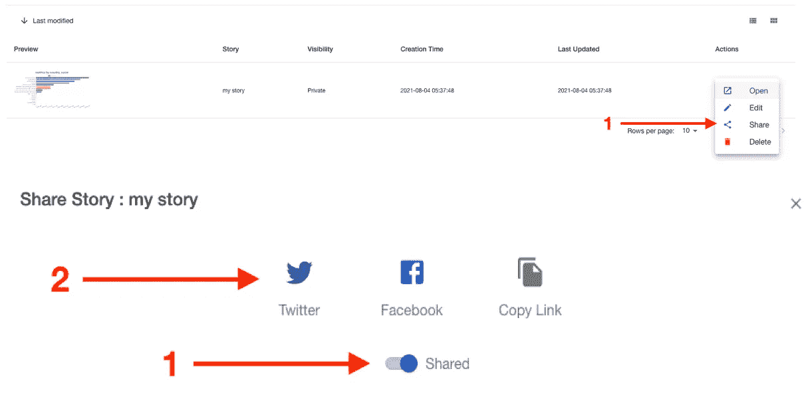

# 让每个人都能用数据讲故事

> 原文：<https://medium.com/geekculture/make-data-storytelling-accessible-to-everyone-19d0466eb84c?source=collection_archive---------44----------------------->

## https://columns.ai 预览版介绍。

One slide of columns story (created by author)

我不经常写文章，但如果曾经读过我以前的帖子“[数据分析与大数据分析](/nerd-for-tech/data-analytics-vs-big-data-analytics-c361c832fb25)”，你可能知道我们的使命是*让每个人都可以使用数据讲述故事，并帮助数据故事讲述者获得社区奖项。*

数据故事对我们每个人都非常重要，它帮助我们通过使用生活在数据中的事实更好地交流，帮助我们表达我们的观点，这是一个令人愉快的过程，它产生艺术一样的结果。越来越多的数据变得可用，无论是公共开放数据还是私人企业数据，将它们转化为故事是一件非常棒的事情。但是…

它依赖于先进的技术和幸福的用户体验。我们一再挑战自己如何构建这个产品来让我们的用户满意，我知道它完成了不到 1%，它看起来不完美，更像是一个概念验证，但我们希望得到您的早期反馈，您的意见将影响我们如何进一步完善这个产品，所以请看看这个**预览**版本: [https://columns.ai](https://columns.ai)

您可以这样发布您的第一个数据故事:

1.  登录产品。(更喜欢谷歌登录)
2.  通过单击 4 个布局的模板创建一个故事。
3.  单击默认幻灯片上的占位符(列徽标)，并创建您对所选数据的视觉洞察。
4.  使用视觉效果创建者—用名称保存视觉效果，以便将来可以重复使用，视觉效果将被插入 story composer。
5.  添加更多页面，或者通过给故事命名来保存故事。
6.  发布您的精彩数据故事，并与您的社区分享(twitter、facebook 或简单的链接)

Step 2: create a story

Step 3: editing story elements — visual creation to add a new visual to current story page

Step 4: play with visual creator — fields (keys, metrics), filter, sorting, topN, animation

Step 5: save your story

Step 6: share your story to your community

我希望你已经发表了你的第一个故事，这花了你 3 分钟，可能你的数据故事看起来像我的，如上面 6 个步骤所示:

 [## 我的故事

### 专栏:向您的社区讲述数据故事。

columns.ai](https://columns.ai/story/a8fec919-9192-4a55-af14-a0435ee49f05) 

你的故事将在所有社交/出版平台上预览，你的读者可能会在这个故事阅读页面上给你 100 个赞，或者分享到他们自己的社区，因为他们发现它有用、有趣或鼓舞人心！

如果我的剪辑技巧不足以说明这 6 个简单的步骤有多简单，那么一个 1 分钟的视频可能会有所帮助。

1 minute video to demo how to publish a data story

那么是什么让 [https://columns.ai](https://columns.ai) 与众不同呢？

1.  正如我在另一篇文章中提到的，我们正在使用**尖端的大数据分析技术**来构建专栏，让每个人都可以用数据来讲述故事！无论您的数据是 1KB、1MB、1GB，甚至更大，columns 都可以通过其分布式后端为您处理这些数据！
2.  列**将支持静态数据和实时运行数据**。如果你上传数据，它为每个账户提供免费的 5GB 存储空间。否则，它会连接到其他云存储，如 Google Spreadsheet、Google Drive、Dropbox、Microsoft OneDrive、Microsoft Excel、Restful API、Real time streaming… Columns 只会计算您的数据，但不会存储您的数据，除非您选择上传方法。
3.  栏目简单、干净，只呈现你需要的东西。

我们不会在我们信奉的产品理念上妥协:

*   简单的
*   快的
*   充满喜悦的

我希望这些公告能帮助你认识到为什么栏目是不同的，我更希望你在产品理念上站在同一边！

这篇文章是为了介绍 [https://columns.ai，](https://columns.ai,)的预览版，我们谦卑地请求反馈，同样，我们清楚地知道这肯定不到 1%的完成，您的输入/反馈对我们来说是非常宝贵的，对于专栏的未来。请给我们发短信:columns.ai@gmail.com，我期待着你的来信！

我们共同努力，让每个人都能用数据讲故事！