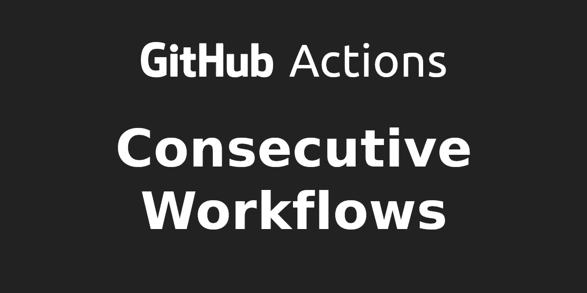
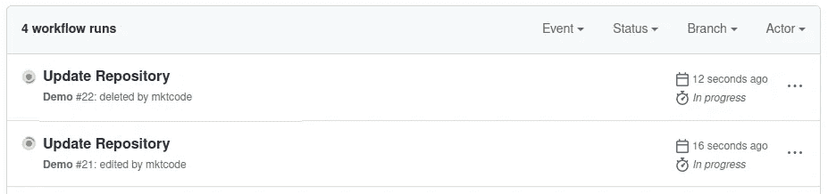
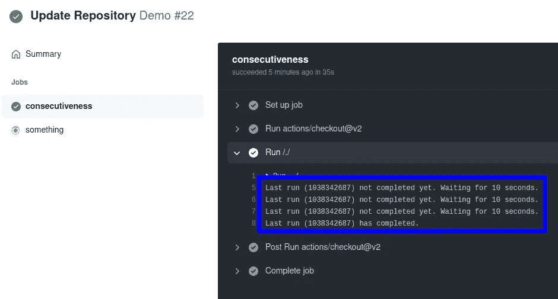

# 让 GitHub 工作流程连续运行

> 原文：<https://medium.com/geekculture/make-github-workflows-run-consecutively-4d98840ed600?source=collection_archive---------4----------------------->

## TLDR:[https://github . com/market place/actions/continuous-workflow-action](https://github.com/marketplace/actions/consecutive-workflow-action)



**截至 2022 年，medium.com 要求您拥有至少 100 名粉丝才有资格加入合作伙伴计划。在写这篇文章的时候，我有 13 个。所以如果你觉得这篇文章有帮助或者有趣，请考虑关注我。谢谢！**

*本文假设你对 GitHub 动作/工作流有一些基本的经验。*

当您使用 GitHub Actions 时，您几乎拥有无限的灵活性，几乎可以做任何事情。但是有时候你必须有点创造力来实现你想要的。

在工作流中，作业是并行执行的，但是您可以创建作业之间的依赖关系，以便它们连续运行。作业中的步骤总是一个接一个地运行。

工作流本身总是彼此独立运行。您可以多次触发同一个工作流，将会有多个并行运行。在许多常见场景中，这完全没问题。当有两个新的拉请求几乎同时提交时，您的自动化测试可以同时为这两个拉请求运行。

但是在有些情况下这会导致问题。我喜欢让我的工作流不仅执行一些检查，而且更新存储库。自动修复代码格式问题就是一个很好的例子。



Two parallel workflow runs.

现在并行的问题当然是这样的:

```
Updates were rejected because the remote contains work that you do not have locally. This is usually caused by another repository pushing to the same ref. You may want to first integrate the remote changes (e.g., 'git pull ...') before pushing again.
See the 'Note about fast-forwards' in 'git push --help' for details.
```

几乎同时向同一个存储库推送的两个工作流运行很可能会失败。首先想到的是在推送之前拉取变更，但是这会导致合并冲突，而您的工作流无法自行解决。

因此，您需要确保一旦工作流运行 A 完成推送，工作流运行 B 只克隆存储库。它们需要连续运行。GitHub 并没有提供现成的，而是提供了一个足够全面的 API 来自己实现它。我不会详细介绍[实现](https://github.com/mktcode/consecutive-workflow-action/blob/main/index.js)，但这是一个通用的、相当简单的想法:

正如我前面提到的，您可以在工作流中的作业之间创建依赖关系。因此，工作流的第一项工作就是查看它以前的运行，并等待它完成。我不关心它的结果，不管它是失败了还是成功了，我只想确保它不再运行了。只要不是这种情况，请稍等片刻，然后再次检查。因此，这里包含了一个很好的 while 循环，以确保我们工作流中的第一个作业阻塞其余的作业，直到上一次运行完成。



First job blocks workflow and checks previous run every 10 seconds.

我[将此作为 GitHub 动作](https://github.com/marketplace/actions/consecutive-workflow-action)发布，这是超级容易使用的。

```
jobs:
  consecutiveness:
    runs-on: ubuntu-latest
    steps:
    - uses: mktcode/consecutive-workflow-action@v1
      with:
        token: ${{ secrets.GITHUB_TOKEN }}

  # your other jobs
  something:
    runs-on: ubuntu-latest
    needs: [ consecutiveness ]
    steps:
    # ...
```

关于`GITHUB_TOKEN`有一点需要说明……在执行 API 调用(检查之前的工作流运行)时，需要使用令牌来避免速率限制问题。确保你阅读了库的自述文件中的[安全说明](https://github.com/mktcode/consecutive-workflow-action#security-note)。

就是这样！希望对一些人有用。如果你对我正在做的事情感兴趣，请在 GitHub 上关注我。谢谢！:)

*如果你打算成为中等会员，可以使用我的推荐页面支持我:*[*https://markus-kottlaender.medium.com/membership*](https://markus-kottlaender.medium.com/membership)