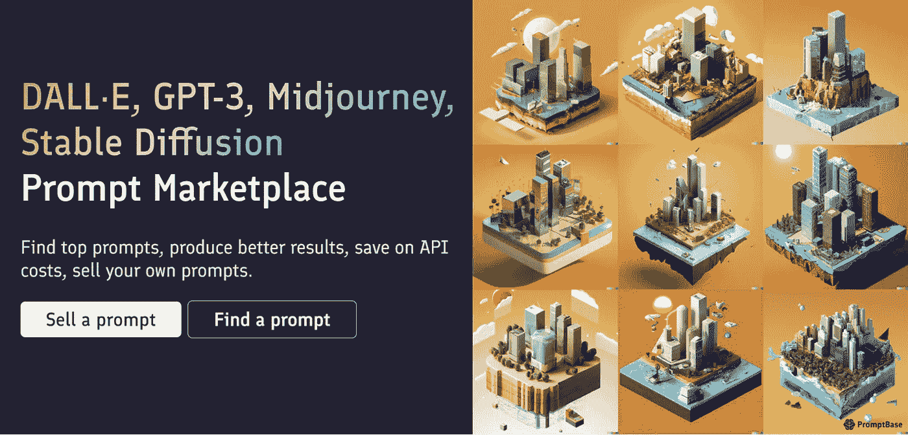

# 通过销售 Dall-E2、MidJourney 和 Stable Diffusion 的文本提示赚钱

> 原文：<https://medium.com/geekculture/make-money-by-selling-text-prompts-for-dall-e2-midjourney-and-stable-diffusion-d3e52afa5dee?source=collection_archive---------0----------------------->

Image from PromptBase. Edited by [Jim Clyde Monge](https://medium.com/u/819323b399ac?source=post_page-----d3e52afa5dee--------------------------------) with Canva

最近几个月，人工智能图像生成器取得了令人难以置信的进展。

[Dall-E2](https://openai.com/dall-e-2/) 、[中途](https://www.midjourney.com/app/)、[稳定扩散](https://stabilityai.us.auth0.com/u/login?state=hKFo2SBMSEY5dUotTDYxeUU5aDlGazBMZlplZVRjMlVyNkZoTqFur3VuaXZlcnNhbC1sb2dpbqN0aWTZIHNRd0JDVGQ0NmV1ZnN3ZFJ1bDJvRTM2bjE4ck5fRHBmo2NpZNkgS3ZZWkpLU2htVW9PalhwY2xRbEtZVXh1Y0FWZXNsSE4)是目前 AI 艺术领域最大的玩家。这些工具对你能想象到的任何东西进行简单的文本描述，并从中生成图像。