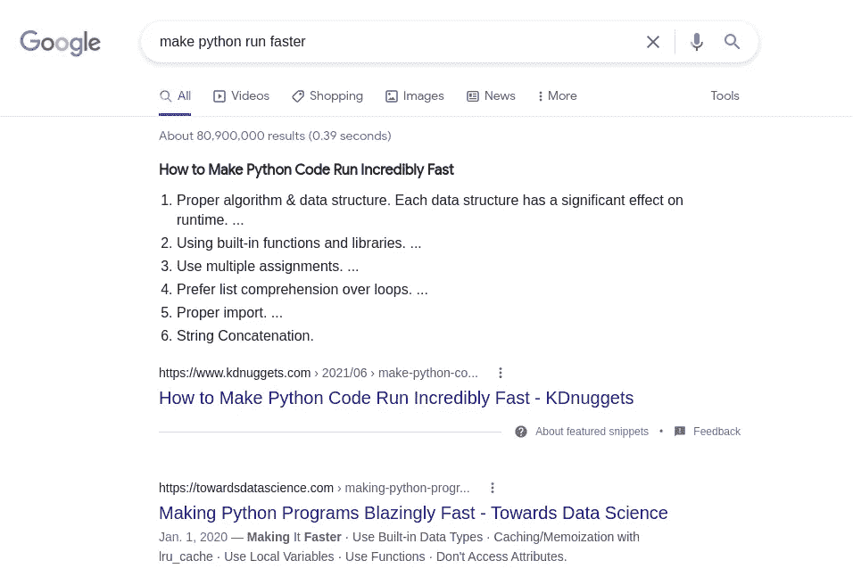
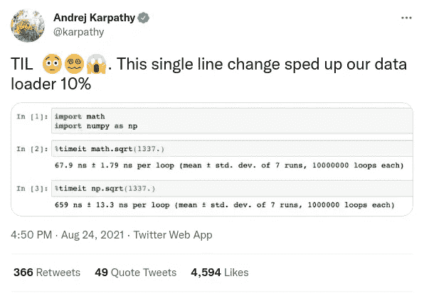
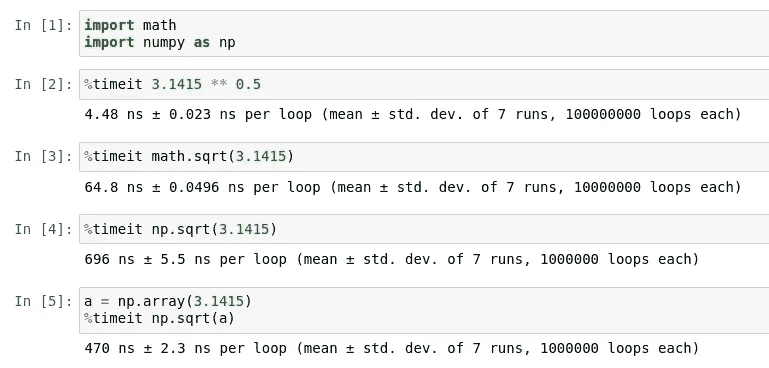
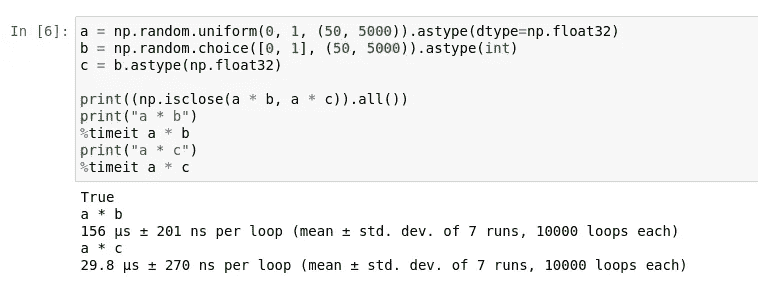
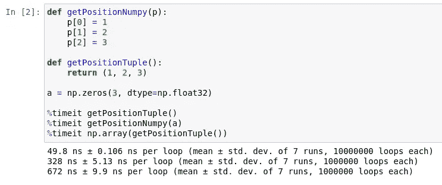
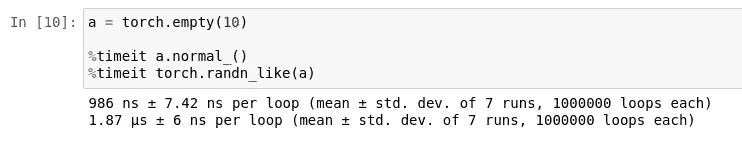
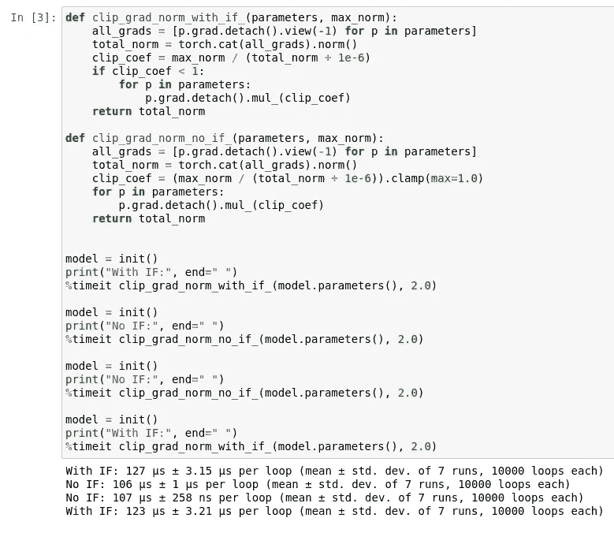
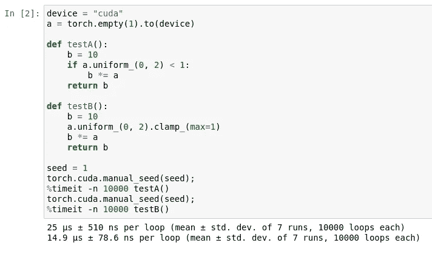
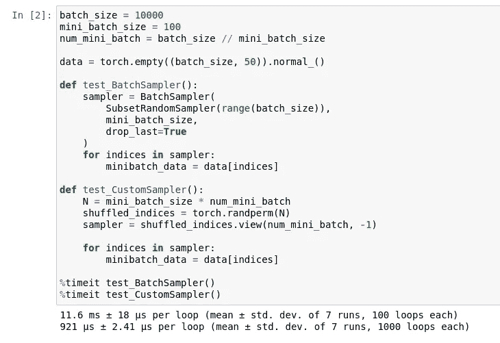

# 让 Python 运行得更快:机器学习的视角

> 原文：<https://medium.com/geekculture/make-python-run-faster-c73137598bae?source=collection_archive---------5----------------------->

## 加速代码的 7 个原则

Python 有一个很好的机器学习生态系统，但深度学习是计算密集型的， [Python 很慢](https://benchmarksgame-team.pages.debian.net/benchmarksgame/fastest/python3-gcc.html)。在这篇文章中，我将讨论帮助我的代码运行更快的不同方法，更具体地说是在物理模拟和角色动画的强化学习中。然而，大多数技巧适用于所有计算密集型程序。

因此，这里有 7 种方法可以让 Python 代码运行得更快:

1.  [让你的机器跑得更快](#4fdc)
2.  [尝试不同的 Python 版本和发行版](#5860)
3.  [剖析和优化](#9235)
4.  [注意类型转换](#d27e)
5.  [对内存分配要有策略](#173e)
6.  写 If 语句时要巧妙
7.  [使用包装时要小心](#83f9)

关于我——我是不列颠哥伦比亚大学的博士生。我的研究使用深度学习和强化学习来解决角色动画问题。例如，看看这个[不断行走的机器人](https://youtu.be/XQ0EKfunVT4?t=90)和[交互式基于网络的角色控制器](https://belinghy.github.io/projects/MVAE/#demo)。我今天分享的让 Python 变得更快的例子是基于 NumPy 和 PyTorch 的，所以一些关于它们的经验会有所帮助。

# 1 让你的机器跑得更快

只有两种方法可以让任何程序运行得更快:编写更高效的代码或者让你的机器运行得更快。

在花几个小时优化代码之前，花几秒钟检查您的机器是否尽可能高效地运行是值得的。这听起来很明显，但这正是为什么它如此容易被忽视，甚至被谷歌上的大多数首页结果所忽视。



默认情况下，电脑不会以最大容量运行。以最大能力运行会浪费能源，对日常任务(如查看电子邮件)几乎没有明显的好处。所以默认的功率设置通常是按需或平衡的。这允许 CPU 在必要时使用更多的功率，例如在打开繁重的应用程序时，同时在机器空闲时节省能量。

操作系统智能地决定何时 CPU 可以汲取更多的能量。但是当我们追求最佳性能时，最好由我们自己来做决定。在性能模式下运行 CPU 给我的代码库带来了 10-25%的差异，因为大多数物理模拟都是受 CPU 限制的。我使用以下命令在 Linux 上设置 CPU 性能模式。

```
sudo apt install cpufrequtils# Check current governor
cat /sys/devices/system/cpu/cpu*/cpufreq/scaling_governor# See governor options: conservative, ondemand, powersave, performance 
cpufreq-info# Turn on `performance` mode for all cores
# $(($(nproc)-1)) returns the number of cores minus 1
sudo bash -c 'for i in $(seq 0 $(($(nproc)-1))); do cpufreq-set -c $i -g performance; done'# Revert back to `ondemand` mode for all cores 
sudo bash -c 'for i in $(seq 0 $(($(nproc)-1))); do cpufreq-set -c $i -g ondemand; done'
```

如果你运行的是 Windows，最好还是换成 Linux。上一次我在两种操作系统上比较运行实验时，Linux 稍微快一些。如果情况有变，一定要让我知道；我很乐意换成现在最快的。

# 2 尝试不同的 Python 版本和发行版

Python 和其他软件一样，仍在随着时间的推移不断改进。Python 的每个版本都有不同的优化；例如，这里是 Python 3.10 的[发行说明。](https://docs.python.org/3.10/whatsnew/3.10.html#optimizations)

较新的 Python 版本不一定比旧版本快。尝试所有版本，看看哪个版本最适合您的代码库。幸运的是，像 [miniconda](https://docs.conda.io/en/latest/miniconda.html) 和 [pyenv](https://github.com/pyenv/pyenv) 这样的工具使得管理不同的 Python 版本变得容易。

不要停留在尝试不同的 Python 版本，也要尝试不同的 Python 发行版。我发现来自 [conda-forge](https://conda-forge.org/docs/) 的 Python(下面的设置步骤)比其他任何东西都要稍微快一点。我尝试过使用 pyenv、 [Pyston](https://github.com/pyston/pyston) 和[英特尔 Python 发行版](https://software.intel.com/content/www/us/en/develop/tools/oneapi/components/distribution-for-python.html)进行编译。我没有试过 [Cinder](https://github.com/facebookincubator/cinder) 或者 Python 3.10+。

```
conda config --add channels conda-forge 
conda config --set channel_priority strict 
conda create -n 3.9.5 python=3.9.5 -c conda-forge
```

如果您一次运行 12 个小时的强化学习实验，那么在寻找最佳 Python 版本和发行版上的时间投资是值得的。以 5%的速度提升，每天可以节省一个多小时。

# 3 剖析和优化

从 Google 的首页结果中加速 Python 代码的大多数技巧都是值得的——尽可能遵循它们。最重要的是，[剖析你的代码](https://en.wikipedia.org/wiki/Profiling_(computer_programming))，找到瓶颈，然后优化。

对于剖析，有许多工具，如 [py-spy](https://github.com/benfred/py-spy) 和 [scalene](https://github.com/plasma-umass/scalene) 。我个人不记得输入标志，所以我倾向于使用内置的分析器。

```
pip install snakeviz 
python -m cProfile -o temp.dat _command_
snakeviz temp.dat
```

这是结果汇总的样子。在本例中，`test.py`第 6 行的列表理解花费了 14.5 秒，总运行时间为 17.8 秒。很容易一眼就看出哪部分代码执行时间最长，因此如果可能的话应该进行优化。


找到瓶颈后，如何改进代码通常就很明显了。一个谷歌搜索就有很多资源，这里就不一一赘述了。对我来说最有帮助的技巧是:使用内置函数，更喜欢列表理解而不是循环，使用 numpy 向量化代码，numpy 对于较小的数组来说会更慢，查看 [numba](https://numba.pydata.org/) 和[瓶颈](https://github.com/pydata/bottleneck)。

大多数强化学习代码都遵循类似的格式，如下所示:

```
for _ in range(epochs):
  for _ in range(steps_per_epoch):
    run_simulation_step()
    store_training_data()
  for _ in range(training_epochs):
    calculate_loss()
    update_model()
```

通常，模拟是瓶颈，因为它在 CPU 上运行(例外: [Isaac Gym](https://developer.nvidia.com/isaac-gym) 和 [Brax](https://github.com/google/brax) )，而其他一切都可以在 GPU 上并行化。就前景而言，基于物理学的 3D 角色动画中的典型实验运行在数百万甚至数十亿个模拟步骤的数量级上。对于训练图像或语言模型，计算量是相当的，甚至更大。

在这种程度上，即使是最微不足道的改进也会对代码执行时间产生很大影响。正如特斯拉的人工智能主管[最近发现的那样，一个简单的](https://karpathy.ai/)[单行变更](https://twitter.com/karpathy/status/1430316576016793600)用`np.sqrt`替换`math.sqrt`将数据加载速度提高了 10%。



可惜 Python 里像这样的招数太多了。在这里一一列举不会很有成效，也不值得死记硬背。编写更快代码的最通用策略是进行分析和优化。其余部分描述了一些可以压缩更多性能的常见地方。

# 4 注意类型转换

像`numpy`和`torch`这样的 Python 包使用起来非常方便，以至于我们有时在使用它们的时候都不会考虑底层开销。我们使用 numpy 函数的频率有多高，仅仅是因为我们懒得检查底层对象是浮点、列表还是 numpy 数组？



为了使这些包更方便，它必须检查数据类型，或者将对象转换成它能理解的东西。这需要时间，在大型应用程序中，特别是在机器学习中，纳秒会很快增加。在本例中，手动将常量从 float 转换为 numpy 数组使操作速度提高了 30%。最快的实现使用内置的幂运算符。当然，当需要复数时，实现的行为会有所不同。



这是另一个例子。在机器学习中，通常编写使用一个数组来掩盖另一个数组的代码，例如图像分割。在同一个操作中组合不同的数据类型通常会有损失，这一点很容易被忽略。

注意类型转换也迫使我们考虑底层数据对象的类型。在我们的大脑中这样做减少了需要用代码完成的工作。最终，执行更少的代码比执行更多的代码更快。

# 5 对内存分配要有策略

除了 Visual Basic，我在大学第一年学的第一门语言是 C。在课堂上了解了`malloc`和`free`之后，我首先了解到的一件事情是，分配内存比基本的算术运算要慢得多。Python 没有`malloc`函数，但是糟糕的内存管理仍然会降低我们代码的速度。

在花了很多时间分析和优化我的 RL 模拟环境之后，我最终发现`np.array`在我的代码中花费了最多的时间。在那一刻，我意识到每个`np.array`都有一个底层的`malloc`用于分配必要的内存来存储数组。每当我把一个列表转换成一个数组时，通常是出于懒惰，我都忘记了我在 c 语言中学到的最重要的一课。

在我的大多数项目中，我使用 PyBullet 来模拟角色运动。它是用 C++编写的物理引擎之上的 Python 绑定。默认情况下，PyBullet API 以 Python 元组的形式返回对象，例如，机器人关节角度、角色根位置等。然后，我将把这些元组转换成 Python 中的 numpy 数组，用于进一步的计算，比如计算两点之间的距离。



尽管创建 numpy 数组的速度很快，但几纳秒的时间会累积起来，成为总时间的重要部分。通常最好在开始时分配一段代码需要的所有内存。在强化学习中，这转化为提前分配重放缓冲区，并直接修改环境中的缓冲区数据，而不是每次都创建新的元组。同样，PyTorch 中的就地操作应该优先于异地操作。



关于内存分配还有一点要注意:CPU 和 GPU 内存要分开处理。CPU 内存和 GPU 内存之间传输数据需要时间，即`torch.randn(10).to(device)`。对于繁重的计算任务和[令人尴尬的可并行化](https://en.wikipedia.org/wiki/Embarrassingly_parallel)问题，利用 GPU 加速可能是值得的。但是如果实现需要在 CPU 和 GPU 之间来回传输数据，那么 GPU 的任何加速都很容易被内存传输时间抵消。

# 6 使用 If 语句时要聪明

还记得我之前说过执行更少的代码比执行更多的代码更快吗？嗯，并不总是这样——有时候代码越多越快。

下面的例子比较了两个`clip_grad_norm`实现。它非常受欢迎，你可能已经在许多开源机器学习项目中看到过它。第一个实现(使用 if 语句)稍微修改了 [PyTorch 的源代码](https://pytorch.org/docs/stable/generated/torch.nn.utils.clip_grad_norm_.html)，只保留了必要的行进行剪辑。第二个实现用箝位操作代替 if 语句。

在 numpy 中矢量化代码时，箝位技术很常见。简而言之，第二个实现将乘法因子固定为 1，然后总是执行循环。另一方面，第一个实现在执行循环之前检查乘法因子是否小于 1。if 语句实现执行的代码更少，所以理论上应该更快？



为了确保比较公平，我每次都初始化相同的模型。尽管执行了更多的代码，第二个实现还是快了 15%。如果您不相信，这里有一个简单的设置，直接比较使用 If 和 clamp 的两种实现之间的差异。



if 语句会损害性能的原因是因为[指令流水线](https://en.wikipedia.org/wiki/Instruction_pipelining)。If 语句和其他[分支指令](https://en.wikipedia.org/wiki/Branch_(computer_science))很慢，因为处理器不知道下一步要执行什么，直到 if 条件被评估——这被称为[分支危险](https://en.wikipedia.org/wiki/Hazard_(computer_architecture))。通常，这不是一个问题，因为[分支预测器](https://en.wikipedia.org/wiki/Branch_predictor)可以高精度地提前预测结果。但是在我们的第二个例子中，if 条件的随机性使得分支预测器无效。没有放之四海而皆准的解决方案。两种方法都试试，看看哪种更快。

# 7 使用包装时要小心

Python 生态系统非常适合快速原型开发，因为它拥有庞大的用户群，而且许多包都是现成的。对于机器学习，其他人已经花时间编写了快速的神经网络实现，这些实现可能比我们自己的实现快几个数量级，例如 [PyTorch](https://pytorch.org/) 、 [TensorFlow](https://www.tensorflow.org/) 和[抱抱脸](https://huggingface.co/)。

但是现成的代码并不总是比我们自己的实现更快。首先，拥有大量用户的软件包需要对用户友好，并保持向后兼容性。在性能和支持一般用例之间可能会有一个折衷。第二，开源软件得到了其用户的支持，这些用户可能与你我没有太大的不同。对于个人来说，在任何时候找到最优的实现都要花费太多的时间，尤其是当他们在空闲时间做出贡献的时候。

一个特别的例子是 PyTorch 创建小批量的工具:BatchSampler 和 SubsetRandomSampler。我发现自己创建小批量的实现比使用提供的实用程序快 10 倍，至少在我的实验中是这样。



尽管这两种实现需要键入的字符数大致相同，但自定义采样器速度更快，而且从主观上来说更容易理解。我确信有一些我没有考虑到的边缘情况，但是自从在我的项目中使用我自己的实现以来，我没有遇到任何问题。对于我自己的研究项目，我更喜欢*快速但具体的*代码，而不是*缓慢但通用的*代码。

# 摘要

我希望这篇文章向您展示了如何编写更快的 Python 代码，而不仅仅是用循环替换列表理解。

现在我想听听你要说什么。这篇文章中的哪个技巧对你来说是新的？每个程序员都应该知道的另一个窍门是什么？在下面评论分享你的想法。

*要了解有关数据科学的更多信息，并与数据科学温哥华的 DataCan & Woman 保持联系，请访问* [*查看我们的网站*](https://datacan.network/) *。*