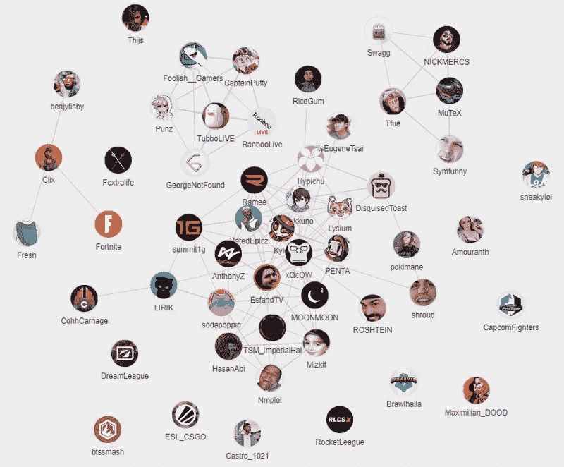

# 让 Twitch API 用网络图说话(Node.js，React，Mongodb，Vis.js)

> 原文：<https://medium.com/geekculture/make-the-twitch-api-speak-with-network-graphs-node-js-react-mongodb-vis-js-65c50603c44c?source=collection_archive---------24----------------------->

## 使用网络图的实际案例

Photo by [JJ Ying](https://unsplash.com/@jjying?utm_source=medium&utm_medium=referral) on [Unsplash](https://unsplash.com?utm_source=medium&utm_medium=referral)

Twitch API 允许你使用流媒体平台提供的一些数据来开发应用。我建议您使用这个强大的 API 来查看 streamer 社区之间的链接。

最终项目的演示可在 splitviewer.com 的[获得。这些源代码可以在](https://fr.splitviewer.com/)[我的 github 库](https://github.com/ermineaweb/en.splitviewer.com)上获得。

原理如下:

*   一个流连接，应用程序通过 twitch API 得到通知。
*   每隔一段时间，流媒体的观众就会被记录下来
*   当拖缆断开时，操作停止
*   每天，应用程序都会为每个流计算与其他流相同的观众的百分比。

示例:

*   我们为 **Streamer1** 录制了 4 个观众:约翰、杰西、黑暗忍者、大狗
*   我们为 **Streamer2** 注册了 6 个观众:奥比万 123、黑暗忍者、凯维基、约翰、莱斯利、小失败者
*   **流媒体工具 1** 因此与**流媒体工具 2** 有两个共同的观看者，即 2/4 * 100 =其社区的 50%也观看**流媒体工具 2** 。
*   **Streamer2** 因此与 **Streamer1** 有两个共同的观众，或者 2/6 * 100 = 33%的社区也观看 **Streamer1** 。

这种计算在所有拖缆上重复进行。结果可以用网络图的形式显示出来。我用的是 [vis.js 库](https://visjs.org)

通过使用网络图，我们可以实现以下目标:

*最初发表于*[*https://romainamichaud.com*](https://romainamichaud.com/en/visualize-communities-twitch-streamers)*。*