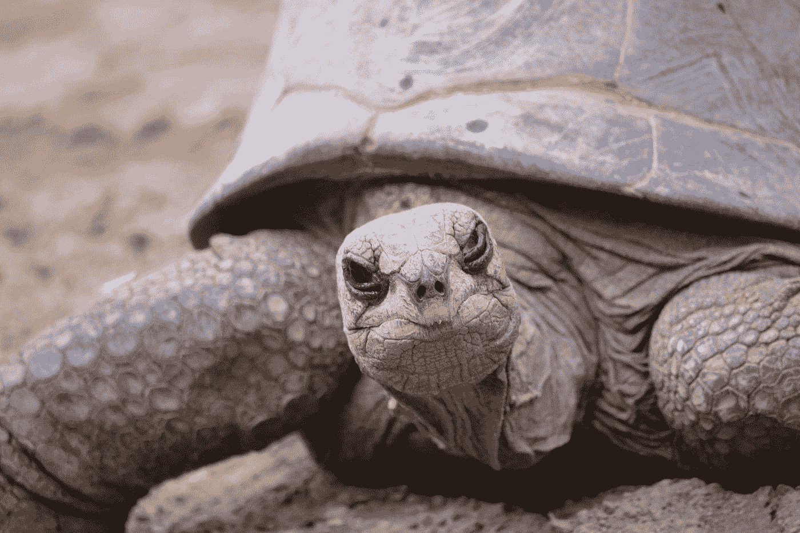
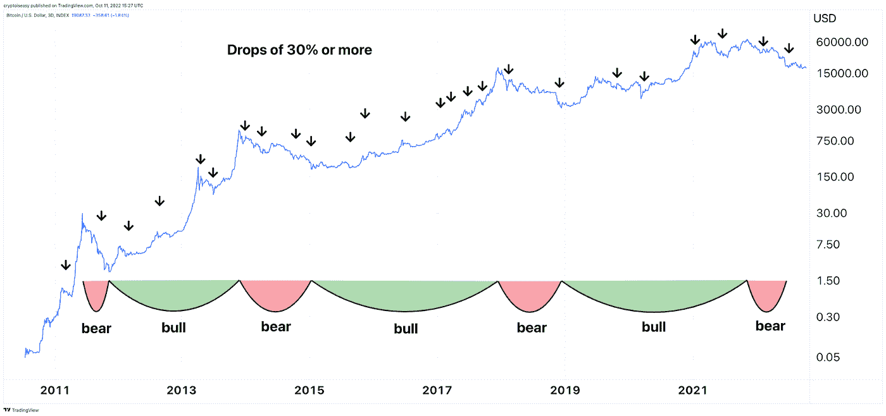

# 给密码龟让路

> 原文：<https://medium.com/geekculture/make-way-for-the-crypto-tortoise-3e5aa4b73259?source=collection_archive---------7----------------------->

Crotchety but persistent. Photo by [Antoine H.C.](https://unsplash.com/@entoyne?utm_source=medium&utm_medium=referral) on [Unsplash](https://unsplash.com?utm_source=medium&utm_medium=referral)

如果你订阅了我的简讯， [*Crypto is Easy*](https://cryptoiseasy.substack.com/) ，你就知道我多乌龟，少兔子。稳定的坚持而不是狂热活动的爆发。马拉松，不是短跑。

大多数人来这里是为了尽快赚到尽可能多的钱。下一个 100x altcoin 是什么？底部在里面吗？哪些链上数据可以预测未来？

我来这里是为了从市场上榨出最多的果汁。低买高卖。只有当市场迫使你这么做时，你才卖出(希望根本不要卖)。缓慢而安全地构建。让市场为你做艰苦的工作。

*马克，那太蠢了。重点是销售！*

也许吧。小心点。我卖密码输了很多钱。我买的时候损失少多了。

# 下降了 99%

号码

这完全取决于速度和耐心。当你只在比特币价格暴跌 30%(替代币下跌 50-70%)后买入时，你不需要获利了结。你限制了自己的劣势，同时也给了自己更多的优势。

随着市场进一步下跌，你投入的每一美元都会获得更高的价值。

一旦市场上涨，你可以停止买入，兔子会跳着回到市场，追逐价格上涨。那是你为下一次崩溃存钱的时候。有时，这些崩溃会持续一周。有时，它们会持续一年。

例如，如果你遵循我的计划，你会在 2021 年的大部分时间里按兵不动，只在 5 月中旬到 8 月初购买，并在 9 月底的 10 天内再次购买。

 [## 我买卖比特币的计划

### 2020 年 3 月 30 日，我发表了这个计划。当时，我已经为此努力了一段时间，终于感到自信了…

cryptoiseasy.substack.com](https://cryptoiseasy.substack.com/p/crypto-is-easy-special-issue-my-plan) 

这可能看起来很蹩脚，因为其他人都在年初和年底变得富有。

但是他们是吗？

大多数交易者都亏损了。按照平均成本计算，你今年的投资将减少 3%。

按照我的计划，你今年的收益至少会增长 17%,而且还有剩余资金。

当市场在 2022 年下跌时，这笔闲钱就能派上用场了。

(用 altcoins，结果遍地都是。在某些方面，我下降了+90%。在其他方面，我在这篇文章发表时已经上涨了 1200%。)

一旦市场好转，你就可以享受你努力工作的成果了。如果你需要现金，卖掉你的密码。或者，花掉它。你不需要战术或防守。你可以像对待你拥有的其他东西一样对待它。

让兔子们疲于追逐一个远离它们的市场。他们可以忙着获利，用杠杆买入，抓住低点，把握高点，寻找机会。

你可以放松，欣赏你的好运。

# 双赢

当你拥有一个上升空间如此之大、顺风顺水的资产类别时，你不需要太用力。在需要的时候买入，让市场上涨，为下一次机会攒下现金。

不管怎样，你都赢了:

*   当价格上涨时，你的密码的价值也会上涨。
*   当价格足够低时，你可以买更多，通常是以很高的折扣。

虽然平均成本有它的优势，一个好的交易者会做得更好，但有时“足够好”就足够好了。

偶尔，你可能会得到一个替代季节。利用这段时间放弃那些没有按照你预期的方式运作的失败项目和好项目。抓紧剩下的。它们会像其他东西一样崩溃 80-95%。在下跌时或尘埃落定后买入。

# 等待牛市？

有人说，在熊市期间，朋友不会让朋友购买代用币。其他人说要为未来几年的新项目存钱。“永远不要买下跌的刀，只在上涨的时候买。”

很公平。牛市什么时候开始？什么价格？什么日期？

如果你等待牛市，唯一的保证就是你会在更高的价格买入。

例如，如果你在 2019 年购买了 random cryptos，这是一个真正的加密冬天，你会在 3000%的涨幅达到峰值。如果你等到 2020 年 12 月，一旦所有人都认为牛市回来了，你就会达到 450%的涨幅。

你可以在这张总加密市值的图表上看到。

给定相同的风险和波动性，你愿意赌相同的钱获得更大的收益还是更小的收益？

一旦你等待牛市，你会用同样的钱赌上更少的收益。即使从现在起到牛市开始，市场只上涨了 200%，这意味着你必须比今天多投入 200%的资金。

此外，如果你等待，你仍然会遭受 30-50%的崩溃后，你购买。这些在牛市比熊市更常见，如下图所示。

今天的市场太棒了。你可以找到很多低价的有趣项目。你可以与认真的团队和关心他们项目的社区互动。

你可以用他们的代币作为奖励，委托他们获利，或者将他们存入流动资金池，收取一部分费用。你可以花很少的钱买到元宇宙的土地，你的智能合同费用比以往任何时候都低。

如果你等待底部的确认，考虑一下你会因为等待而损失的钱。你可以弥补糟糕的时机。自满害死人。

# 没有风险，就没有饼干

现金正以多年来最快的速度贬值。

美国政府正试图摧毁所有东西的价格，无论在哪里。

如果没有刺激和补贴，中国的房地产市场将会崩溃。英国和日本需要广泛的政府干预，以防止其货币和债务市场崩溃。

欧洲央行(ECB)对于是加息引发能源危机，并可能引发一些成员国的主权债务违约，还是任由通胀肆虐，并可能眼睁睁看着欧元区崩溃，仍态度暧昧。

与此同时，自 2021 年 11 月以来，加密市场下跌了 70%。

当加密技术悬于悬崖边缘，世界上最大的经济体似乎注定要经历一场灾难时，将资金投入加密技术是否显得鲁莽？

也许吧。

至少当你的银行、政府、企业和信用卡公司不工作时，比特币可以工作。你不能吃它，但是你可以在冬天开采它来取暖。这比股票和债券的价格要高。

替代硬币波动性更大，但在这些价格下不一定风险更高。你的下跌空间仍然被限制在 100%，而你的上涨空间是无限的。对于提供赌注奖励的代币，您可以在等待市场复苏时获得免费加密。

为什么要冒着上升的风险来避免同样的 100%的损失呢？

# 不需要等待，没有时间去匆忙

一些人会一直等待“底部已经到来”的确认，央行会再次开始印刷钞票，“宏观”形势会有所改善。

让他们去吧。

这样我们就有更多的时间来积累代币，参与他们的相关项目。

在 3AC、Luna 和 lending 平台崩溃后，我们需要给加密市场时间来重建其基础。

你最喜欢的股票，五年内很可能永远不会有 500%的回报。一些替代硬币会，而且随着时间的推移，它们会做得更好。让它们的价格上涨，等待下一次崩盘给你另一次买入的机会，甚至可能是今天的价格。

许多最好的项目都有实际的开发、经验和真正的社区增长——这是 altcoins 以前从未有过的。比特币处于 13 年的上升趋势，顺风顺水。该技术现在支持实际的真实世界使用(尽管它仍然缺乏参与)。

当你把你的钱押在一个机会上，以增加你在未来金融网络中的股份时，你也会遭受任何后果。随着时间的推移，接受一些损失以换取更大的收益是错误的吗？

野兔在疯狂的能量爆发中工作，带着急迫和匆忙。这在生活中对他们很有用，但在秘密中却不一定。

乌龟明白加密是一场需要勇气、耐心和坚持的长跑。

总有一天，可能比你想象的要早，野兔会再次拥有它们的时刻。

现在，让他们睡吧。他们需要休息。

我们乌龟将继续前进，调整自己的速度，最终赢得比赛。

这篇文章也可以作为 NFT 在以下平台上发布:

*   [SolType](https://soltype.io/#/soltype/DksfVRfkxkTmhHeyDdsRUAwfz72Dgcijy1jr5mvqorB7)
*   [镜子](https://mirror.xyz/0x9a6600c7B40801dda9A0Fa4E8DE7b1B99FE524a7/KgUQKcKirp2i4QfoTXEkdBF9mIpmyYREwchAHBTTIwU)

马克·赫尔夫曼发布了 [*加密易*](https://cryptoiseasy.substack.com/) 简讯。他还是三本书的作者，也是*[*黑客正午*](https://hackernoon.com/u/MarkHelfman) 的顶级比特币作家。在他的简历中了解更多关于他的信息。*