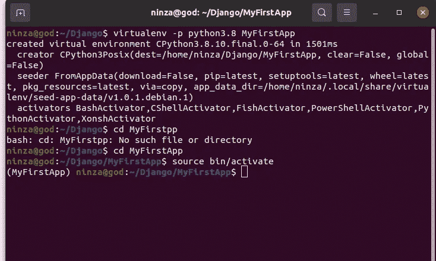
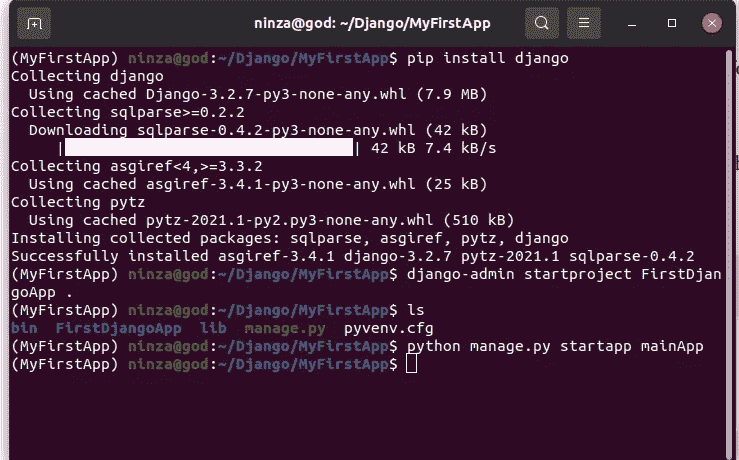
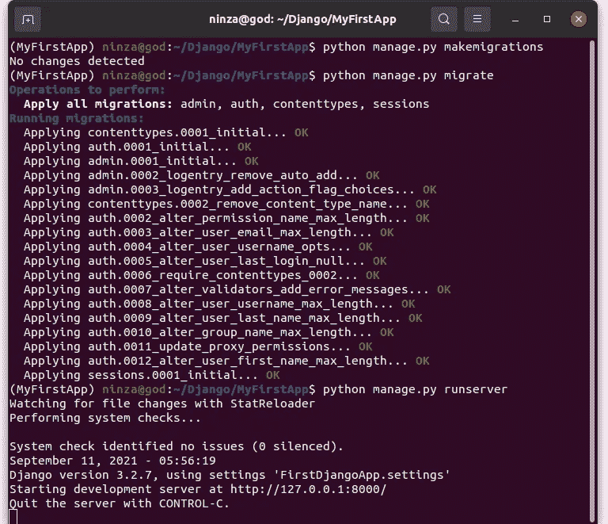
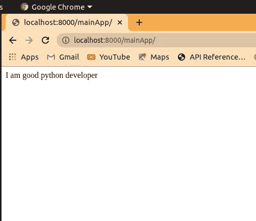

# 开始在 Python 虚拟环境中构建 Django 应用程序

> 原文：<https://medium.com/geekculture/make-your-first-web-app-with-django-python-in-a-virtual-environment-4cce2241031d?source=collection_archive---------0----------------------->

## 在虚拟环境中，在 Windows、Mac 和 Linux 上制作漂亮 Django 应用程序


Photo by [Faisal](https://unsplash.com/@faisaldada?utm_source=medium&utm_medium=referral) on [Unsplash](https://unsplash.com?utm_source=medium&utm_medium=referral)

# 姜戈是什么？

Django 是一个高级 python web 框架，用 python 编写，支持快速开发安全且可维护的网站。它遵循模型-模板-视图架构模式。默认情况下，它包含了构建网站的所有必要功能，而不是作为一个单独的库提供。

它也有大量的响应性社区支持。一旦你开始学习 Django，你就不用太担心你的错误了。

如果您正在寻找视频教程，那么它就在这里:

# Django 入门

**从虚拟环境开始**

在虚拟环境中做项目总是一个好习惯。虚拟环境就像你家里的个人房间。你可以在你的房间里做任何事情，比如唱歌、跳舞、阅读、玩游戏，但同时，它不会影响到房子其他房间里的人。更像是个人空间。

虚拟环境的工作方式类似。您可以做任何事情，比如生成项目、安装现有包的旧包等等。您的任何活动都不会影响或中断您电脑上的其他文件或项目。让我们把它安装到我们的系统中。

## Linux 操作系统

要安装虚拟环境，您必须在系统中预装 python。

打开您的终端并运行以下命令:

```
sudo apt update
sudo apt install python3-virtualenv
```

现在打开一个目录，在虚拟环境中启动项目。为此，在该目录中运行以下命令。

```
virtualenv -p python3.8 MyFirstApp
cd MyFirstApp
source bin/activate
```

类似这样的。



A virtual environment in Linux

首先，创建一个虚拟环境，并将其命名为 MyFirstApp。它将创建一个目录，然后移动到该目录。之后，使用上面给出的命令激活虚拟环境。

现在，您已经在系统中激活了虚拟环境。

## Windows 操作系统

您必须在系统中安装 Python 编程语言。现在，打开您的管理命令提示符 shell 并运行以下命令。

```
python -m pip install — upgrade pip
```

此命令将在您的 windows 操作系统中安装 pip。

```
pip install virtualenv
virtualenv MyFirstApp
MyFirstApp\scripts\activate
```

首先，我们使用 pip 安装虚拟环境。然后创造了一个虚拟环境。您可以在系统的任何地方创建它。最后，激活环境。

# 姜戈

从这里开始，您使用的所有命令和代码对于 Windows 和 Linux 操作系统都将是相同的。

打开激活的虚拟环境，使用下面的命令安装 Django。

```
pip install django
```

安装完成后，使用以下命令启动 Django 项目:

```
django-admin startproject FirstDjangoApp .
```

接下来，启动一个 app。

```
python manage.py startapp mainApp
```

在成功执行所有命令后，您的终端或命令提示符窗口将如下所示。



Django Installation

答对了。你刚刚创建了你的第一个 Django 应用。下一步是什么？让我们用一些代码来探索这些目录。

在您喜欢的文本编辑器中打开此项目。我的是 VS 代码。

**mainApp/views.py**

在该文件中，添加以下代码。

```
from django.http import HttpResponsedef index(request):
    return HttpResponse("I am good python developer")
```

这里我们基本上返回一个 HTTP 响应。

在“mainApp”目录中添加一个文件，并将其命名为 **urls.py，**在 urls.py 文件中添加以下代码行。

**mainApp/urls.py**

```
from django.urls import pathfrom . import viewsurlpatterns = [
    path('', views.index, name='index'),
]
```

在主 urls.py 文件(FirstDjangoApp)中导入此 URL

**FirstDjangoApp/urls.py**

```
from django.contrib import admin
from django.urls import path, includeurlpatterns = [
    path('admin/', admin.site.urls),
    path('mainApp/', include('mainApp.urls')),  #add
]
```

重要的一步来了。您创建了一个应用程序(mainApp)。让姜戈知道这件事。为此，在 **settings.py** 中的已安装应用程序部分添加您的新应用程序

**first djangoapp/settings . py**

```
INSTALLED_APPS = [
    'django.contrib.admin',
    'django.contrib.auth',
    'django.contrib.contenttypes',
    'django.contrib.sessions',
    'django.contrib.messages',
    'django.contrib.staticfiles',

    'mainApp' #add
]
```

我们在这里做的是创建一个应用程序。返回对消息的 HTTP 响应。为此邮件创建了 URL。毕竟我们需要一个 URL 来运行一个网站，不管这个网站是运行在 localhost 还是任何服务器上。之后，将该 URL 文件添加到主 URL 文件中，Django 在其中检测运行的 URL。最后，在已安装的应用程序部分添加了应用程序。

如果您创建了另一个新应用程序，请不要忘记将它们添加到 settings.py 中的已安装应用程序部分

拯救一切。返回终端或命令提示符窗口，运行以下命令:

```
python manage.py makemigrations
python manage.py migrate
python manange.py runserver
```



First Django App

现在打开浏览器，将给定的 URL 添加到搜索路径中。

```
[localhost:8000/mainApp/](http://localhost:8000/mainApp/)
```

按回车键。你会在屏幕上看到类似这样的东西



First Django App

祝贺..！！你刚刚创建了你的第一个 Django 应用。

如果你想制作一个基于模板的应用程序，那么你必须了解 HTML 和 CSS 的基础知识。然后，在 apps 目录(不是根目录)中创建一个 templates 文件夹。如果你想把它放在 apps 目录之外的任何地方，那么你必须在 settings.py 文件中指定模板的位置。

```
TEMPLATES = [
    {
        'BACKEND': 'django.template.backends.django.DjangoTemplates',
        'DIRS': [], **#specify the location here.**
        'APP_DIRS': True,
        'OPTIONS': {
            'context_processors': [
                'django.template.context_processors.debug',
                'django.template.context_processors.request',
                'django.contrib.auth.context_processors.auth',
                'django.contrib.messages.context_processors.messages',
            ],
        },
    },
]
```

现在你可以走了。尽可能多的制作项目，让 Django 触手可及。没有什么是容易的，你必须通过练习让事情变得容易。

我将为初学者和中间用户提供更多的 Django 项目。你必须做 follow 来保持更新。

感谢您的阅读。如果这篇文章内容丰富，那么一定要鼓掌，与你的社区分享，并关注更多。

你好，我叫 Rohit Kumar Thakur。我对自由职业者持开放态度。我构建了 **react 原生项目**，目前正在开发 **Python Django** 。随时联系我(**freelance.rohit7@gmail.com**)

*更多内容请看*[***plain English . io***](http://plainenglish.io/)