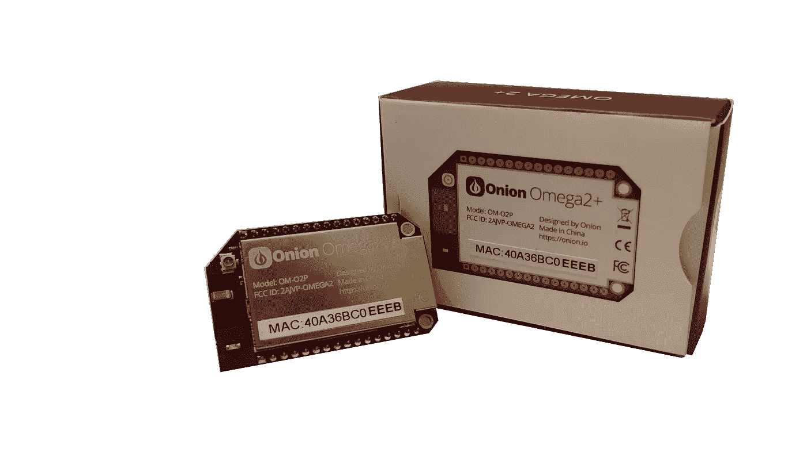

# 使用这款价格低廉、令人惊叹的 Onion Omega2+单板计算机制作您的物联网小工具:-规格、价格，在印度购买。

> 原文：<https://medium.com/geekculture/make-your-iot-gadget-with-this-low-priced-amazing-onion-omega2-56fc7c2966d8?source=collection_archive---------16----------------------->

## 洋葱 Omega2+ SBC 的完整细节

Onion Omega2+

Omega2+是最便宜的、基于 Linux 的、支持 Wi-Fi 的、基于 Linux 的单板计算机之一，用于物联网项目。它运行在 LEDE (Linux 嵌入式开发环境)Linux OS 上——一个基于 OpenWRT 的发行版。插入 Omega2+后，操作系统将立即启动，减少了启动时间。

让你自己的助手可以做你的工作，像灯和其他电器开关，在你的电脑上开始一个游戏，一个语音控制的音乐播放器等。[点击这里](https://onion.io/posts/projects/)看看你能用这个做什么类型的项目。

# **规格**

以下规格，你会得到当你购买洋葱欧米茄 2+单板电脑。

## 1.CPU :-

*   芯片组 MT7688AN
*   架构 MIPS24KEc
*   时钟速度 580MHz

## 2.记忆

*   闪存 16MB (OM-O2)或 32MB (OM-O2P)
*   DDR2 DRAM 64MB (OM-O2)或 128MB (OM-O2P)

## 3.处理器:

*   580 MHz MIPS

## 4.无线局域网（wireless fidelity 的缩写）

*   WiFi 协议 WEP 64/128、AES、WPA、WPA2、WAP
*   基带 2.4GHz
*   数据速率 150 兆比特/秒
*   通道带宽 20/40 MHz
*   操作模式 AP、STA、AP&STA
*   加密模式 IEEE 802.11 b/g/n
*   车载天线 2 dBi 定向芯片天线
*   可选外部天线的天线连接器 U.FL 连接器

## 5.接口

*   以太网 1(10 米/100 米)
*   USB 2.0 主机 1
*   SPI 1
*   I2C 1 号
*   I2S 1 号
*   UART 2
*   PWM 2
*   高达 18 个 GPIO
*   SD 1x MicroSD 插槽(仅限 OM-O2P)

## 6.电源要求

*   DC 输入 3.3V
*   空载运行电流 200±40mA
*   峰值电流要求 800 毫安

## 7.操作条件

*   环境温度-10 摄氏度~ 55 摄氏度
*   储存温度-20 摄氏度~ 80 摄氏度
*   工作湿度 10%-95%RH(非冷凝)
*   储存湿度 5%-95%RH(非冷凝)

## 8.物理规格

*   尺寸 42.9*26.4*9.9 毫米
*   封装通孔
*   引脚间距 2mm
*   总引脚数 32

# 利弊

在买它之前，你必须了解它的利弊。

## **优点**

*   微型 Linux 计算机
*   使用多种编程语言
*   易于设置。
*   它具有可扩展的功能，有几个插件板和套件可以购买。

## **缺点**

*   有限的 GPIO 引脚
*   由于引脚间距，需要扩展坞来中断 GPIO
*   船坞虽然有用，但增加了平台的成本
*   它没有迷你 HDMI 端口，这可能是一个主要缺点。

# 在印度购买

## [价格:₹1595.00](https://www.amazon.in/Onion-Omega2-Expansion-Dock-PotentialLabs/dp/B01BLX5VE4)

 [## 洋葱 Omega2 扩展坞-电位实验室

### 在亚马逊上以低价购买洋葱 Omega2 扩展坞- PotentialLabs

amzn.to](https://amzn.to/3xDfpuh)