# 用普通的 Javascript 制作你自己的 TileMap

> 原文：<https://medium.com/geekculture/make-your-own-tile-map-with-vanilla-javascript-a627de67b7d9?source=collection_archive---------2----------------------->

本文的目标是解释我用 javascript 制作 tilemaps 的过程。我将解释设计地图，然后编写一个函数在浏览器中渲染地图的过程。我将要解释的这个项目的一个实例可以在[这里](https://tjconti12.github.io/Cat-Crusader/)找到。源代码也可以在[这里](https://github.com/tjconti12/Cat-Crusader)获得。

在我的游戏猫十字军中，我知道我想建立一个 tilemap。不熟悉 tilemap 是什么？玩过超级马里奥兄弟吗？

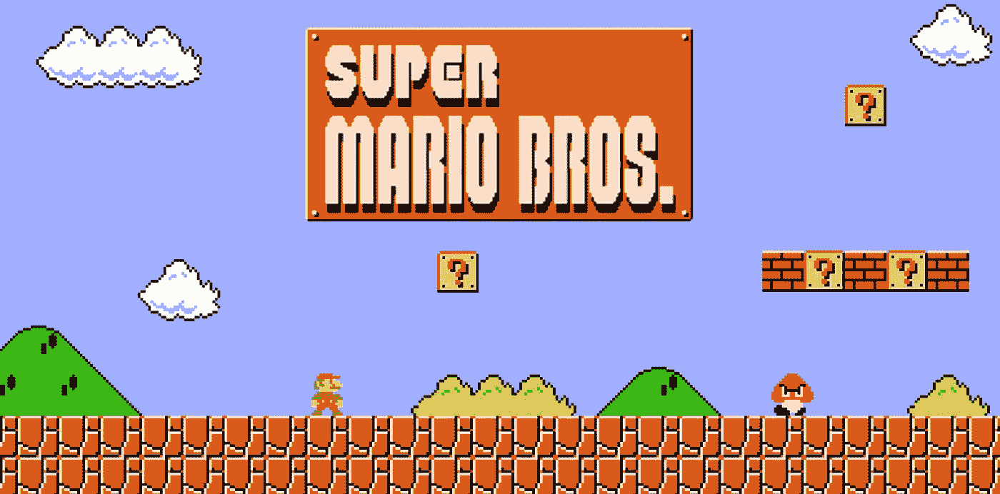

Example of a tilemap used in-game

这个老派经典是一个使用标题地图的游戏的完美例子。从本质上来说，tilemap 是可以放在一起组成游戏地图的图块集合。把它想象成做一个拼图，除了你可以重复使用碎片！Tilemaps 存储在项目中，称为 tile atlas。这实际上是一个图像，包含了您可以使用的所有可能的图块。免费磁贴地图的一个很好的资源是 [opengameart](https://opengameart.org/) 。这是猫十字军第一关使用的 tilemap。


House Level Tilemap. Map courtesy of Sharm, HughSpectrum, and LPC

变成了这样:

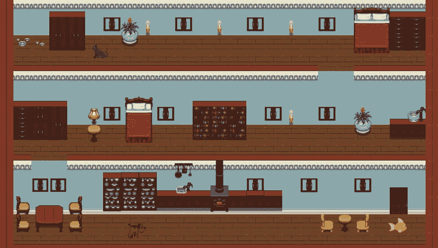

House Level in Cat Crusader

# 制作自定义地图

使用 tilemaps 可以做的事情真的令人印象深刻！我到底是如何设计这些地图的呢？有一个令人惊叹的免费开源应用程序叫做 tiled。这里可以下载[。开始的时候，学习平铺地图的曲线有点陡，但是只要花一点时间和练习，你就可以制作出一些令人惊叹的地图！打开 tiled 时，首先创建一个新的 tileset。](https://www.mapeditor.org/)


Tiled application opening page

您可以在这里上传您选择的图块图集。了解地图中每个图块的大小非常重要。大多数时候它们不是 16 就是 32 像素。如果您下载的源没有指定，请尝试 16 或 32px，看看它是否正确。您还必须选择边距和间距，但是大多数 tilesets 不需要这样做。给你的 tileset 一个名字并保存它！

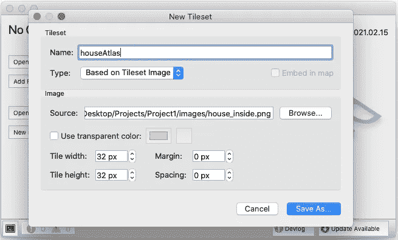

Creating new Tileset

正如您现在所看到的，tiled 突出显示了 tileset 中的每个图块。现在你可以点击创建一个新的地图开始设计！。

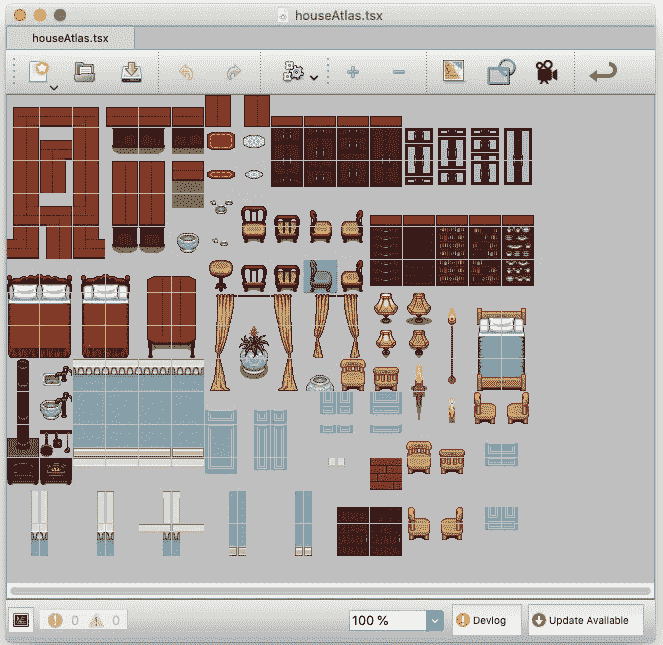

Newly Created Tileset

您需要指定地图的宽度和高度。您还需要再次以像素为单位给出图块大小。(需要代码时，您将需要这些信息)

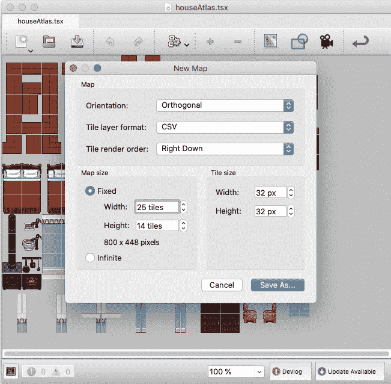

Create New Map

现在你可以抓住个别瓷砖和设计了！

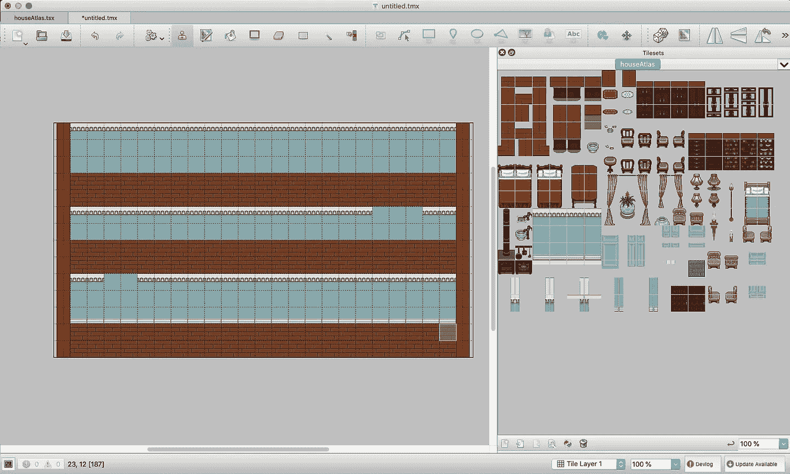

Designing the Map

平铺使我们能够添加多个图层到我们的地图。例如，如果我们想在地板瓷砖上添加一个椅子瓷砖，而不使地板消失。平铺使这个非常简单的层视图。添加多个层需要记住的唯一一点是，这会使代码更加复杂。当我们看到代码时，我会向你展示它的效果。现在 tile 能够将地图导出为 javascript 地图文件或 JSON 地图文件。我选择使用 javascript 地图文件，因为我只对静态地图感兴趣。我相信你可以使用 JSON 地图文件来创建更大的地图，随着玩家的进展来加载。

新创建的 javascript 映射文件将包含大量信息。我们只对数据数组感兴趣。这告诉我们哪块瓷砖应该放在哪个位置。例如，第一个数字是 17。这意味着地图集的第 17 个分块应该在地图上的第一个位置。保存这个数组，现在，我们将在以后的绘图函数中使用它。

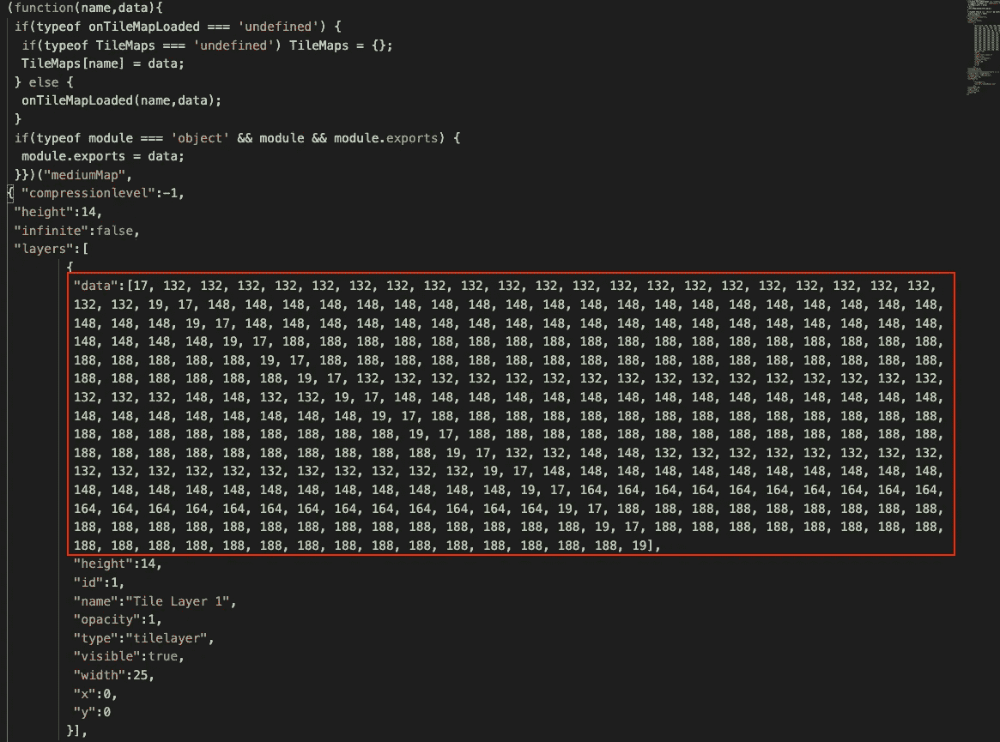

Example of the Data Array

# 用 Javascript 实现地图

现在我们有了漂亮的地图，我们需要用 javascript 写一些代码来绘制这些地图。为此，我们将使用一个名为 canvas 的 javascript 元素([这里的](https://developer.mozilla.org/en-US/docs/Web/API/Canvas_API/Tutorial)是指向文档的链接)。canvas 元素本质上允许我们将图像绘制到将由浏览器显示的画布上。这些元素可以使用普通的 CSS(或在 cat crusader 中使用的 scss)进行样式化。

```
<! -- HTML code -->
<canvas id="test-canvas"></canvas>/* CSS code */
#test-canvas {
   width: 500px;
   height: 250px;
}
```

现在我们需要编写一个函数，允许我们从 tileset 到 canvas 绘制正确的瓷砖。Canvas 使用一个名为 getContext 的函数来允许我们绘制图像、形状等。例如，在画布元素上绘制一个简单的矩形。

```
const canvas = document.getElementById('test-canvas');
const ctx = canvas.getContext('2d');// Setting the color of the rectangle
ctx.fillStyle = 'blue';// First parameter is the starting x position on the canvas
  // an x value of 0 would start drawing all the way to the left
// Second parameter is the starting y position on the canvas
  // a y value of 0 would start drawing all the way to the top
// The third and fourth parameters are for the width and height of the rectanglectx.fillRect(50, 50, 100, 100);
```

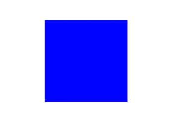

Blue Square Rendered on a Canvas

上面的代码将生成一个 100x100px 的蓝色正方形。它还将从左边 50 个像素开始绘制正方形，从顶部 50 个像素开始绘制。[这里的](https://codepen.io/tjconti12/pen/abpgVEd)是我为这个例子制作的代码笔的链接。

对于这个项目，有几种不同的方法来处理 javascript 中的图像。你可以使用`document.createElement(‘img’)`功能。然而，javascript 有一个类构造函数，使得这变得更加容易。

```
const tileAtlas = new Image();
tileAtlas.src = 'path to image';
tileAtlas.onload = drawFunction;
```

现在来说说我们刚刚做了什么。我们使用 javascript 中的`new Image()`来创建一个新的图像元素。然后，我们将其源设置为图块地图集的路径(不是我们创建的实际地图，只是包含所有图块的地图集)。一旦图像被加载到 javascript 中，我们就可以使用`.onload`方法来调用我们的 draw 函数。

一旦我们加载了图块图集，我们需要设置一些变量。这不是必需的，但是，这将使代码更容易编辑和重用不同大小的级别和不同的图块地图集像素大小(记住前面的示例使用 32 像素大小的图块)。首先，我们将为单个图块大小、期望的图块输出大小(稍后将详细介绍)和新更新的图块大小声明一个变量。

```
let tileSize = 32;
let tileOutputSize = 1.5 // can set to 1 for 32px or higher
let updatedTileSize = tileSize * tileOutputSize;
```

我们将在我们的 draw 函数中使用这些变量，所以将来很容易在不同的级别重用该函数。我决定使用`tileOutputSize`变量，因为这允许我轻松地放大或缩小地图的尺寸，以确保它适合画布。

现在我们需要为图块图集设置更多的变量。每个图块图集将具有不同数量的图块行和列。例如，房屋级别的图块地图集包含 16 列和 14 行图块。

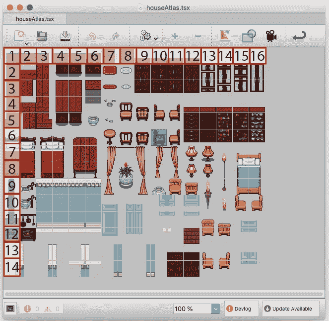

Tile Atlas Rows and Columns Highlighted

地图本身有 25 列和 14 行。让我们继续为地图集和地图创建变量。

```
let atlasCol = 16;
let atlasRow = 14;let mapCols = 25;
let mapRows = 14;
let mapHeight = mapRows * tileSize;
let mapWidth = mapCols * tileSize
```

让我们也加入先前保存的数据数组。我把它重新命名为有意义的东西(例如。level1Map)。

```
let level1Map = [
17, 132, 132, 132, 132, 132, 132, 132, 132, 132, 132, 132, 132,  132, 132, 132, 132, 132, 132, 132, 132, 132, 132, 132, 19, 17, 148, 148, 148, 148, 148, 148, 148, 148, 148, 148, 148, 148, 148, 148, 148, 148, 148, 148, 148, 148, 148, 148, 148, 19, 17, 148, 148, 148, 148, 148, 148, 148, 148, 148, 148, 148, 148, 148, 148, 148, 148, 148, 148, 148, 148, 148, 148, 148, 19, 17, 188, 188, 188, 188, 188, 188, 188, 188, 188, 188, 188, 188, 188, 188, 188, 188, 188, 188, 188, 188, 188, 188, 188, 19, 17, 188, 188, 188, 188, 188, 188, 188, 188, 188, 188, 188, 188, 188, 188, 188, 188, 188, 188, 188, 188, 188, 188, 188, 19, 17, 132, 132, 132, 132, 132, 132, 132, 132, 132, 132, 132, 132, 132, 132, 132, 132, 132, 132, 132, 148, 148, 132, 132, 19, 17, 148, 148, 148, 148, 148, 148, 148, 148, 148, 148, 148, 148, 148, 148, 148, 148, 148, 148, 148, 148, 148, 148, 148, 19, 17, 188, 188, 188, 188, 188, 188, 188, 188, 188, 188, 188, 188, 188, 188, 188, 188, 188, 188, 188, 188, 188, 188, 188, 19, 17, 188, 188, 188, 188, 188, 188, 188, 188, 188, 188, 188, 188, 188, 188, 188, 188, 188, 188, 188, 188, 188, 188, 188, 19, 17, 132, 132, 148, 148, 132, 132, 132, 132, 132, 132, 132, 132, 132, 132, 132, 132, 132, 132, 132, 132, 132, 132, 132, 19, 17, 148, 148, 148, 148, 148, 148, 148, 148, 148, 148, 148, 148, 148, 148, 148, 148, 148, 148, 148, 148, 148, 148, 148, 19, 17, 164, 164, 164, 164, 164, 164, 164, 164, 164, 164, 164, 164, 164, 164, 164, 164, 164, 164, 164, 164, 164, 164, 164, 19, 17, 188, 188, 188, 188, 188, 188, 188, 188, 188, 188, 188, 188, 188, 188, 188, 188, 188, 188, 188, 188, 188, 188, 188, 19, 17, 188, 188, 188, 188, 188, 188, 188, 188, 188, 188, 188, 188, 188, 188, 188, 188, 188, 188, 188, 188, 188, 188, 188, 19]
```

现在该写 draw 函数了。本质上，我们的目标是从 x 位置 0 和 y 位置 0 开始渲染地图。

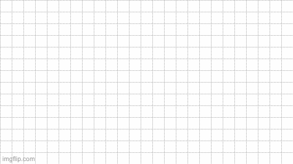

How the Tiles are rendered onto the Canvas

为此，我们将编写一个嵌套的 for 循环。我们希望遍历地图中每一列的每一行。该函数还需要三个变量，我们将在循环之前声明它们。这是完整的绘图功能。每个部分的详细解释将在后面。

```
let mapIndex = 0;
let sourceX = 0;
let sourceY = 0;function draw() { for (let col = 0; col < mapHeight; col += tileSize) {
      for (let row = 0; row < mapWidth; row += tileSize) {
         let tileVal = level1Map[mapIndex];
         if(tileVal !=0) {
            tileVal -= 1;
            sourceY = Math.floor(tileVal/atlasCol) * tileSize;
            sourceX = (tileVal % atlasCol) * tileSize;
            ctx.drawImage(tileAtlas, sourceX, sourceY, tileSize,
            tileSize, row * tileOutputSize, col * tileOutputSize,
            updatedTileSize, updatedTileSize);
         }
         mapIndex ++;
      }
   }
}
```

第一个变量 mapIndex 表示在`level1Map`数组中的位置。这将从 0 开始，并在每次内循环运行时递增。这将评估`level1Map`数组中的每个值。接下来的两个变量是 X 和 Y 源。`ctx.drawImage()`需要准确地知道沿着`tileAtlas`的 X 轴和 Y 轴有多少像素开始切割。我们只是在这里初始化值。

每次内部 for 循环运行时，它将表示地图上要绘制的位置。例如，嵌套的`for`循环第一次运行时，我们试图绘制地图左上角的方块。


First Square Highlighted

该函数将首先确定`level1Map`数组中的值。

```
let tileVal = level1Map[mapindex];
// tileVal would be equal to 17 the first time the loop runs
```

接下来，我们添加一些逻辑，以防平铺值为 0。(如果使用多个层，会出现这种情况，因为不是每个层都有与每个单幅图块相关联的值。然而，它不适用于这个例子)如果值是 0，则对于特定的正方形，不在画布上绘制任何东西，并且循环重复。如果该值不为 0，我们需要从`tileAtlas`中确定要切割的 X 和 Y 源。对于此示例，第一个值是 17，它是指图块图集第二行上的第一个图块。

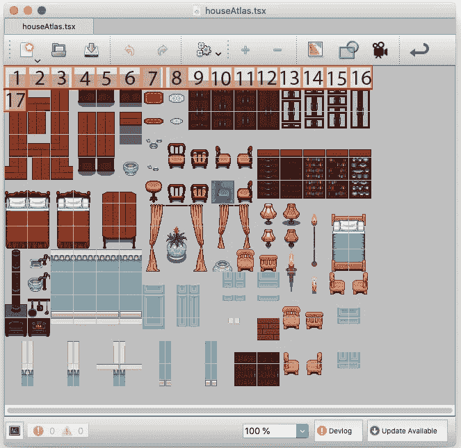

Tile Atlas Highlighted Showing the Position of the 17th Square

我们用来创建地图的平铺软件从 1 开始计数。所以`level1Map`数组中的每个值实际上相差 1。要纠正这个错误，在 if 语句中，从`tileVal`中减去 1。

```
tileVal -= 1;
```

我们需要告诉`ctx.drawImage()`函数在 X 位置 0 和 Y 位置 32px 开始切割。(图集中每个图块为 32px)对于源自图集第一行的任何图块，其`sourceY`应等于 0。如果它来自第二行，那么它的`sourceY`应该等于 32，依此类推。在本例中，第一行是 0-15 之间的任何值。要确定图块是否位于第一行，请将图块值除以图块图集的列数。如果数字小于 1，那么它从 0 的 Y 位置开始。如果数字大于 1 但小于 2，则它从 32 的 Y 位置开始。

```
sourceY = Math.floor(tileVal/atlasCol) * tileSize;// For a tile originating in the first row of the atlas
sourceY = Math.floor(1/16) * 32; which will equal 0// For the first tile of this example
// sourceY = Math.floor(16/16) * 32; which will equal 32
```

对于 X 位置，我们可以使用 javascript 模数运算符`%`。对于源自图集的第一列的任何图块，其`sourceX`应该等于 0。对于第二列，应该是 32，以此类推。在这个例子中，图集有 16 列。我们想数一下我们离左边有多少列。

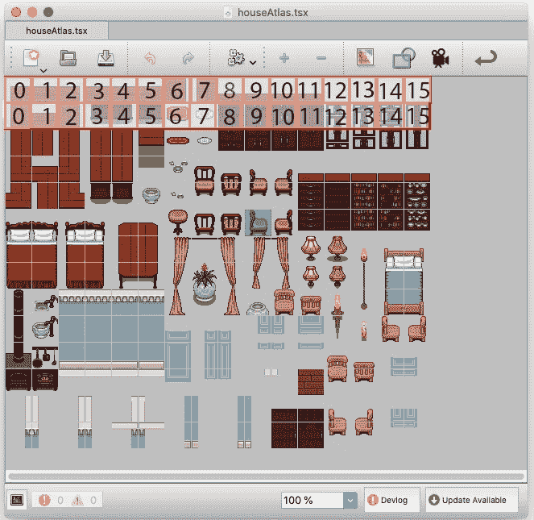

Tile Atlas Highlighted showing the First Two Rows

```
sourceX = tileVal * tileSize;
```

0 到 15 之间的任何值都很好。然而，任何超过 15 的都会引起问题。如果该值大于 15，我们需要将它重置回 0。这就是模数运算符的用武之地。

```
sourceX = (tileVal % atlasCol) * tileSize;// Our first map tile has the value of 16
// sourceX = (16 % 16) * 32; which would equal 0// For a tile in the second row and second column
// sourceX = (17 % 16) * 32; which would equal 32
```

既然我们已经知道从哪里开始从图集上切割瓷砖，我们需要将这些信息导入到`cts.drawImage()`函数中。这个函数接受 9 个参数。

1.  地图集的来源。对图像的引用。在示例中，我们称之为`tileAtlas`。
2.  `sx`:我们应该从 X 轴上的多少像素开始切割。这将是变量`sourceX`。
3.  `sy`:我们应该从 Y 轴上的多少像素开始切割。这将是变量`sourceY`。
4.  `sWidth`:源宽度。要在 X 轴上剪切多少像素。这应该就是`tileSize`了。
5.  `sHeight`:源高度。Y 轴上要剪切多少像素。这应该也是`tileSize`。
6.  `dx`:目的画布 X 坐标。这是目标画布中应该绘制图块左上角的位置。
7.  `dy`:目标画布 Y 坐标。这是目标画布中应该绘制图块左上角的位置。
8.  `dWidth`:要在目标画布上绘制的图块的宽度。
9.  `dHeight`:要在目标画布上绘制的图块的高度。


Canvas draw function example. Source [MDN Docs](https://developer.mozilla.org/en-US/docs/Web/API/CanvasRenderingContext2D/drawImage)

```
ctx.drawImage(tileAtlas, sourceX, sourceY, tileSize, tileSize, row * tileOutputSize, col * tileOutputSize, updatedTileSize, updatedTileSize);
```

# 分层

现在你有一个完整的函数来绘制 tilemaps 了！只需改变几个变量，就可以很容易地对不同的地图重复这个函数。如果要向地图添加多个图层，切片也允许您这样做。

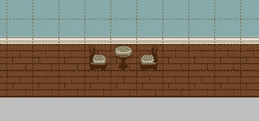

Example of Layering. The chair and table tiles are on top of the floor tiles.

当您将地图导出为 javascript 地图文件时，您将为创建的每个图层获得一个数据数组。

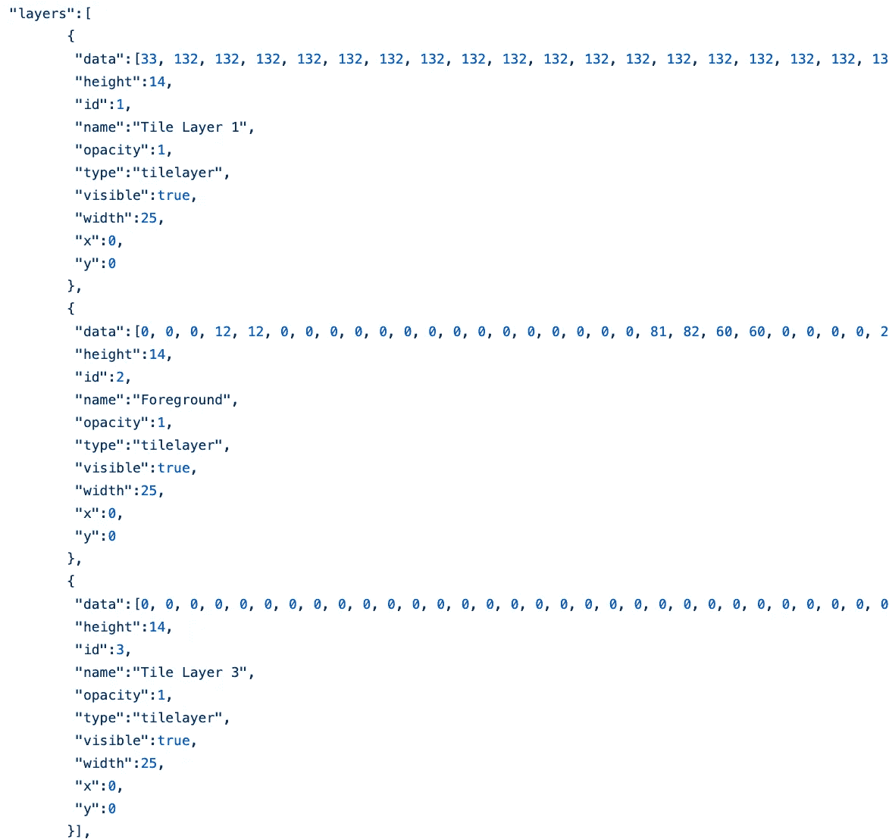

The data arrays of three different layers. This one is from the Cat Crusader level 1

您所要做的就是为您想要创建的每个层创建一个画布元素。对每一层重复该功能，并绘制到该层对应的`ctx`元素。

# 结论

我希望这个快速教程是有帮助的。如果你想知道这是如何在游戏中实现的，一定要看看源代码。敬请关注未来关于猫十字军发展的帖子！我打算写一写我是如何为碰撞、重力和摩擦创建游戏引擎逻辑的！大声喊出[坑爹编程](https://www.youtube.com/channel/UCdS3ojA8RL8t1r18Gj1cl6w)的教程视频，帮助这个游戏成为现实。