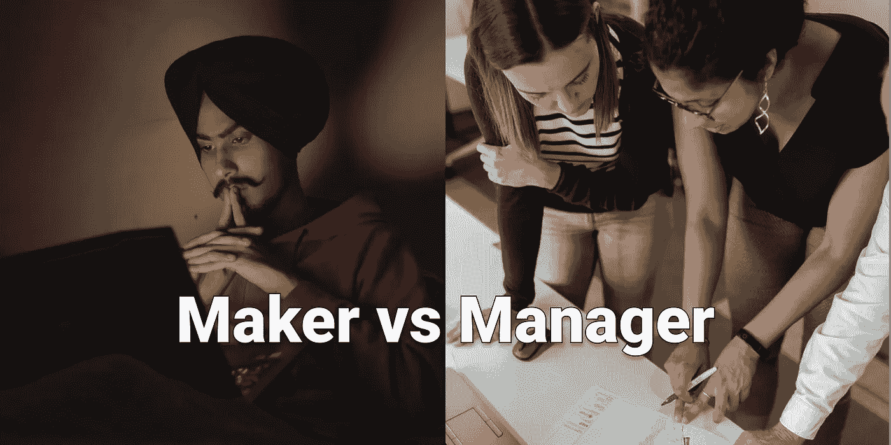

# 如果你是一个软件开发人员,“制造者和管理者的时间表”是必不可少的读物

> 原文：<https://medium.com/geekculture/maker-vs-manager-schedule-is-essential-reading-if-youre-a-software-developer-afc880dec2a4?source=collection_archive---------4----------------------->

会议会破坏你的工作效率。如果你是一个构建复杂应用程序的开发者，你应该遵循 Maker 的时间表。

# 我的大问题是

作为一名软件开发人员，我讨厌开会。如果你做过开发人员，你可能会理解。