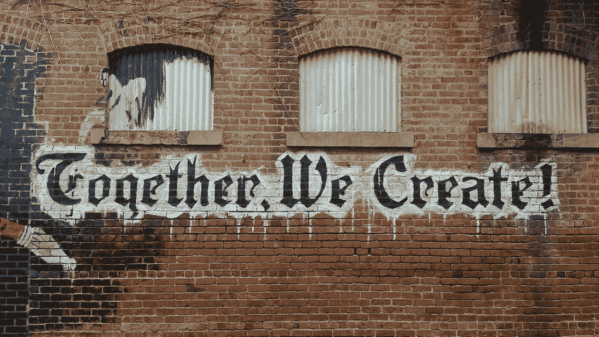

# 制造商学徒——第 11 周

> 原文：<https://medium.com/geekculture/makers-apprenticeship-week-11-648145cb8197?source=collection_archive---------28----------------------->

我在创客训练营的第十一周也是倒数第二周

Photo by [“My Life Through A Lens”](https://unsplash.com/@bamagal?utm_source=unsplash&utm_medium=referral&utm_content=creditCopyText) on [Unsplash](https://unsplash.com/s/photos/collaboration?utm_source=unsplash&utm_medium=referral&utm_content=creditCopyText)

正如在上周的博客中提到的，我们将在训练营的最后两周进行一个基于团队提出的想法的小组项目。该小组提出了各种各样的伟大想法，涵盖几个类别，包括游戏，机器学习和助手程序，如 VS 代码和 Chrome 扩展。我们被要求提出我们的第一、第二和第三选择，并由我们的制造商教练相应地进行分组。我的第一选择是一个游戏程序，但更确切地说是一个文本冒险游戏，比如这个游戏或者一个帮助年轻人学习英语和数学的游戏。我的第二个选择是一个电影评论网络应用程序(有点像[信箱](https://letterboxd.com/))，个人可以注册评论电影，并与其他用户分享他们的评论。我得到了第二个选择(大概是因为对我喜欢的游戏选择没有足够的兴趣)，并再次非常幸运地被安排在一群可爱的人当中，其中包括我未来的苹果同事之一，我在训练营期间与他变得很亲密。我也喜欢看电影，所以我很高兴有机会在这个应用程序上工作。

我们在周一早上晚些时候开始计划，并在当天余下的时间里继续我们的计划。我们以一块 Trello 板开始，在那里我们列出了项目的学习目标，并讨论了如何实现这些目标。我的目标是:

*   提高我为使用 RESTful 服务的程序编写测试的能力；
*   大致了解 Spring Security 如何登录/捕获用户数据；和
*   以敏捷的方式在团队中工作，结合诸如冲刺计划、积压工作、站立和追溯等方法。

最后一个目标的进展非常顺利，但是本周前两个目标需要一些关注！我们有点调皮，还没有写任何测试，我还没有机会处理涉及登录的票证。希望我能在下周的博客中告诉你，我满足了这个项目的所有学习目标。

我们还讨论了我们希望如何作为一个团队工作，我们的应用程序的 MVP 是什么(我们需要在周四之前实现)，以及我们的应用程序的名称加上非常重要的团队名称决定！在处理了这些初步事项(包括起草一周的时间表)后，我们更深入地规划了实际的程序，包括起草一些对象模型图来显示我们应用程序中不同的对象如何相互作用，以及线框图来展示应用程序的实际外观。我不得不在周一下午比平时早一点离开，所以在我离开后，团队继续在我们的特雷罗板上写下潜在的门票。

周二上午，我们使用 [Spring Initializr](https://start.spring.io/) 设置了我们的项目，并选择了所需的依赖项，包括用于注册和登录的 Spring Security、用于在 Spring 和 JUnit 中创建和集成 HTML 和 CSS 的 Thymeleaf 以及用于测试的 JUnit。我们还使用 GitHub 项目制作了整个 web 应用程序的所有标签，并决定我们需要将哪些标签带入 sprint 以满足 MVP。在做了所有的计划后，我们准备在周二下午开始编码！

Photo by [Afif Kusuma](https://unsplash.com/@javaistan?utm_source=unsplash&utm_medium=referral&utm_content=creditCopyText) on [Unsplash](https://unsplash.com/s/photos/lets-go?utm_source=unsplash&utm_medium=referral&utm_content=creditCopyText)

我一开始是专注于做首页的前端设计，这绝对不是我的一个爱好！然而，我们现在有了一个非常酷的首页，上面有我们的应用程序徽标，其中包括一个可滚动的当前票房电影的图片列表。我们还决定，我们需要使用第三方 API 来查询电影，因为为了让用户查看电影，他们需要按标题搜索，并显示一个潜在匹配的列表。让我们自己的数据库拥有这些信息并不实际，所以我们已经注册了 [themoviedb](https://www.themoviedb.org/) ，它有一个我们可以用来查询电影的 API。这意味着当用户搜索一部电影时，会对 moviedb 的 API 进行查询，该 API 会返回一个匹配结果的列表，然后我们可以用它来显示在页面上。

弄清楚如何在我们的应用程序中查询 API 当然是一个挑战，但我们设法在周三下午解决了这个问题，这很好。团队中的其他人也解决了注册新用户的问题，我们一直在使用 Spring Security，以便作为现有用户登录应用程序，包括进行必要的身份验证检查。这一部分被证明是相当具有挑战性的，但我毫不怀疑我们将很快实现这一目标。

团队中的每个人都非常专注于开发这款应用，我们一直工作到深夜，周末我还和团队中的另一个人一起花了一些时间开发一个新页面，用户可以用它来添加对某部电影的评论；这个想法是，一旦用户添加了评论，它将出现在该用户的仪表板上。

这些想法和应用程序的功能可能看起来很简单，但是，当我们同时做前端和后端时，在短时间内要完成很多工作，而且所有团队成员都只有两周的使用 Spring Boot 的经验。最重要的是，我们中的一些人只做了 4 周的 Java，这根本算不上什么时间。因此，我真的为我们迄今为止所取得的成就感到骄傲，我相信我们的辛勤工作将在下周五的演示会上展示这款应用程序时得到回报。考虑演示文稿有点伤脑筋，因为它不仅要向我们的同学演示，还要向我们的雇主以及我们邀请的任何家人/朋友演示。因此，呈现一个高度完美的项目确实让人感觉压力很大。我们不能忘记我们的学习之旅有多重要，我认为目前，团队在专注于制作一个像样的程序，而不是以学习新东西为代价方面取得了很好的平衡。

除此之外，苹果工作人员还在周三上午举行 Python 研讨会，同时进行小组项目，所以我真的很期待在 11 月 29 日开始放置之前，下周末有一些时间让我的大脑放松一下！

因此，在我的最后一周，我将继续小组项目的进展，并在下周五与我的团队一起展示成品。我会在下周的博客中让你知道这是关于训练营的最终想法。