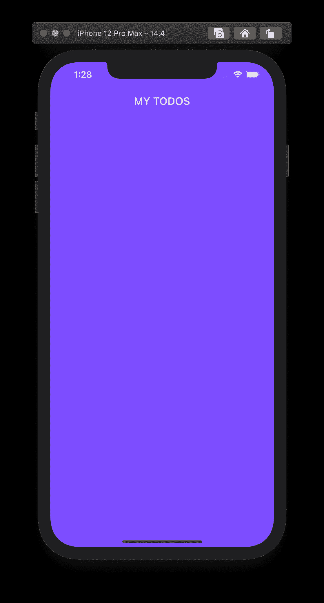
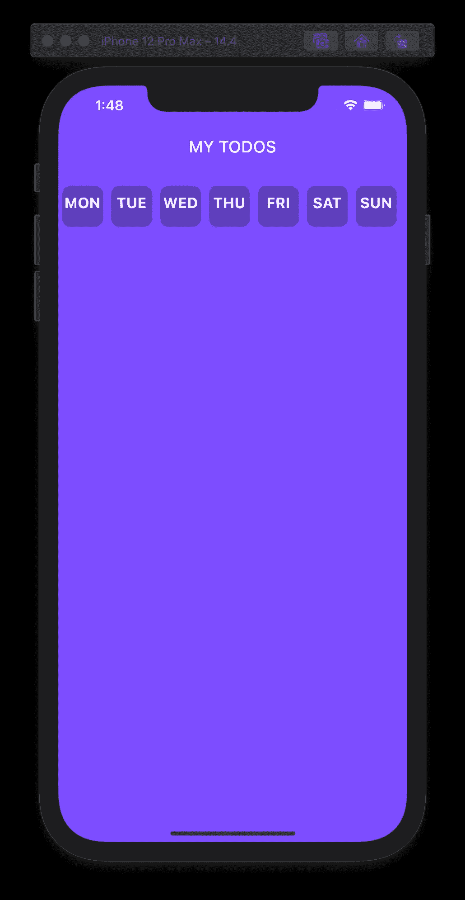
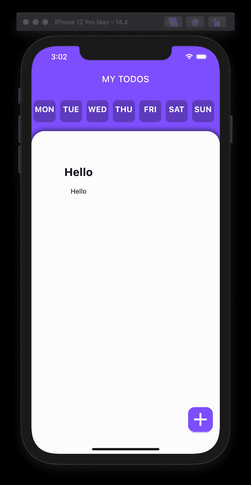
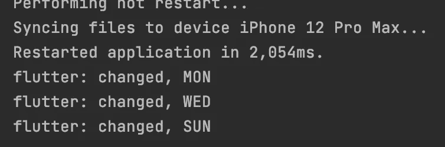
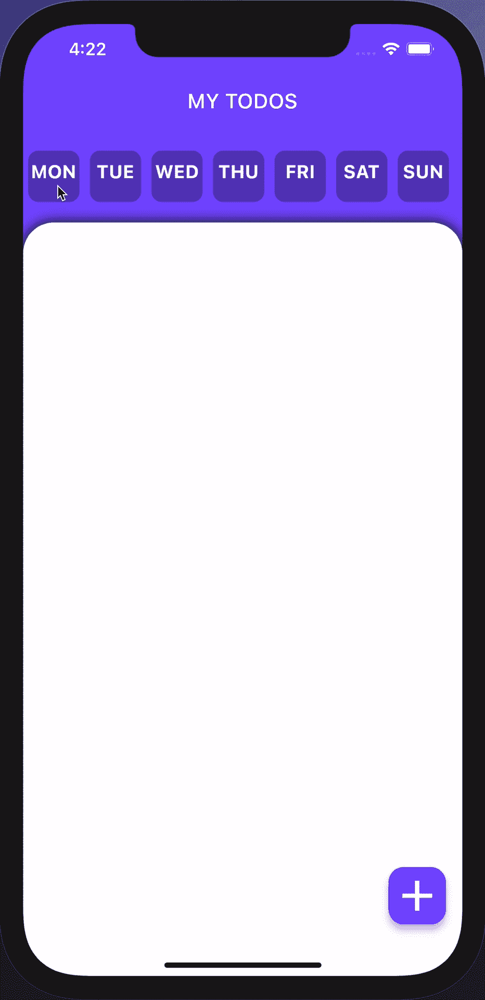
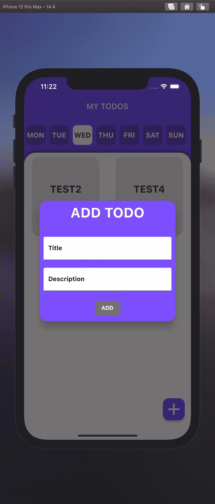
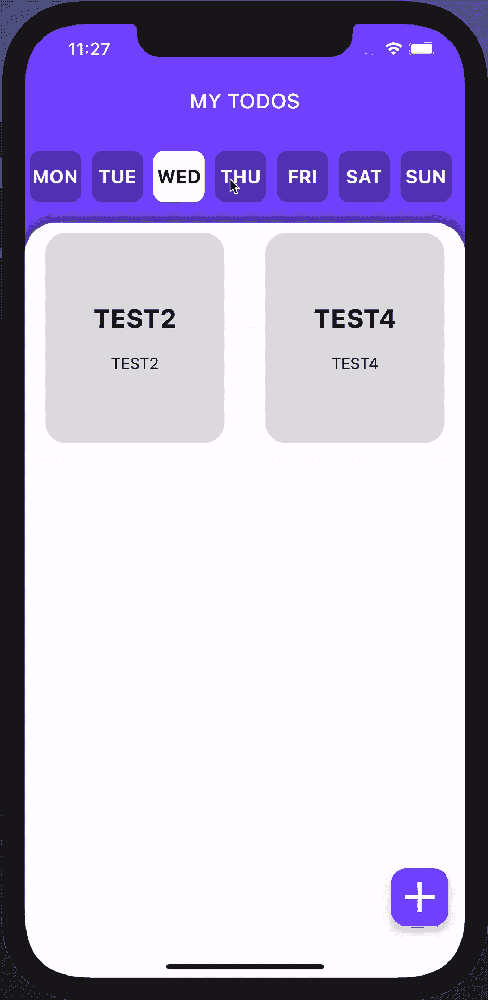

# 使用 Flutter 制作一个基本的周计划应用程序

> 原文：<https://medium.com/geekculture/making-a-basic-weekly-planner-app-using-flutter-d1b06ed97e47?source=collection_archive---------3----------------------->


Photo by [JESHOOTS.COM](https://unsplash.com/@jeshoots?utm_source=medium&utm_medium=referral) on [Unsplash](https://unsplash.com?utm_source=medium&utm_medium=referral)

嘿大家好！很久没有在 Flutter 上写博客了。所以这一次，我将展示我如何制作一个简单的周计划应用程序。我将展示如何用基本功能制作一个非常基本的版本。你可以随心所欲地改进你的应用程序！

# 它将如何工作？

用户将能够选择一周中的某一天，以及带有标题和描述的待办事项。

# 我们开始吧

我将使用 Android Studio 作为我的编辑器，我将使用 iOS 模拟器。我将创建一个新的 Flutter 项目，并删除默认的 starter 项目。我还将删除测试文件夹。在我的 lib 文件夹中，我将创建两个文件夹:`custom_widgets`和`pages`。在`pages`内部，让我们创建一个文件夹来存放我们的 home widget，`home.dart`。让我们从在`main.dart`写这段代码开始:

在我们的`home.dart`中，让我们添加这段代码，构建一个基本的脚手架并运行我们的应用程序:

结果:



让我们添加一个日列表，其中包含一周中每一天的项目。为此，我们将使用 ListView.builder 和一个简单的列表<string>来存储一周中各天的日程安排。在`custom_widgets`文件夹中，我们添加一个名为`horizontal_day_list.dart`的 dart 文件。在该文件中，让我们制作一个名为`HorizontalDateList`的有状态小部件:</string>

我想改变点击时的卡片颜色，这就是为什么我做了一个列表<list>>。第一种颜色是容器的颜色，第二种颜色是文本的颜色。我们将在稍后添加更改卡片和文本颜色的功能。</list>

让我们在`home.dart`中导入文件，并将主体中的容器改为列。我们将添加两个小部件:

结果:



让我们在列表下面添加一个容器，在那里我们所有的待办事项都将被显示。因此，整个`home.dart`页面应该是这样的:

注意在正确的位置添加`const`修饰符(我会在更新代码时改变它们的位置)。这会给我们这样的东西:


让我们添加一个浮动操作按钮来添加待办事项。我们可以将按钮修改为圆角矩形，颜色与背景相同，并带有一个大的添加图标:


现在让我们定义一个小部件，它将在网格视图中显示我们创建的所有待办事项。在`custom_widget`文件夹中，我们创建一个名为`todo_tile.dart`的文件，该文件将包含我们的待办事项的标题和描述。我将使用一个添加了一些装饰的简单容器来完成此操作，并制作磁贴，以便它需要一个标题和描述:

在`home.dart`中，让我们制作一个列表< List < String > >来保存每个 todo_tile 的标题和描述。我们将把这个列表传递给 TodoGridView 小部件，以显示所有的待办事项:

```
List<List<String>> todoInformation = [];
```

在`custom_widget`文件夹中，我们创建一个名为`todo_grid_view.dart`的文件。这将使瓷砖保持在网格中:

在`home.dart`中，让我们定义容器的子属性:

```
child: TodoGridView(todoList: todoInformation),
```

要测试这是否有效，请在 todoInformation 列表中添加一个虚拟 todo:

```
List<List<String>> todoInformation = [
  ["Hello", "Hello"]
];
```

按下热重启后，应该可以看到:



现在，让我们实现在顶部按下工作日时更改星期几的功能。为了表示哪一天是活动的，我们将更改列表视图对象的配色方案，然后打印被单击的那一天。我们还将改变一个变量`weekday`，我们将在`home.dart`中定义:

```
String weekday = "MON";

void changeWeekday(String newDay) {
  setState(() {
    weekday = newDay;
  });
  print("changed, $weekday");
}
```

我们将添加一个函数，因为我们将使用 HorizontalDayList 检测点击，但我们希望更新变量 globaly。还有其他方法可以做到这一点，但我只是选择了这种方法。在`horizontal_day_list.dart`中，让我们添加代码来改变日期的颜色。我们可以通过将列表视图中的容器小部件包装在一个 GestureDetector 小部件中，然后指定 onTap:

这将首先设置所有卡的颜色为未选中，然后使点击的卡被选中。同样，可能有更有效的方法来做到这一点，但这是我如何做到这一点。小部件应该接受我们之前定义的 changeWeekday 函数并运行它。就这么办吧。首先，我们将在构造函数中添加函数:

```
final Function dayUpdateFunction;

const HorizontalDayList({Key? key, required this.dayUpdateFunction}) : super(key: key);
```

现在，让我们在 onTap 中的 setState 之后运行该函数:

```
widget.dayUpdateFunction(weekdays[index]);
```

在执行热重启并几次单击日期后，控制台中应该会显示以下内容:



让我们先做一些虚拟的 todos。这里有几个。使用这些更新`todoInformation`:

```
List<String> todoInformation = [
  "MON,TEST1,TEST1",
  "WED,TEST2,TEST2",
  "SUN,TEST3,TEST3",
  "WED,TEST4,TEST4",
  "FRI,TEST5,TEST5",
  "THU,TEST6,TEST6",
  "MON,TEST7,TEST7",
];
```

这里可能会出现错误，但那是因为您更改了列表数据类型，并且没有在网格视图小部件中修改。只需将构造函数中列表的数据类型改为 List <string>，并使用 split 函数访问标题和描述。只需在 itemBuilder 中返回:</string>

```
TodoTile(title: widget.todoList[index].split(",")[1], description: widget.todoList[index].split(",")[2])
```

现在，所有这些小部件都应该出现了。但是让它们只在某一天出现。让我们制作一个存储所选日期的待办事项的列表，并定义一个更新该列表的函数:

```
void updateList() {
  dayDependentTodos.clear();
  for (int i = 0; i < todoInformation.length; i++) {
    if (todoInformation[i].split(",")[0] == weekday) {
      dayDependentTodos.add(todoInformation[i]);
    }
  }
}
```

在 changeWeekday 函数中，让我们在 print 语句后添加该函数:

```
void changeWeekday(String newDay) {
  setState(() {
    weekday = newDay;
  });
  print("changed, $weekday");

  updateList();
}
```

在`home.dart`中，让我们将传递给网格视图的列表从 todoInformation 更改为 dayDependentTodos。并运行热重启。



首先，让我们在打开应用程序后，自动选择星期几。为此，打开`horizontal_day_list.dart`文件，让我们添加一个 init 函数:

```
@override
void initState() {
  super.initState();
  SchedulerBinding.*instance*!.addPostFrameCallback((_) {
    date = DateTime.now();
    widget.dayUpdateFunction(weekdays[date.weekday - 1]);
    updateDayColor(date.weekday - 1);
  });
}
```

这将运行 build 函数，然后获取一周中某一天的索引号，并对其进行赋值。我已将手势检测器中 onTap 的代码更新为:

```
onTap: () {
  updateDayColor(index);
  widget.dayUpdateFunction(weekdays[index]);
},
```

其中`updateDayColor`函数是这样的:

```
void updateDayColor(int index) {
  setState(() {
    for (int i = 0; i < cardColorList.length; i++) {
      cardColorList[i][0] = inactiveCardColor;
      cardColorList[i][1] = inactiveTextColor;
    }

    cardColorList[index][0] = activeCardColor;
    cardColorList[index][1] = activeTextColor;
  });
}
```

在定义 init 函数之前，我还添加了`late DateTime day;`。

现在，让我们通过单击浮动操作按钮来添加另一个 todo 的机制。在`home.dart`中，我添加了两个这样的文本编辑控制器:

```
TextEditingController titleController = TextEditingController();
TextEditingController descriptionController =
                                            TextEditingController();
```

我还创建了一个函数，在输入无效的情况下显示 snackbar:

```
void showInSnackBar(String value) {
  ScaffoldMessenger.*of*(context).showSnackBar(
      SnackBar(
          content: Text(
            value,
            style: const TextStyle(
                fontWeight: FontWeight.*bold*,
                fontSize: 20,
                color: Colors.*redAccent*),
          )
      )
  );
}
```

在 FloatingActionButton 的 onPressed 参数中，让我们添加添加对话框的函数:

```
showDialog(
  context: context,
  builder: (context) {
    return TodoInformationPopup(titleController: titleController,
                  descriptionController: descriptionController,);
  }
)
```

稍后我们将定义 TodoInformationPopup。因为我们在`home.dart`中，所以让我们添加代码来定义退出对话框后会发生什么:

代码应该是不言自明的。我们在主列表中添加 todo，然后运行`updateList()`来更新 dayDependantTodo 列表。之后，我们清除两个控制器。现在在`custom_widgets`中制作一个名为`todo_information_popup.dart`的 dart 文件。这将返回一个对话框小部件，如下所示:

如您所见，它将两个控制器作为输入。你可以随心所欲地定制它。我会这样做:



我将发布代码，但是正如我在开始时所说的，您可以随意使用它:

点击对话框之外的任何地方应该会退出，你会得到一个提示无效输入的提示条。这是最终的应用程序:



# 结论

这篇博客就写到这里吧！您可以继续使用该应用程序，并将待办事项存储在手机的文档文件夹中的一个文件中，这样您就可以随时访问它们。我将链接 github repo，我在这里包含了代码，所以你可能想看看。

如果你喜欢这篇文章，请按几次拍手按钮。我写关于编程和空间的文章，所以如果你感兴趣，可以看看我的其他文章。

感谢阅读！