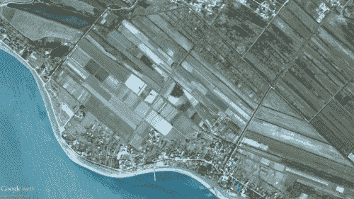

# 在 Jupyter 笔记本中制作前/后图像滑块

> 原文：<https://medium.com/geekculture/making-a-before-after-image-slider-in-jupyter-notebook-b88723924a35?source=collection_archive---------6----------------------->

> 如果您使用 Python 进行图像处理，这个实用程序非常方便，可以快速检查图像更改前后的情况。

Image source : Google earth

最近，我在[https://juxtapose.knightlab.com](https://juxtapose.knightlab.com/)的基础上偶然发现了这个分裂视图的有用工具——
[【https://github.com/kolibril13/jupyter-splitview】](https://github.com/kolibril13/jupyter-splitview)