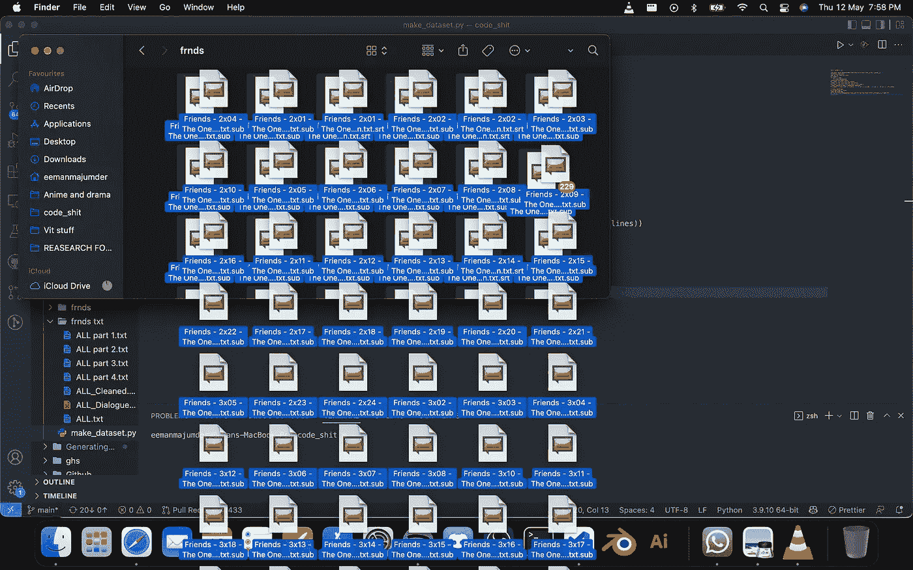
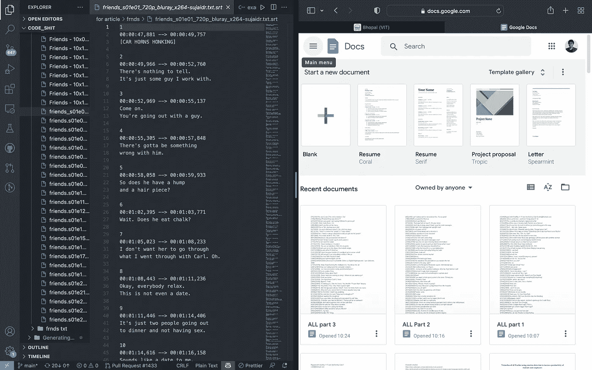
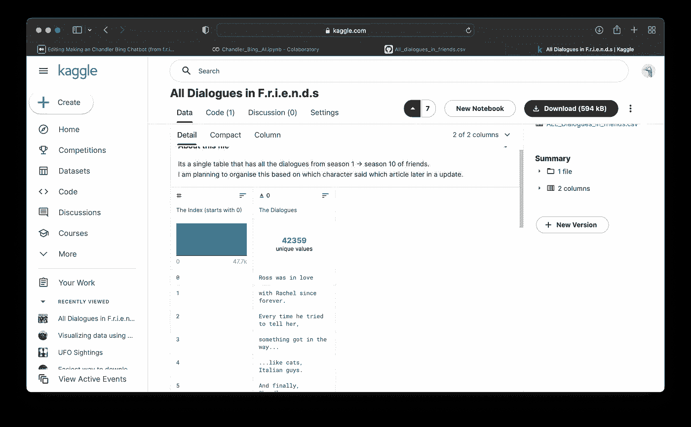

# 深度学习钱德勒·宾·艾(来自美国国防科学研究院)第一部分

> 原文：<https://medium.com/geekculture/making-a-chandler-bing-chatbot-from-f-r-i-e-n-d-s-part-1-5cd2af606ffe?source=collection_archive---------10----------------------->

Image generated by author

我是 f.r.i.e.n.d.s 的粉丝钱德勒和乔伊是我最喜欢的角色。钱德勒有时超级讽刺，但同时也能安慰人。乔伊精力无限，乐在其中。老实说，一旦我完成了这个系列。我真的觉得我非常想念这些角色。所以，我以前有过这样的想法“如果我做一个钱德勒·宾聊天机器人会怎么样”,但那时我既没有时间也没有知识去做它。所以，现在我既有时间又有知识，我想让我们做这个，我们在这里。

**所以为了制作这个，我们需要做很多东西:**

*   制作一个包含所有朋友对话的数据集。
*   做一个 NLP 模型。
*   在数据集上训练 NLP 模型。
*   优化 NLP 模型。
*   让人工智能在公众面前更体面

**让我们开始制作数据集:**

为了制作这个数据集，我们需要朋友们的所有对话，那么最好的方法是什么呢？是的，是字幕。

所以，我下载了《老友记》所有剧集的字幕，是的，总共 229 集

由于我没有找到将所有内容合并在一起的工具，我不得不手工复制粘贴它们🙂这花了大量的时间。

然后是清理字幕文件的过程，只保留对话而不保留时间戳。潜艇和。srt 文件具有关于何时在视频上显示文本的时间戳。

我用这个[工具](https://subtitletools.com/convert-subtitles-to-plain-text-online)来做这个。

清理完成后，将获得以下文件:

 [## ALL_Cleaned.txt

drive.google.com](https://drive.google.com/file/d/17MVl9vVzkEpgxf1tK_PuUdlySW-NvAE5/view?usp=sharing) 

现在让我们通过下面的代码将它转换成数据帧并转换成 csv 格式:

数据集构建完成:

 [## 神盾局的所有对话

### 如果你点了这个，你就知道什么是朋友了。这是它的每一段对话

www.kaggle.com](https://www.kaggle.com/datasets/eemanmajumder/all-dialogues-in-friends) 

数据集有超过 42，000 个值

[link](https://www.kaggle.com/datasets/eemanmajumder/all-dialogues-in-friends)

所以我想让数据集更详细，让我们给数据添加情感分析，这样我们就可以区分+ve 和-ve 对话。

我将使用 [Textblob](https://textblob.readthedocs.io/en/dev/) 进行情感分析。

让我们从下面的代码开始:

因此，之后的输出将类似于以下内容:

 [## 神盾局的所有对话

### 如果你点了这个，你就知道什么是朋友了。这是它的每一段对话

www.kaggle.com](https://www.kaggle.com/datasets/eemanmajumder/all-dialogues-in-friends?select=ALL_Dialogues_in_friends_after_sentiment_analysis_Text_Blob.csv) 

数据太大，无法通过 Github Gist 显示。

因此，我对 TextBlob 的情感分析不满意，所以我使用 [nltk](https://www.nltk.org) 制作了另一个分析数据集。

让我们首先下载:

现在，让我们获取对话并对其进行预处理，找出积极因素、消极因素和情绪:

the output

现在我们有了训练 NLP(自然语言处理)模型的数据集。

在本文的下一部分，我将从头开始制作一个 NLP 模型并训练它，敬请关注。

****如果你喜欢这篇文章，在 medium 上关注一下对我有很大帮助。****

**数据集:**

** [## 神盾局的所有对话

### 如果你点了这个，你就知道什么是朋友了。这是它的每一段对话

www.kaggle.com](https://www.kaggle.com/datasets/eemanmajumder/all-dialogues-in-friends?select=ALL_Dialogues_in_friends_after_sentiment_analysis_Text_Blob.csv) 

Colab 笔记本:

 [## 钱德勒 _ 冰 _AI.py

### Eeman_Majumder

colab.research.google.com](https://colab.research.google.com/drive/1tjnkyzBSCvqEMtjJsn6kT3QLYnhZDTAY?usp=sharing) 

如需更多信息，请访问我们的 my GitHub:

 [## GitHub-eeman 1113/Chandler-Bing-深度学习-AI-Chatbot

github.com](https://github.com/Eeman1113/Chandler-Bing-Deep-Learning-AI-Chatbot) 

请在 twitter 上关注我的每日 AIML 研究动态:

感谢阅读😁，下周见👋🏼**