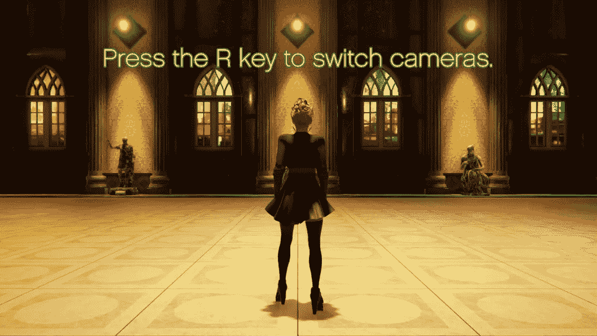

# 制作电影游戏:用时间轴创建教程

> 原文：<https://medium.com/geekculture/making-a-cinematic-game-create-a-tutorial-63674439ba93?source=collection_archive---------9----------------------->

在网上发布一个可玩的演示之前，我需要做的最后一件事是为玩家制作一个教程序列！

**UI 对象**

这里是*层级*中的*画布*，它保存了一个 *UI 图像*，以及一系列 *UI 文本*。