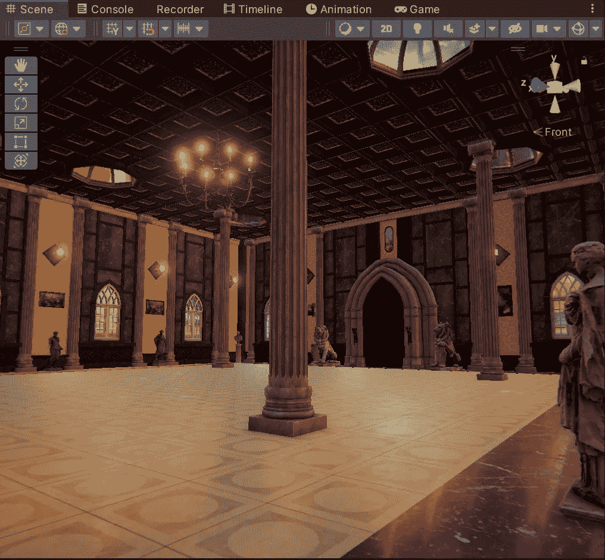

# 制作电影游戏:关卡设计

> 原文：<https://medium.com/geekculture/making-a-cinematic-game-level-design-6a80d5cb205b?source=collection_archive---------21----------------------->

当我接近 GameDevHQ 的电影摄影认证的尾声时，我需要做一个最后的项目。我已经决定为玩家部分制作一个有节奏的舞蹈游戏，而游戏的其余部分将涉及电影过场动画和相机互动。让我们从头开始，用一些*模块化*级别的设计！