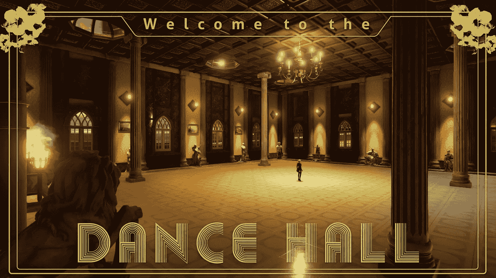

# 制作电影游戏:灯光和后期处理

> 原文：<https://medium.com/geekculture/making-a-cinematic-game-lighting-and-post-processing-7f4ac998b44b?source=collection_archive---------16----------------------->

在制作基于电影的游戏之旅的第二部分，我将对场景进行照明，添加后期处理特效和一些粒子系统。

首先，我需要一个主角，所以她已经准备好跳舞了！*(所有游戏资产均来自 GameDevHQ 的 Filebase 资产库)。*