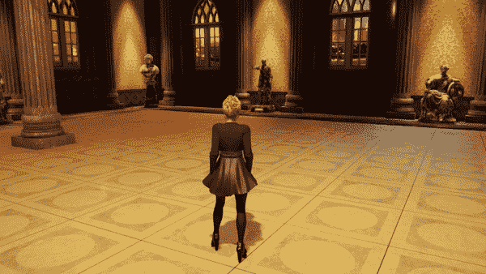

# 制作电影游戏:当玩家空闲时播放过场动画

> 原文：<https://medium.com/geekculture/making-a-cinematic-game-play-a-cutscene-when-the-player-goes-idle-ffb215719deb?source=collection_archive---------12----------------------->

在我的上一篇文章中，我展示了当玩家进入*空闲*5 秒时，我是如何制作过场动画的。这个挑战的另一部分是在玩家停止空闲时将摄像机视图返回给他们，所以让我们用一些代码来实现它吧！

*电影导演*游戏对象是持有*游戏导演*的…