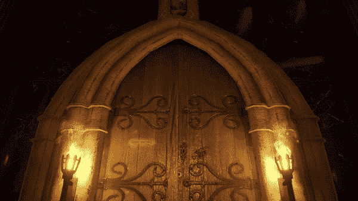

# 制作电影游戏:玩家空闲过场动画

> 原文：<https://medium.com/geekculture/making-a-cinematic-game-player-idle-cutscene-398823b2e96c?source=collection_archive---------8----------------------->

这个游戏的第一个过场动画需要在玩家空闲 5 秒的时候发生。我将在下一篇文章中检查玩家控制，所以现在，让我们进入过场动画！

**摄像机**

这些是将用于这个过场动画的所有摄像机*组*。我主要使用*混合列表*相机，这些相机*在多个相机视图之间插入*,并且…