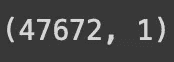
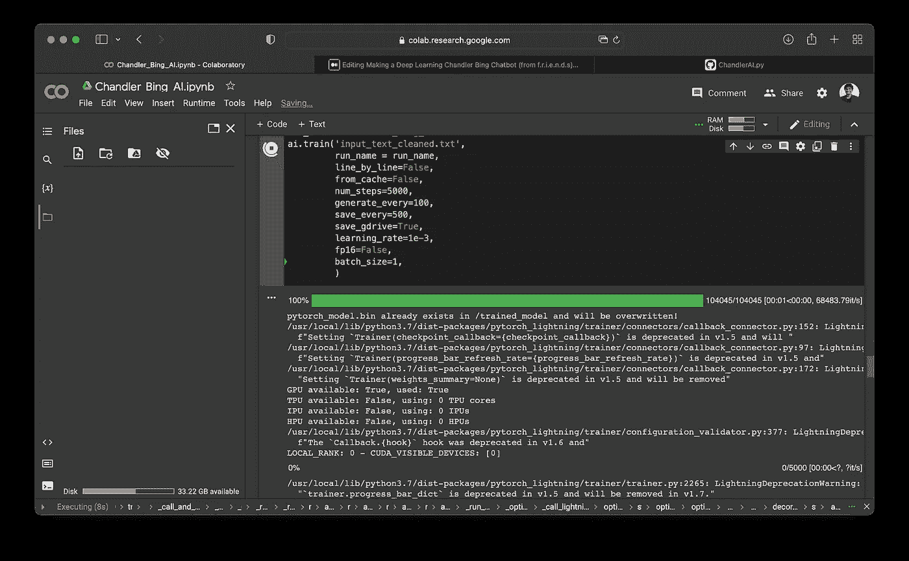
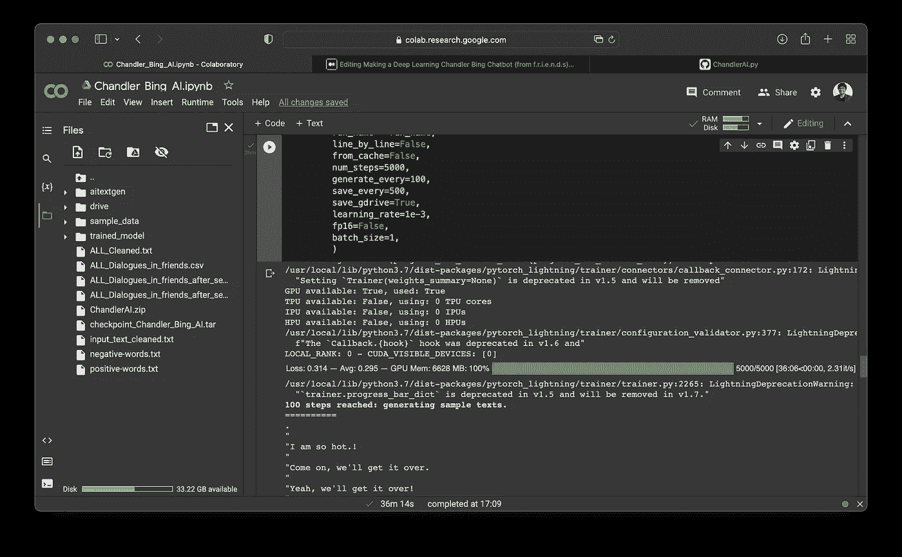
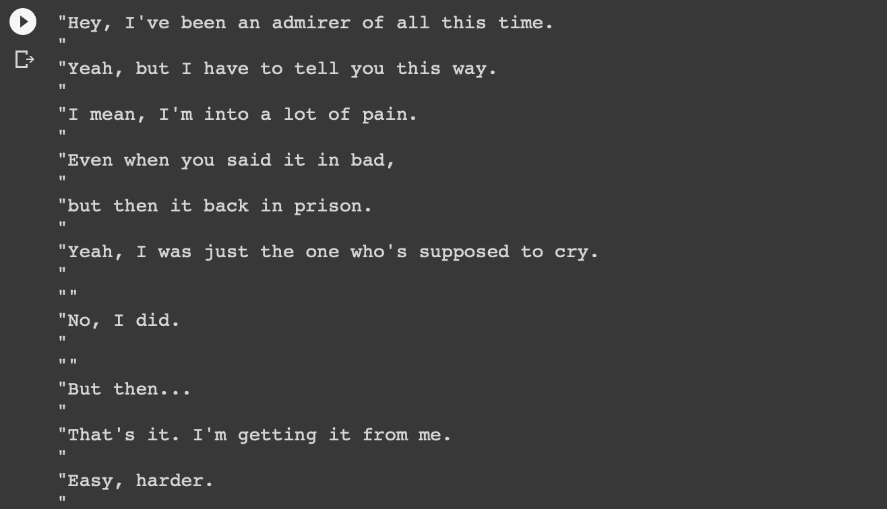
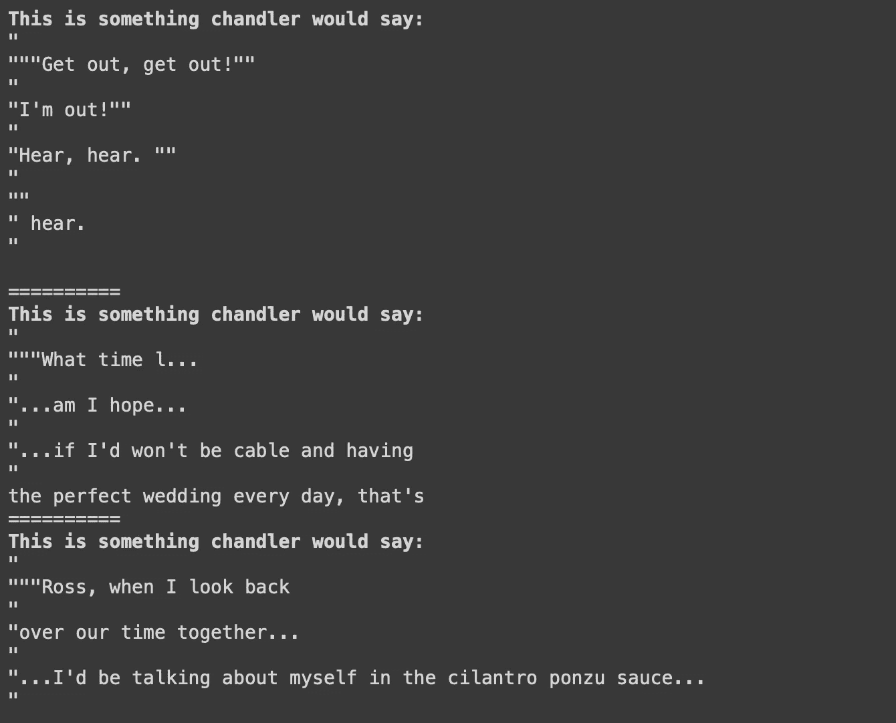
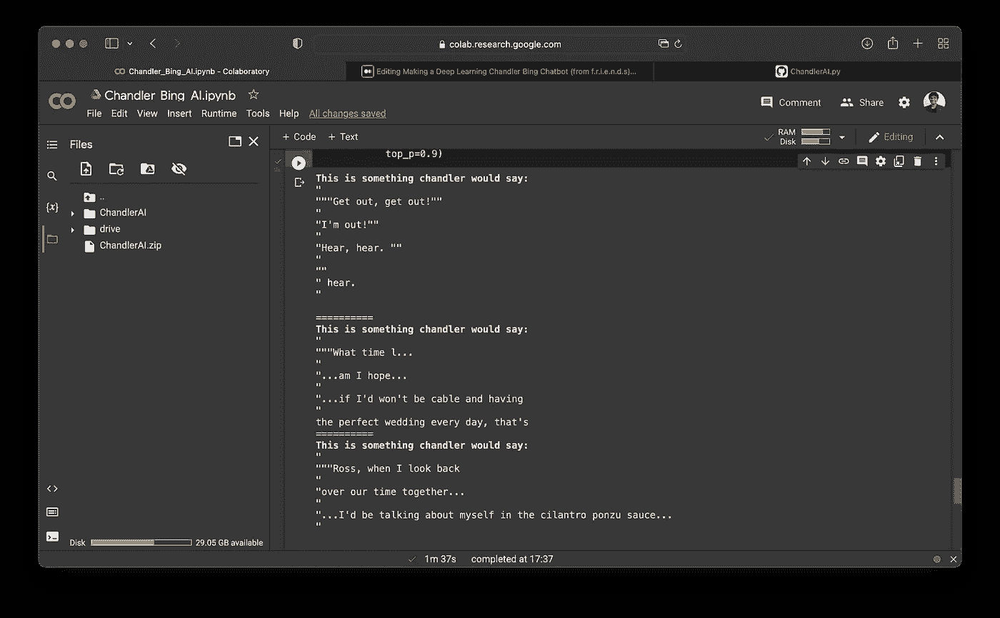

# 做深度学习的钱德勒·宾·艾(来自美国国防科学研究院)第二部分

> 原文：<https://medium.com/geekculture/making-a-deep-learning-chandler-bing-ai-from-f-r-i-e-n-d-s-part-2-83e991321f63?source=collection_archive---------13----------------------->

[source](https://www.sportskeeda.com/pop-culture/chandler-bing-s-growth-how-friends-character-went-just-funny-guy-father-two)

在最后一部分，我们制作了一个包含《老友记》中所有对话的数据集，并对它们进行了情感分析。如果你还没有读第一部分，我建议你先读一下:

 [## 制作深度学习的钱德勒·宾聊天机器人第一部分

### 我是 f.r.i.e.n.d.s 的粉丝钱德和乔伊是我最喜欢的角色。钱德勒可能超级讽刺，但也…

medium.com](/geekculture/making-a-chandler-bing-chatbot-from-f-r-i-e-n-d-s-part-1-5cd2af606ffe) 

假设你已经阅读了上面的文章，让我们继续。

在本文中，我将使用数据集中的数据训练一个 NLP 模型。我经历了很多 NLP 模型，并决定基于 GPT-2 的模型，因为它很容易制作和使用，所以在这里使用是最好的。

因此，我们将为这个项目使用 Aitextgen 库，让我们安装它:

让我们导入 Aitextgen:

检查您的 GPU(如果您在 Google Colab 或 Kaggle Notebook 中执行此操作，请确保使用 GPU 运行时):

The output

下载 [124M GPT-2 型号](https://huggingface.co/gpt2):

现在让我们来看看我在[上一篇文章](/geekculture/making-a-chandler-bing-chatbot-from-f-r-i-e-n-d-s-part-1-5cd2af606ffe)中制作的数据集:

现在我们需要清理数据集并删除不需要的列和空格:

让我们看看新数据帧的形状:

The output

现在让我们把单词分成两行，以便更好地训练:

as you can see there are two rows now

现在让我们将清理后的对话保存在一个. txt 文件中:

**现在我们可以使用上面的文本文件来微调模型并设置正确的参数:**

让我们挂载我们的 Gdrive 来保存模型:

现在让我们根据我们的需求微调模型:

This process will take about 25 minutes.

Its done and its a 6gigabyte model

现在不再需要对模型进行训练，我们可以直接加载训练好的模型，并根据需要使用它:

现在，让我们使用该模型在没有任何提示的情况下生成一个样本:

The Output

所以，在它产生文本的时候，每个角色会怎么说话。现在让我们添加一个提示“chandler 会这样说:”并过滤输出。

现在，女士们，先生们，我向你们展示一个人工智能，它可以生成来自联邦民主共和联盟的钱德勒·宾所说的话。😁

> 钱德勒会这么说:" " " "滚出去，滚出去！" " " " "我出来了！" " " " "听到了，听到了。" " " " "“听到了。" ==========
> 
> 这是钱德勒会说的话:" " " "我什么时候…"…我是不是希望…"…如果我不会每天都有“完美的婚礼”，那就是========
> 
> 这是钱德勒会说的话:" " " "罗斯，当我回顾" "我们在一起的时光…"…我会在芫荽叶酱里谈论我自己…"

结果非常好，但如果您将步骤数设置为较高的数字，模型会更好，效果会更好。我没有这方面的硬件，所以只能用我现有的硬件。

如果你喜欢这篇文章，请考虑在 medium 上关注我，它确实对我帮助很大。

关于 Colab 笔记本，请点击此处:

 [## Chandler_Bing_AI.ipynb

### Eeman_Majumder

colab.research.google.com](https://colab.research.google.com/drive/1tjnkyzBSCvqEMtjJsn6kT3QLYnhZDTAY?usp=sharing) 

更多内容请查看我的 github:

 [## GitHub-eeman 1113/Chandler-Bing-深度学习-AI

github.com](https://github.com/Eeman1113/Chandler-Bing-Deep-Learning-AI) 

请在 twitter 上关注我的每日 AIML 研究动态:

感谢阅读😁，下周见👋🏼