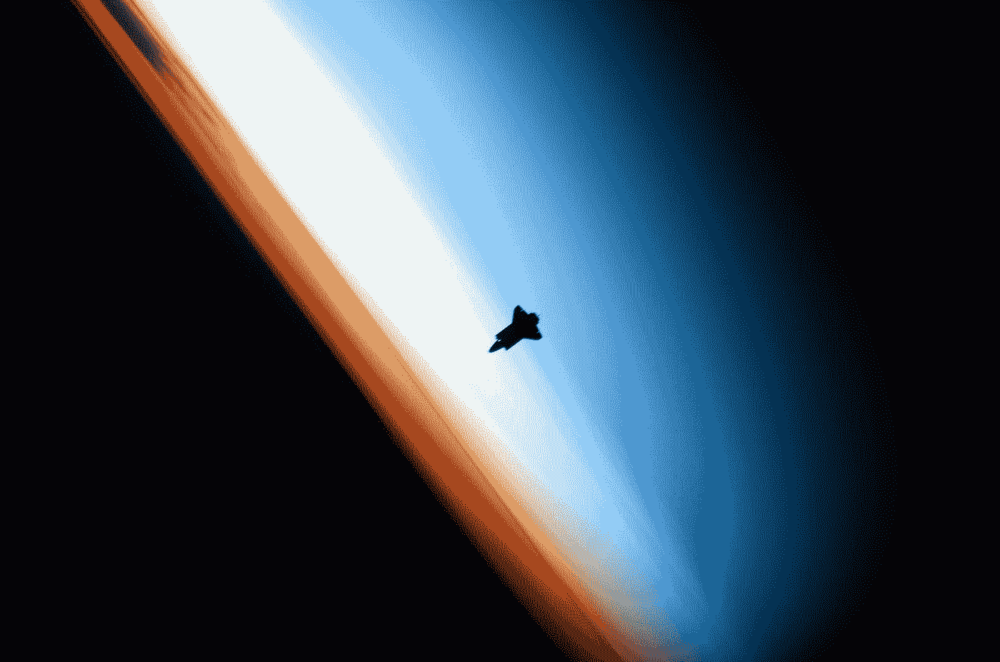

# 用 Python 制作重力模拟器

> 原文：<https://medium.com/geekculture/making-a-gravity-simulator-using-python-33d90c591edd?source=collection_archive---------8----------------------->



Photo by [NASA](https://unsplash.com/@nasa?utm_source=medium&utm_medium=referral) on [Unsplash](https://unsplash.com?utm_source=medium&utm_medium=referral)

“你好世界！”今天我将向你展示如何用 Python 制作一个重力模拟器。你应该能够定义具有特定质量和初速度的物体。然后让编程的重力接管！

# 模块

我们将使用 pygame 作为画布来显示物体的运动，使用 numpy 来计算模拟中的所有向量。你可以很容易地安装它们。

```
pip install numpy
pip install pygame
```

如果你使用 anaconda，用`conda`代替 pip。我刚刚设置了一个虚拟环境，并使用 pip 将它们安装在那里。此外，我将使用 PyCharm 作为我的 IDE，虽然，这应该没多大关系。

# 我们开始吧

这是我使用的文件结构:

```
Gravity_sim
|
|-- src
    |-- classes
        |-- body.py
        |-- physics_engine.py
        |-- simulation.py
    |-- main.py
    |-- README.md
|-- venv
```

让我们从`body.py`文件开始。在这里，我们将在我们的模拟中定义身体的特征。我们将使它成为一个类:

```
import numpy as np
import pygame# constants
TIME_DELAY = 0.0005class Body:
    def __init__(self, position_array, mass, color, radius=10):
        self.velocity = np.array([[0, 0, 0]])
        self.force = np.array([[0, 0, 0]])
        self.mass = mass
        self.position = position_array
        self.radius = radius
        self.thickness = self.radius * 2
        self.color = color
```

时间延迟被设置为以这样的方式更新 sim，以便它对我们可见。接下来我们可以定义几个函数。我们可以定义的第一件事是绘制代表我们身体的圆的绘制函数:

```
def draw(self, surface):
    pygame.draw.circle(surface, self.color, (self.position[0][0],
                       self.position[0][1]), self.radius,
                       self.thickness)
```

曲面参数只是我们在 pygame 中定义的曲面。由于我们可能有多个模拟，我决定添加一个表面参数。正如您所看到的，我们已经定义了一个速度数组，因此我们需要添加一个函数来更新模拟开始时的速度。这很琐碎:

```
def add_velocity(self, velocity_array):
    self.velocity = self.velocity + velocity_array
```

力也是如此。但是，这将在我们每次更新模拟时使用。这意味着每 0.0005 (TIME_DELAY)秒:

```
def add_force(self, force_array):
    self.force = self.force + force_array
```

现在我们有了速度和力，我们需要更新物体的位置。既然我们要在这里用牛顿定律，我们可以只用运动定律。你们应该从高中就记得这些，但这些是我用过的法则:

v = u + a*t

d = s * t

其中 v 是最终速度，u 是初速度，a 是加速度，t 是时间，d 是位移。

在代码中:

```
def move(self):
    self.velocity = self.velocity + ((self.force / self.mass) *
                                     TIME_DELAY)
    self.position = self.position + self.velocity * TIME_DELAY
```

现在是困难的部分。定义运行 sim 卡的“物理引擎”。在`physics_engine.py`文件中，首先导入 numpy。然后我们将定义两个辅助函数:一个用于计算向量的大小，另一个用于计算单位向量。

```
# shape of all arrays will be 1, 3.
# example: np.array([[x, y, z]])def _magnitude(arr):
    return np.sqrt(pow(arr[0], 2) + pow(arr[1], 2) + pow(arr[2], 2))def _unit_vector(arr):
    mag = _magnitude(arr)
    return np.array([
        [
            arr[0] / mag,
            arr[1] / mag,
            arr[2] / mag,
        ]
    ])
```

现在我们可以定义一个物理引擎类:

```
class PhysicsEngine:
    def __init__(self):
        self.body_pos_array = np.array([]).reshape((0, 3))
        self.body_list = None
```

我们需要一种方法让物理引擎知道模拟中的物体，因此我们可以创建一个函数来实现这一点:

```
def define_bodies(self, body_list):
    self.body_list = [np.array([i, body]) for i, body in
                      enumerate(body_list)]
```

我决定使用枚举功能，并为每个几何体分配一个索引，这样我们就可以跟踪正在分析的几何体。这个以后会派上用场的。现在是这个项目最困难和可怕的部分，计算力的矢量:

```
def compute_force_vectors(self):
    distance_list = []
    force_list = []
    net_force = []
```

距离列表将保存模拟中每隔一个实体与一个实体的距离。“力”列表将执行相同的操作，只是模拟中相对于每个其他实体的力。净力列表将保存每个物体的最终力矢量。

现在的难点是更新力列表和位移列表。我将发布代码，然后解释:

首先我们考虑一个单体。然后我们找到模拟中从这个物体到其他物体的位移矢量。我们将数组添加到 distance_list 中。我们乘以 np.array([[-1，-1，1]])作为 pygame 的坐标系与笛卡尔坐标系略有不同。原点在左上角，正 y 在向下的方向。

现在我们来计算力的矢量:

如果你看到了这个公式，我将大小乘以 0.25，这样吸引力的影响就被放大了，这样观察者就能看到这些影响。

for 循环相对简单。首先我们取一个主物体，计算其他物体对它的作用力。然而，当第二物体和第一物体是相同的，或者两个物体重叠时，我们不希望在计算中出现 np.inf，因此我们使用 if 语句忽略这种情况，只将力设置为零。然后我把数组添加到一个列表中。

```
for obj in force_list:
    net_force.append(obj.sum(axis=0))

return net_force
```

之后，我只是对每个物体在每个方向上的力求和，然后返回列表。

让我们开始制作模拟课堂。让我们导入 pygame，time 和物理引擎类。

```
import pygame
import time
from src.classes.physics_engine import PhysicsEngineclass Simulation:
    physics_engine = PhysicsEngine()

    def __init__(self):
        self.run, self.space, self.bodies = None, None, None
```

self.run 将用于管理 pygame 的循环。“self.bodies”将保存模拟中的身体，而 self.space 只是一个 pygame 显示。我们稍后将定义所有这些，所以我现在只将其设置为`None`。让我们创建一个函数来初始化 pygame 显示，并定义模拟类中的所有实体:

```
def initialise_environment(self, body_list):
    self.bodies = body_list
    space_plane_size = (1000, 800)  # width, height of canvas
    self.run = True

    # setting up pygame
    pygame.init()
    pygame.display.set_caption("Orbit simulator")
    self.space = pygame.display.set_mode(space_plane_size)

    # setting up physics engine
    self.physics_engine.define_bodies(body_list)
```

这段代码是不言自明的。我只需设置显示的大小，并将正文列表传递给物理引擎。现在我们定义运行 sim 的函数:

```
def show_environment(self):
    while self.run:
        for event in pygame.event.get():
            if event.type == pygame.QUIT:
                self.run = False

        self.space.fill((0, 0, 0))

        net_force = self.physics_engine.compute_force_vectors()
        for i, body in enumerate(self.bodies):
            body.force = net_force[i]

        for body in self.bodies:
            body.draw(self.space)

        for body in self.bodies:
            body.move() time.sleep(0.0005)
        pygame.display.update()
```

即使是这段代码也是不言自明的。我们设置了退出的条件。然后我们用黑色填充显示屏。然后我们使用所有物体的绘制函数。然后我们使用所有物体的移动功能。然后我们等待 0.0005 秒，然后我们更新显示。仅此而已。现在我们只运行 main.py 中的代码:

```
body1 = Body(np.array([[500, 300, 0]]), 6 * pow(10, 15), (255, 255,
                                                          255))
body1.add_velocity(np.array([[40, 0, 0]]))

body2 = Body(np.array([[600, 200, 0]]), 6 * pow(10, 15), (0, 0,
                                                          255))
body2.add_velocity(np.array([[-40, 0, 0]]))

body3 = Body(np.array([[300, 500, 0]]), 6 * pow(10, 15), (0, 255,
                                                          0))
body3.add_velocity(np.array([[50, 0, 0]]))

sim = Simulation()
sim.initialise_environment([body1, body2, body3])
sim.show_environment()
```

# 结论

就这样了。如果你想看完整的代码，你可以在这里访问它[。我希望你喜欢阅读这篇博客。如果你想要更多与编程和空间新闻相关的博客，请点击这里关注我。](https://github.com/Tanmay-R-Choudhary/Gravity-Simulation)

感谢阅读！