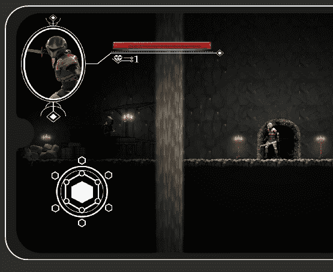

# 在 Unity 中制作 HUD 第 3 部分:触摸屏输入

> 原文：<https://medium.com/geekculture/making-a-hud-in-unity-part-3-touchscreen-input-12265f2b2e98?source=collection_archive---------16----------------------->

## 设定要在 Android 设备上使用的 HUD

**目标**:使用 Unity 标准资产对触摸屏输入进行编码