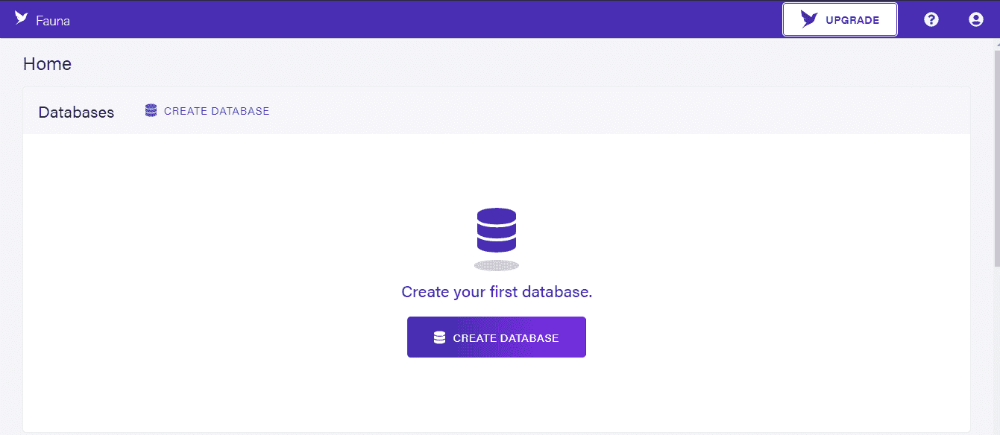
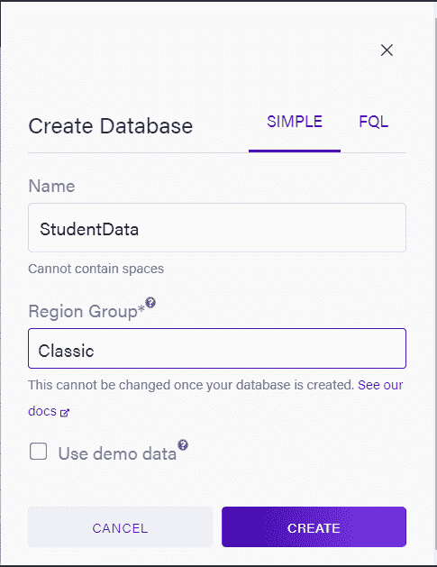
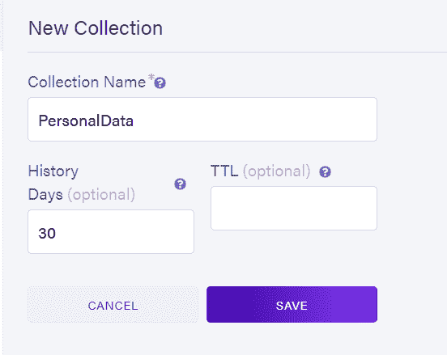
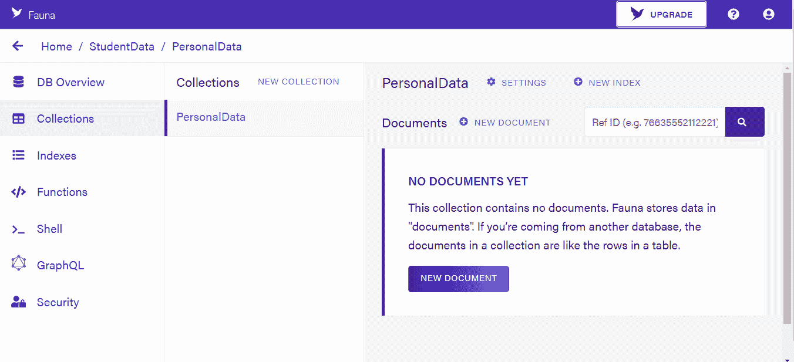
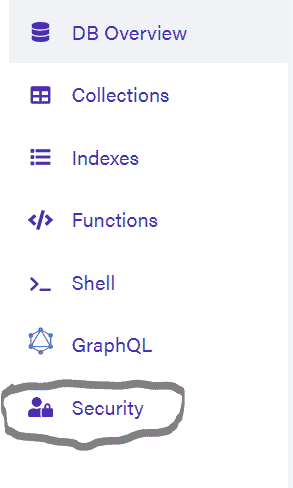
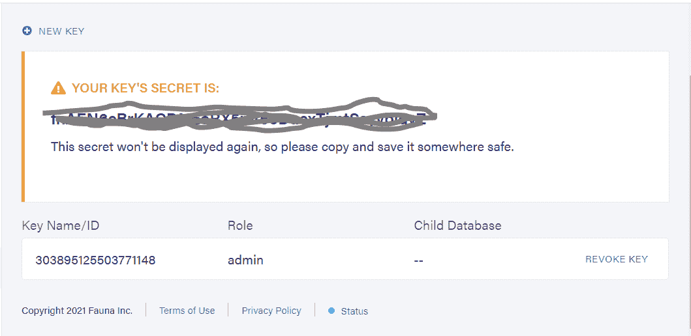
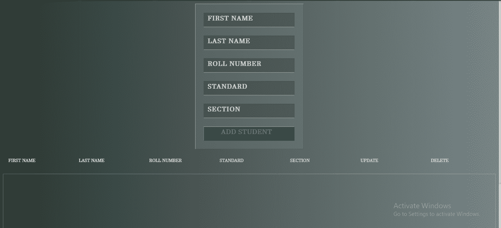

# 使用 Django 和云存储动物群数据库制作真实的端到端项目(第 1 部分)

> 原文：<https://medium.com/geekculture/making-a-real-world-end-to-end-project-using-django-and-cloud-storage-fauna-db-part-1-b89011b8466c?source=collection_archive---------6----------------------->

我们将使用 Django 和动物群数据库制作一个学生数据管理系统

# **简介:**

今天我们将使用 Django 和 Fauna 来创建一个项目，这个项目将向您全面介绍如何将它们的力量结合在一起。

如果你了解 Django，那么我希望你知道为什么它是最好的框架之一。它可以在一个网站中结合 Python 的力量。

为什么是弗娜？

**动物群**处理所有后端数据任务。它提供了合适的强大数据、用户高数据安全性，而且速度非常快，全天候可用，有了它，扩展您的 web 和应用程序项目变得超级简单。

*现在，为什么一起使用它们？*

Django 数据库非常适合一些复杂的查询和类似的东西，但它会慢很多倍，Django 模型最适合复杂的查询，但如果你正在做一个可扩展的大型项目，需要一个简单的数据库查询，使用动物群而不是 Django 模型是更聪明的选择。

动物群将使简单的数据库查询快得多。

所以让我们开始做一个项目。

# **设置在姜戈使用的动物:**

去[*https://dashboard.fauna.com/accounts/register*](https://dashboard.fauna.com/accounts/register?utm_source=writewithfauna&utm_medium=dev.to&utm_campaign=q3wwf&utm_id=athtripathi)记账。它应该是这样的:

现在创建一个数据库，如下所示:

创建收藏:

现在你会看到这样的东西:

我们将通过 Django 项目创建数据，所以如果您还没有看到任何数据，请不要担心。

现在，我们将创建一个密钥，因此现在转到安全部分:

创建一个键，将所有信息设为默认值，然后点击保存。

您将得到这样一个密钥:

复制它并保存在某个安全的地方，现在你准备好了。

**建立 Django 项目:**

现在首先通过运行命令创建一个 django 项目:

> django-管理启动项目 faunadbDjango

现在安装一个包:

> **pip 安装 faunadb**

创建应用程序:

> **python manage . py startapp myapp**

现在在 setting.py 的 INSTALLED_APPS 中添加 app:

> **INSTALLED _ APPS+=[' myapp ']**

现在在项目目录的 urls.py 中:

> **来自 django.contrib 导入管理**
> 
> **从 django.urls 导入路径，包含**
> 
> **urlpatterns = [**
> 
> **路径(' admin/'，admin.site.urls)，**
> 
> **包含(')，包含(' myapp . URLs ')**
> 
> **】**

现在在 views.py 中:

> **从 django.shortcuts 导入渲染**
> 
> 在此创建您的观点。
> 
> ***def* home( *请求* ):**
> 
> **return render(request，" home.html")**

现在在 app 的 urls.py 中:

> **从 django.urls 导入路径**
> 
> **从。导入视图**
> 
> **urlpatterns = [**
> 
> **path(' '，views.home， *name* ='home ')，**
> 
> **】**

现在一切都在一个工作结构中。

这样我们的结构就完成了，现在让我告诉你我们要做什么端点:
1。用于添加学生数据

2.用于获取学生数据

3.用于删除学生数据

4.用于更新学生数据。

所以我希望你明白我们要用 Django 做什么。

# **创建前端:**

现在我们要做一个前端部分，它将由一个显示数据的表组成。将有 5 个关于学生的数据:

1.  西方人名的第一个字
2.  姓
3.  等级或标准
4.  卷号
5.  部分

它将由 5 个输入框添加数据。

因此，在应用程序目录中创建一个“模板”文件夹，并在其中创建一个“home.html”。

我不会一行一行地解释设计部分，但会解释得足够多，这样你就明白了。

创建一个 CSS 文件，命名为: **home.css** 。

您的 HTML 样板文件应该如下所示:

> **！DOCTYPE html>**
> 
> **< html >**
> 
> **头<头>头**
> 
> **<风格>**
> 
> **</样式>**
> 
> **</头>/头**
> 
> **<正文>**
> 
> **</正文>**
> 
> **< /html >**

现在让我们来谈谈你的前端应该是什么样子，它会做什么。

它将基本上有 5 个输入框，将采取名，姓，类，部分，和卷号。它将有一个表格，其中的数据将被显示，并提交按钮，将点击数据库，并从数据库中，它会去点击我们的动物数据库

我们的第一个功能是写和读。

让我们从我们的前端开始。

首先，让我们创建我们的表:

> **！DOCTYPE html >**
> 
> **< html >**
> 
> **<头>**
> 
> **<样式>**
> 
> **</样式>**
> 
> **</头>**
> 
> **正文<正文>正文**
> 
> **div class = " TBL-content ">**
> 
> **<表格 cell padding = " 0 " cellspacing = " 0 " border = " 0 ">**
> 
> **< thead >**
> 
> **tr>**
> 
> **<第>名</第>名**
> 
> **<第>个姓氏</第>个**
> 
> **< th >卷号< /th >**
> 
> **< th >标准< /th >**
> 
> **<第>节</第>节**
> 
> **<日>更新</日>**
> 
> **<第>条删除</第>条**
> 
> **< /tr >**
> 
> **T142/thead>**
> 
> **</表>**
> 
> **< /div >**
> 
> **div class = " TBL-content ">**
> 
> **<表格 cell padding = " 0 " cellspacing = " 0 " border = " 0 ">**
> 
> **< tbody >**
> 
> **< /tbody >**
> 
> **</表>**
> 
> **< /div >**
> 
> **</正文>**
> 
> **< /html >**

这里我们实际上创建了两个表。我们这样做是有目的的:第一个只是为了标题，另一个是为了数据，这样做是为了更好的风格，所以系统中没有其他东西。

现在我们将为我们的前端添加表单和 CSS。你可以从下面复制粘贴我的代码。

现在，您的整个代码应该如下所示:

> **！DOCTYPE html>**
> 
> **html>**
> 
> **头<头>头**
> 
> **<样式>**
> 
> **h1{**
> 
> ***font-size*:30px；**
> 
> **颜色:# fff；**
> 
> ***文本转换*:大写；**
> 
> ***font-weight*:300；**
> 
> ***文本对齐*:居中；**
> 
> ***边距-底部*:15px；**
> 
> **}**
> 
> **表{**
> 
> ***宽度*:100%；**
> 
> ***表格布局*:固定；**
> 
> **}**
> 
> **。TBL-标题{**
> 
> ***背景色* : rgba(255，255，255，0.3)；**
> 
> **}**
> 
> **。TBL-内容{**
> 
> ***高度*:300 px；**
> 
> ***溢出-x* :自动；**
> 
> ***margin-top*:0px；**
> 
> ***边框* : 1px 实心 rgba(255，255，255，0.3)；**
> 
> **}**
> 
> **第{**
> 
> **填充:20px 15px；**
> 
> ***文本对齐*:左对齐；**
> 
> ***font-weight*:500；**
> 
> ***字号*:12px；**
> 
> ***颜色*:# fff；**
> 
> ***文本转换*:大写；**
> 
> **}**
> 
> **td{**
> 
> ***填充*:15px；**
> 
> ***文本对齐*:左对齐；**
> 
> ***垂直对齐*:中间；**
> 
> ***font-weight*:300；**
> 
> ***字号*:12px；**
> 
> ***颜色*:# fff；**
> 
> ***border-bottom*:solid 1px rgba(255，255，255，0.1)；**
> 
> **}**
> 
> **@导入网址(*https://fonts.googleapis.com/css?family=Roboto:400，500，300，700*)；**
> 
> **正文{**
> 
> ***背景* : -webkit-linear-gradient(左，#2a3631，# c5d5d 6)；**
> 
> ***背景*:线性渐变(向右，#2a3631，# 778586)；**
> 
> ***font-family*:‘Roboto’，无衬线；**
> 
> **}**
> 
> **章节{**
> 
> ***边距*:50px；**
> 
> **}**
> 
> **::-WebKit-滚动条{**
> 
> ***宽度*:6px；**
> 
> **}**
> 
> **::-WebKit-scroll bar-track {**
> 
> ***-WebKit-box-shadow*:inset 0 0 6px rgba(0，0，0，0.3)；**
> 
> **}**
> 
> **::-WebKit-滚动条-缩略图{**
> 
> ***-WebKit-box-shadow*:inset 0 0 6px rgba(0，0，0，0.3)；**
> 
> **}**
> 
> **表格{**
> 
> ***位置*:相对；**
> 
> ***宽度*:250 px；**
> 
> ***余量* : 0 自动；**
> 
> ***背景* : rgba(130，130，130，. 3)；**
> 
> ***填充*:20px 22px；**
> 
> **边框 : 1px 实心；**
> 
> ***:rgba(255，255，255，.. 4)；***
> 
> ****border-left-color*:rgba(255，255，255，.. 4)；***
> 
> ****border-bottom-color*:rgba(60，60，60，.. 4)；***
> 
> ****border-right-color*:rgba(60，60，60，.. 4)；***
> 
> ***}***
> 
> ***表单输入，表单按钮{***
> 
> ****宽度*:212 px；***
> 
> ****边框* : 1px 纯色；***
> 
> ****border-bottom-color*:rgba(255，255，255，. 5)；***
> 
> ****border-right-color*:rgba(60，60，60，. 35)；***
> 
> ****border-top-color*:rgba(60，60，60，. 35)；***
> 
> ****border-left-color*:rgba(80，80，80，. 45)；***
> 
> ****背景色* : rgba(0，0，0，.. 2)；***
> 
> ****后台-重复*:无-重复；***
> 
> ****填充*:8px 24px 8px 10px；***
> 
> ****字体*:bold . 875 em/1.25 em“Open Sans Condensed”，无衬线；***
> 
> ****字母间距*:. 075 em；***
> 
> ****颜色*:# fff；***
> 
> ****文字-阴影* : 0 1px 0 rgba(0，0，0，.. 1)；***
> 
> ****边距-底部*:19px；***
> 
> ***}***
> 
> ***表单输入:焦点{ *背景色* : rgba(0，0，0，.. 4)；}***
> 
> ***表单输入输入{***
> 
> ****背景位置* : 223px 8px***
> 
> ***}***
> 
> ***::-WebKit-input-placeholder {*color*:# CCC；*文本转换*:大写；}***
> 
> ***::-moz-placeholder {*color*:# CCC；*文本转换*:大写；}***
> 
> ***:-ms-input-placeholder {*color*:# CCC；*文本转换*:大写；}***
> 
> ***表单按钮【类型=提交】{***
> 
> ****宽度*:248 px；***
> 
> ****边距-底部*:0；***
> 
> ****颜色*:# 3f 898 a；***
> 
> ****字母间距*:. 05 em；***
> 
> ****text-shadow*:0 1px 0 # 133 d3e；***
> 
> ****文本转换*:大写；***
> 
> ****背景*:# 225556；***
> 
> ****边框-顶部-颜色*:# 9fb 5b 5；***
> 
> ****边框-左侧-颜色*:# 608586；***
> 
> ****边框-底色*:# 1b 4849；***
> 
> ****边框-右边-颜色*:# 1e4d 4 e；***
> 
> ****光标*:指针；***
> 
> ***}***
> 
> ***</风格>***
> 
> ***</头>***
> 
> ***正文<正文>正文***
> 
> ***<表单动作="" method="POST "动作="/" >***
> 
> ***<标签为= " "></标签>***
> 
> ***<input type = " text " name = " " id = " " placeholder = " first name " class = " inputs " name = " first ">***
> 
> ***<标签为= " "></标签>***
> 
> ***<输入 type = " text " name = " " id = " " placeholder = " last name " class = " inputs " name = " last ">***
> 
> ***<标签为= " "></标签>***
> 
> ***<输入 type = " text " name = " " id = " " placeholder = " roll number " class = " inputs " name = " roll ">***
> 
> ***<标签为= " "></标签>***
> 
> ***<输入 type = " text " name = " " id = " " placeholder = " standard " class = " inputs " name = " standard ">***
> 
> ***<标签为= " "></标签>***
> 
> ***<输入 type = " text " name = " " id = " " placeholder = " section " class = " inputs " name = " section ">***
> 
> ***<按钮类型= "提交">添加学生</按钮>***
> 
> ***</表格>***
> 
> ***<表格 cell padding = " 0 " cellspacing = " 0 " border = " 0 ">***
> 
> ***< thead >***
> 
> ***< tr >***
> 
> ***<th>First name</th>***
> 
> ***< th >姓氏< /th >***
> 
> ***< th >卷号< /th >***
> 
> ***< th >标准</th>***
> 
> ***<第>节</第>节***
> 
> ***</tr>***
> 
> ***< /thead >***
> 
> ***</表>***
> 
> ***div class = " TBL-content ">***
> 
> ***<表格 cell padding = " 0 " cellspacing = " 0 " border = " 0 ">***
> 
> ***< tbody >***
> 
> ***< /tbody >***
> 
> ***</表>***
> 
> ***< /div >***
> 
> ***</正文>***
> 
> ***T131/html>***

*现在，它的输出如下所示:*

**

*我们没有创建删除和更新功能，但我们稍后会这样做。*

*现在我们的前端部分接近完成，我们唯一剩下的任务是:
1。添加数据*

*2.检索数据*

*所以现在我们将连接我们的动物数据库和 Django 后端。*

*我们将在下一部分完成主要的查询工作，您可以在这里找到整个项目代码:[https://github . com/ath 34-tech/Fauna-d b-and-django-student-management-system](https://github.com/ath34-tech/Fauna-DB-and-django-student-management-system)*