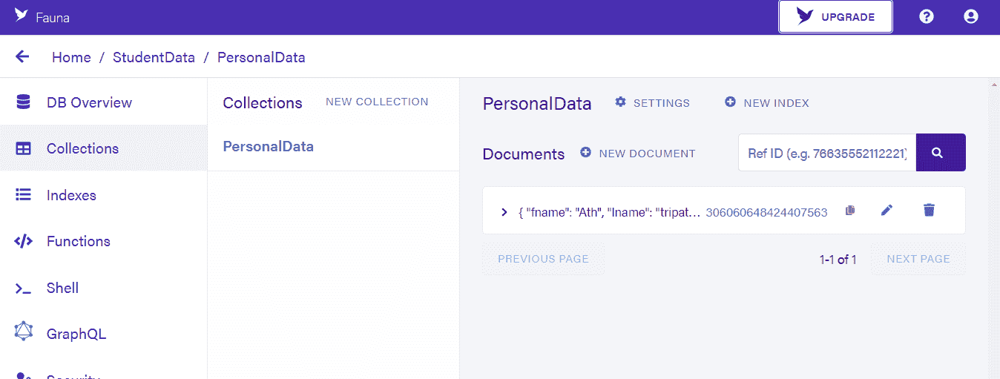
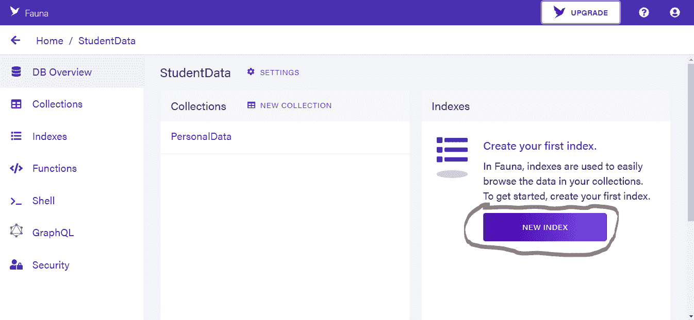
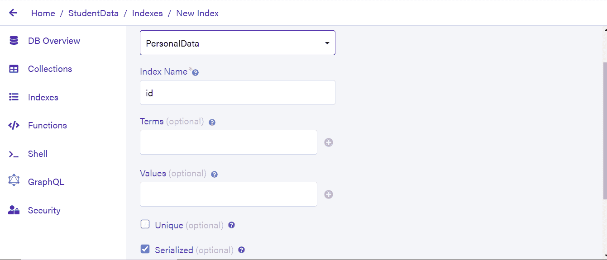
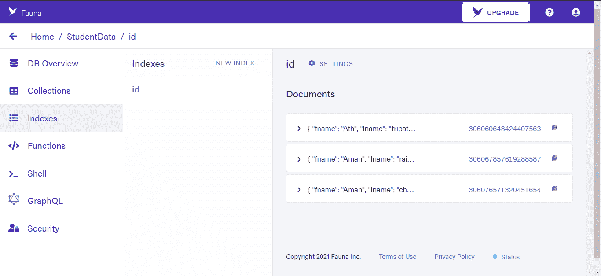
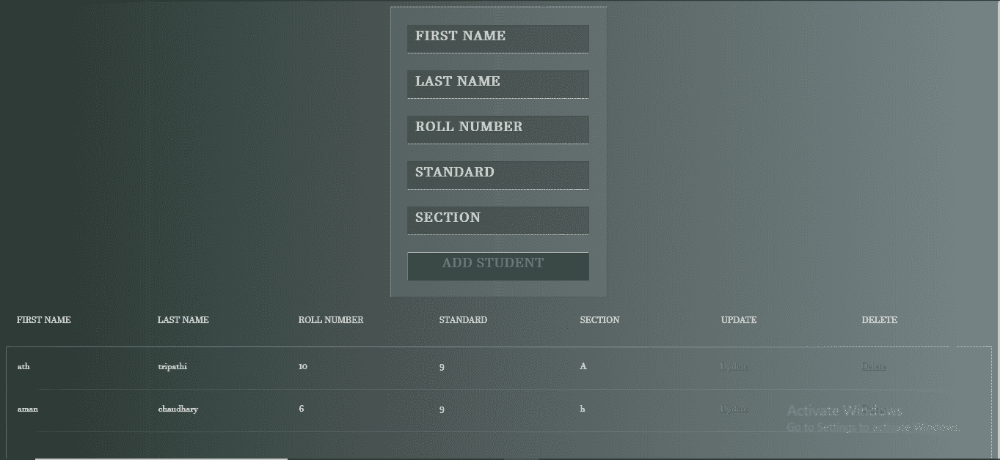

# 使用 Django 和云存储动物群数据库制作真实的端到端项目(第 2 部分)

> 原文：<https://medium.com/geekculture/making-a-real-world-end-to-end-project-using-django-and-cloud-storage-fauna-db-part-2-ba826d1a9415?source=collection_archive---------7----------------------->

我们将使用 Django 和动物群数据库对我们创建的学生数据管理系统进行后端查询

# **从 Django 项目中进行动物群查询:**

现在我们将测试从 Python 中进行动物群查询，所以只需创建一个临时文件“main.py”来测试连接是否建立。

现在首先在 main.py 中导入我们需要的所有东西:

> **从 faunadb 导入查询 as q**
> 
> **从 faunadb.client 导入 FaunaClient**

因此“FaunaClient”将用于建立连接，这意味着它将充当身份验证系统，q 或 query 将用于进行查询。现在，我们将首先检索之前创建的集合，因此:

> **从 faunadb 导入查询为 q**
> 
> **从 faunadb.client 导入 FaunaClient**
> 
> **client = fauna client(*secret*=“放上我让你保管好的密钥”)**
> 
> **coll = client . query(q . collection(" personal data "))**
> 
> **打印(收集)**

因此，输出将是:

> **Ref(id=PersonalData，collection = Ref(id = collections))**

“Coll”实际上是我们系列的一个参考，你可以看到参考 id 和其他内容。

现在让我们尝试创建数据，或者我们可以通过我们的脚本来创建文档。

编写以下代码来创建一个文档:

> **从 faunadb 导入查询 as q**
> 
> **从 faunadb.client 导入 FaunaClient**
> 
> **client = fauna client(*secret*= " secret key ")**
> 
> **coll = client . query(q . collection(" personal data "))**
> 
> **created = client . query(q . create(coll，{"data":{"fname":"Ath "，" lname":"tripathi "，" class":"10 "，" section":"A "，" roll no ":" 14 " }))**
> 
> **打印(已创建)**

因此，输出将是:

> **{ ' Ref ':Ref(id = 306060648424407563，collection=Ref(id=PersonalData，collection=Ref(id=collections))，' ts': 1628141029685000，' data': {'fname': 'Ath '，' lname': 'tripathi '，' class': '10 '，' section': 'A '，' rollno': '14'}}**

现在，当我们创建一个文档时，我们引用我们的集合，第二个参数是一个 JSON，它有一个键名“data ”,它的值是另一个 dictionary 对象，它包含我们数据库的字段名及其值。

现在让我们尝试检索数据。

首先创建一个索引。在您的数据库仪表板上，创建一个:

单击新索引，您将看到类似这样的内容:

不要为了简单而选择唯一的选项。

现在点击保存。

您将看到类似这样的内容:

索引基本上是为了引用我们的文档对象。当涉及到复杂的查询时，它们非常有用，并且它们在过滤数据时非常有用。

我们将从我们的集合中检索每个数据。我们将首先对每个文档的索引引用进行分页，然后运行一个“for”循环，并使用 get 函数逐个检索数据。

所以代码应该是这样的:

> **从 faunadb.objects 导入参考**
> 
> **从 faunadb 导入查询 as q**
> 
> **从 faunadb.client 导入 FaunaClient**
> 
> **client = fauna client(*secret*= " secret key ")**
> 
> **coll = client . query(q . collection(" personal data "))**
> 
> **dat = client . query(q . paginate(q . match(q . index(" id ")))**
> 
> **对于 dat['data']中的 I:**
> 
> **data = client . query(q . get(I))**
> 
> **打印(数据['数据'])**

这方面的输出将是:

> **{'fname': 'Ath '，' lname': 'tripathi '，' class': '10 '，' section': 'A '，' rollno': '14'}**
> 
> **{'fname': 'Aman '，' lname': 'rai '，' class': '10 '，' section': 'I '，' rollno': '3'}**
> 
> **{'fname': 'Aman '，' lname': 'chaudhary '，' class': '10 '，' section': 'I '，' rollno': '3'}**

现在让我们看看如何更新数据。

更新查询和以前的所有查询一样简单，它只需要文档引用和一个更新的数据参数。例如，我将使用我的第一个数据点，这是我自己的名字，所以我将把我的 fname 值从“ath”改为“Ayush”。为此，我复制了第一个数据点的引用 id。

您的更新代码将如下所示:

> **从 faunadb.objects 导入参考**
> 
> **从 faunadb 导入查询为 q**
> 
> **从 faunadb.client 导入 FaunaClient**
> 
> **client = fauna client(*secret*= " secret key ")**
> 
> **coll = client . query(q . collection(" personal data "))**
> 
> **data = client . query(q . update(q . ref(coll，' 306060648424407563 ')，{ " data ":{ " fname ":" Ayush " } }))**
> 
> **打印(数据)**
> 
> **所以它的输出将是:**
> 
> **{ ' Ref ':Ref(id = 306060648424407563，collection=Ref(id=PersonalData，collection=Ref(id=collections)))，' ts': 1628162190785000，' data': {'fname':**
> 
> **'Ayush '，' lname': 'tripathi '，' class': '10 '，' section': 'A '，' rollno': '14'}}**

您可以看到 fname 从“ath”更改为“ayush”。现在让我们做最后一个 CRUD 操作，即删除。这是所有四个操作中最简单的一个，你只需要给它一个文档的引用。

所以删除的代码是:

> **从 faunadb.objects 导入参考**
> 
> **从 faunadb 导入查询为 q**
> 
> **从 faunadb.client 导入 FaunaClient**
> 
> **client = fauna client(*secret*= " fnaepxhmqaacc 0 tpre R1 zhwygdzt _ wpj G8 bzkcf 4 ")**
> 
> **coll = client . query(q . collection(" personal data "))**
> 
> **data = client . query(q . delete(Ref(coll，" 306067857619288587 "))**
> 
> **打印(数据)**

现在它将删除文档，输出为:

> **{ ' Ref ':Ref(id = 306067857619288587，collection=Ref(id=PersonalData，collection=Ref(id=collections)))，' ts': 1628161816736000，' data': {'fname':**
> 
> **'Aman '，' lname': 'rai '，' class': '10 '，' section': 'I '，' rollno': '3'}}**

现在我们已经完成了对查询的测试，是时候在我们的后端实现它了。

## **后台实现查询:**

现在让我们在后端实现我们的查询。

我们将使用 home 函数来获取数据。

首先，让我们在 views.py 中创建三个端点:

> **从 django.shortcuts 导入渲染**
> 
> **从 faunadb 导入查询为 q**
> 
> **从 faunadb.objects 导入参考**
> 
> **从 faunadb.client 导入 FaunaClient**
> 
> **从 django.http 导入 HttpResponse**
> 
> **从 django.shortcuts 导入重定向**
> 
> **client = fauna client(*secret*= " secret key here ")**
> 
> 在这里创造你的观点。
> 
> ***def*home(*request*):**
> 
> **return render(request，" home.html")**
> 
> ***def*AddStudent(*请求* ):**
> 
> **通过**
> 
> ***def*update student(*请求，id* ):**
> 
> **通过**
> 
> ***def*delete student(*请求，id* ):**
> 
> **通过**

现在在 urls.py 中设置 URL:

> **从 django.urls 导入路径**
> 
> **从。导入视图**
> 
> **urlpatterns = [**
> 
> **path(' '，views.home， *name* ='home ')，**
> 
> **路径('添加'，视图。AddStudent， *name* ='add '，**
> 
> **路径(' update/ < str:id >')，视图。UpdateStudent， *name* ='update '，**
> 
> **路径(' delete/ < str:id >')，视图。删除学生，*姓名* = '删除')**

**现在，您已经完成了基本设置。**

****读取数据:****

**现在让我们将这段代码添加到家庭端点:**

> *****def* home( *请求* ):****
> 
> ****学生数据=[]****
> 
> ****dat = client . query(q . paginate(q . match(q . index(" id "))))****
> 
> ****对于 dat['data']中的 I:****
> 
> ****data = client . query(q . get(I))****
> 
> ****all _ data = { " id ":f ' { data[' ref ']。id()} '，" info":data['data']}****
> 
> ****学生 _ 数据.追加(全部 _ 数据)****
> 
> ****return render(request，" home.html "，{"data":student_data})****

**希望你能理解的代码，因为我们使用了相同的代码，我们以前使用的。在这里，我们不仅添加我们的文档数据，还添加我们的文档参考 id，我们将使用它进行更新和删除。我们使用 id()函数来获取 id。**

****前端渲染数据:****

**在前端，我们只需要更新表内容，所以在第二个表中添加:**

> ****
****
> 
> ****<表格 cell padding = " 0 " cellspacing = " 0 " border = " 0 ">****
> 
> ****< tbody >****
> 
> ********
> 
> ****< tr >****
> 
> ****<TD>{ { points . info . fname } }</TD>****
> 
> ****<TD>{ { points . info . lname } }</TD>****
> 
> ****<TD>{ { points . info . rollno } }</TD>****
> 
> ****<TD>{ { points . info . class } }</TD>****
> 
> ****<TD>{ { points . info . section } }</TD>****
> 
> ****TD>a href = " Update/{ { points . id } } ">更新</a>/TD>****
> 
> ****TD>a href = " Delete/{ { points . id } } ">删除</a>/TD>****
> 
> ****</tr>****
> 
> ********
> 
> ****< /tbody >****
> 
> ****</表>****
> 
> ****
/****

**在这里，我们对每个过滤器循环使用，并访问嵌套的字典数据，对于更新和删除，我们在链接中给出引用 id，因此每当我们单击更新时，我们将到达更新用户页面，单击删除时，我们将删除用户。我们稍后将添加更新功能。**

## ****添加数据:****

**现在在“AddStudent”端点中添加以下代码:**

> *****def*AddStudent(*请求* ):****
> 
> ****if request . method = = " POST ":****
> 
> ****fname，lname，standard，section，rollno=request。POST['first']，请求。POST['last']，请求。发布['标准']，请求。发布['部分']，请求。帖子['滚']****
> 
> ****created = client . query(q . create(q . collection(" personal data ")****
> 
> ****，{ " data ":{ " fname ":*f*" { fname } "，" lname": *f* "{lname} "，" class": *f* "{standard} "，" section": *f* "{section} "，" rollno ":*f*" { rollno } " }))****
> 
> ****返回重定向("首页")****

**希望你明白这是怎么回事，我们只是访问表单数据，将它们保存在变量中，并将其作为一个文档写入动物群。我们只需将其重定向到主页，您可以呈现任何其他 HTML 页面或 HttpResponse，这完全由您决定。**

## ****更新数据点:****

**现在，对于更新，我们将使用不同的方法，我们将创建一个不同的 Html 文件，该文件将从更新端点呈现。我们将使用参考 id 访问某些文档进行更新。所以做一个名为“update.html”的文件。让我们首先在更新端点中创建一个脚本:**

> ****defupdate student(*请求*， *id* ):****
> 
> ****if request . method = = " POST ":****
> 
> ****通过****
> 
> ****student _ data = client . query(q . get(q . ref(q . collection(" personal data ")，*f*" { id } "))****
> 
> ****return render(request，' update.html '，{'url': *f* '{id} '，" data ":student _ data[' data ']})****

**对于“get”请求处理，我们首先使用给定学生的引用 id 获取他的所有数据，然后呈现 update.html 并给它两个参数。**

1.  **第一个参数是 URL，它用于告诉前端需要更新哪个引用 id，或者它只是告诉 URL，例如:“update/306076571320451654”。**
2.  **第二个参数是学生数据，这将是表单的默认值，就像它用于更新表单中的预填充值一样。**

**现在让我们在 update.html 中创建我们的前端:**

> ****！DOCTYPE html >****
> 
> ****< html >****
> 
> ****头<头>头****
> 
> ****<风格>****
> 
> ****/*演示风格*/****
> 
> ****@导入网址(*https://fonts.googleapis.com/css?family=Roboto:400，500，300，700*)；****
> 
> ****正文{****
> 
> *****背景* : -webkit-linear-gradient(左，#2a3631，# c5d5d 6)；****
> 
> *****背景*:线性渐变(向右，#2a3631，# 778586)；****
> 
> *****字体系列*:‘Roboto’，无衬线；****
> 
> ****}****
> 
> ****节{****
> 
> *****边距*:50px；****
> 
> ****}****
> 
> ****表格{****
> 
> *****位置*:相对；****
> 
> *****宽度*:250 px；****
> 
> *****余量* : 0 自动；****
> 
> *****背景* : rgba(130，130，130，. 3)；****
> 
> *****填充*:20px 22px；****
> 
> *****边框* : 1px 纯色；****
> 
> *****border-top-color*:rgba(255，255，255，. 4)；****
> 
> *****border-left-color*:rgba(255，255，255，. 4)；****
> 
> *****边框-底色* : rgba(60，60，60，.. 4)；****
> 
> *****border-right-color*:rgba(60，60，60，.. 4)；****
> 
> ****}****
> 
> ****表单输入，表单按钮{****
> 
> *****宽度*:212 px；****
> 
> *****边框* : 1px 实心；****
> 
> *****:rgba(255，255，255，.. 5)；*****
> 
> ******border-right-color*:rgba(60，60，60，. 35)；*****
> 
> ******border-top-color*:rgba(60，60，60，. 35)；*****
> 
> ******border-left-color*:rgba(80，80，80，. 45)；*****
> 
> ******背景色* : rgba(0，0，0，.. 2)；*****
> 
> ******后台-重复*:无-重复；*****
> 
> ******填充*:8px 24px 8px 10px；*****
> 
> ******字体* : bold .875em/1.25em“开放无浓缩”，无衬线；*****
> 
> ******字母间距*:. 075 em；*****
> 
> ******颜色*:# fff；*****
> 
> ******文字-阴影* : 0 1px 0 rgba(0，0，0，.. 1)；*****
> 
> ******边距-底部*:19px；*****
> 
> *****}*****
> 
> *****表单输入:焦点{ *背景色* : rgba(0，0，0，.. 4)；}*****
> 
> *****表单输入.输入{*****
> 
> ******背景位置* : 223px 8px*****
> 
> *****}*****
> 
> *****::-WebKit-input-placeholder {*color*:# CCC；*文本转换*:大写；}*****
> 
> *****::-moz-placeholder {*color*:# CCC；*文本转换*:大写；}*****
> 
> *****:-ms-input-placeholder {*color*:# CCC；*文本转换*:大写；}*****
> 
> *****表单按钮【类型=提交】{*****
> 
> ******宽度*:248 px；*****
> 
> ******边距-底部*:0；*****
> 
> ******颜色*:# 3f 898 a；*****
> 
> ******字母间距*:. 05 em；*****
> 
> ******文字-阴影*:0 1px 0 # 133 d3e；*****
> 
> ******文本转换*:大写；*****
> 
> ******背景*:# 225556；*****
> 
> ******边框顶部颜色*:# 9fb 5b 5；*****
> 
> ******边框-左侧-颜色*:# 608586；*****
> 
> ******边框-底色*:# 1b 4849；*****
> 
> ******border-right-color*:# 1e4d 4 e；*****
> 
> ******光标*:指针；*****
> 
> *****}*****
> 
> *****</样式>*****
> 
> *****</头>*****
> 
> *****正文<正文>正文*****
> 
> *****form method = " POST " action = " { { URL } } ">*****
> 
> **********
> 
> *****<输入 type = " text " id = " first " placeholder = " first name " class = " inputs " name = " first " value = " { { data . fname } } ">*****
> 
> *****<input type = " text " id = " last " placeholder = " last name " class = " inputs " name = " last " value = " { { data . lname } } ">*****
> 
> *****<input type = " text " id = " roll " placeholder = " roll number " class = " inputs " name = " roll " value = " { { data . roll no } } ">*****
> 
> *****输入 type = " text " id = " standard " placeholder = " standard " class = " inputs " name = " standard " value = " { { data . class } } ">*****
> 
> *****<input type = " text " name = " section " id = " section " placeholder = " section " class = " inputs " name = " section " value = " { { data . section } } ">*****
> 
> *****<按钮 type="submit" >添加学生</按钮>*****
> 
> *****</表格>*****
> 
> *****</正文>*****
> 
> *****T104/html>*****

***该表单与之前的表单具有相同的样式，但该表单具有我们从后端发送的值，因此现在我们在[http://127 . 0 . 0 . 1:8000/update/306076571320451654](http://127.0.0.1:8000/update/306076571320451654)上的表单将如下所示:***

******

***您可以看到，它已经有了预填充的值，现在已经准备好了。如果您查看表单元素的 action 属性中的代码，我们传递了将在处理 post 请求时使用的引用 id。现在让我们回到更新端点，处理 post 请求:***

> ******def*update student(*请求*， *id* ):*****
> 
> *****if request . method = = " POST ":*****
> 
> *****fname，lname，standard，section，rollno=request。POST['first']，请求。POST['last']，请求。发布['标准']，请求。发布['部分']，请求。帖子['滚']*****
> 
> *****data = client . query(q . update(q . ref(q . collection(" personal data ")， *f* '{id} ')，{ " data ":{ " fname ":*f*" { fname } "，" lname": *f* "{lname} "，" class": *f* "{standard} "，" section ":*f*" { T66]"*****
> 
> *****return render(request，' update.html '，{'url': *f* '{id} '，" data":data['data']})*****
> 
> *****student _ data = client . query(q . get(q . ref(q . collection(" personal data ")，*f*" { id } ")*****
> 
> *****return render(request，' update.html '，{'url': *f* '{id} '，" data ":student _ data[' data ']})*****

***在 post 请求中，我们只是做了与更新所需做的相同的事情，我们获取变量中的所有值并更新整个文档。我们正在更新所有的数据点，但前端没有改变的数据点或值将保持不变。它们只是被重写，而不是被改变。***

***对于渲染，我们只是用更新后的预填充值重新渲染我们的 update.html。***

## *****删除数据:*****

***现在让我们配置最后一个被删除 CRUD 操作。我们只需要为它配置后端。所以在后端:***

> ******def*delete student(*request*，*id*):data = client . query(q . delete(q . ref(q . collection(" personal data ")， *f* '{id}')))*****
> 
> *****返回重定向(' http://127.0.0.1:8000/')*****

***我们只需删除数据并将其重定向回主页。***

***现在我们完成了所有的任务和 CRUD 操作，我们完成了我们的学生管理项目！***

# ***输出:***

******

# *****最后的话:*****

***所以我们来讨论一下今天所做的总结。我们首先创建了一个 Faunadatabase 和其中的一个集合。然后，我们创建了一个 Django 项目，并对它进行了基本设置。然后，我们创建了一个端点来呈现我们的前端，并创建了我们的前端 HTML。然后我们测试并学习了如何在 Python 脚本中根据我们的需要查询动物群。在测试了所有东西之后，我们在 Django 后端实现了我们的查询。我们创建了整个 CRUD 应用程序。***

# *****结论:*****

***因此，我们使用动物群制作了一个完整的 CRUD 应用程序，在使用动物群时，您会注意到:***

1.  ***查询执行速度非常快，这对于现实世界的项目来说非常重要。***
2.  ***数据管理很牛逼。馆藏和文献是有分工的。***
3.  ***您还拥有存储引用的索引。对于生产项目来说，这确实是一个很好的功能，因为它节省了存储和内存。***
4.  ***数据传输是以 JSON 格式完成的，这表明了动物群是现代的云存储。***
5.  ***不太复杂，每个查询都很容易理解。***
6.  ***它支持多种编程语言。***

***现在你都完成了，我希望你喜欢这个，请分享并查看代码的 Github 链接。***

***Github 链接:[https://github . com/ath 34-tech/Fauna-d b-and-django-student-management-system](https://github.com/ath34-tech/Fauna-DB-and-django-student-management-system)***