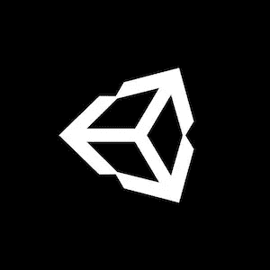

# 制作一个 RTS 游戏#53:最后的话，谢谢…和一本电子书！(Unity/C#)

> 原文：<https://medium.com/geekculture/making-a-rts-game-53-final-words-thanks-and-an-ebook-unity-c-aba38542b9b9?source=collection_archive---------5----------------------->

## 这是“第一阶段”的结束！:)

[*⬅️教程#52:实现一个技术树 3/3*](/codex/making-a-rts-game-52-implementing-a-technology-tree-3-3-unity-c-c7038b979e77)*|*[*TOC*](https://mina-pecheux.medium.com/making-an-rts-game-in-unity-91a8a0720edc)

*📕* [*获取 Gumroad 上的电子书和奖励资料！*](https://mpecheux.gumroad.com/l/rrylr)🚀 [*在我的 Github 上找到这个教程系列的代码！*](https://github.com/MinaPecheux/UnityTutorials-RTS)

