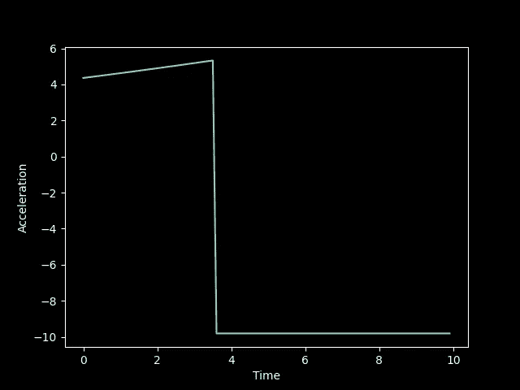
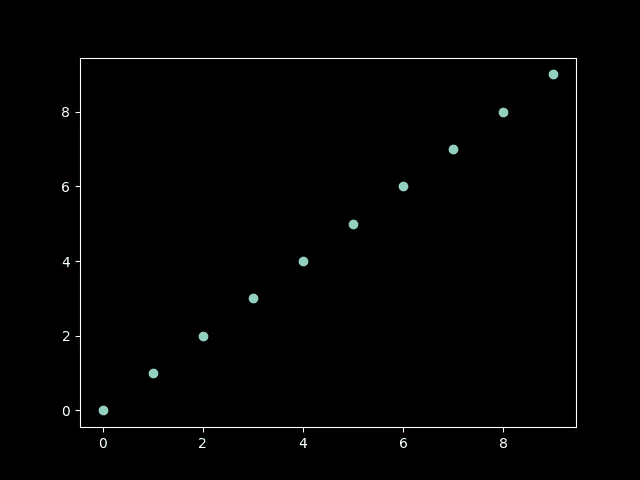
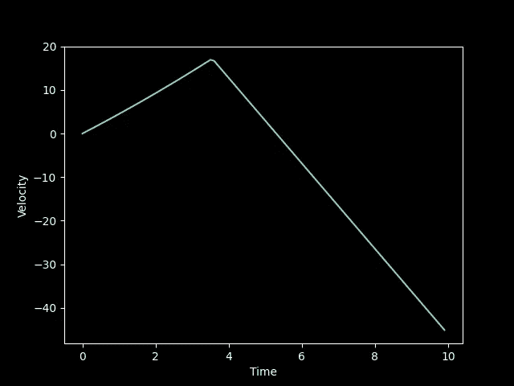
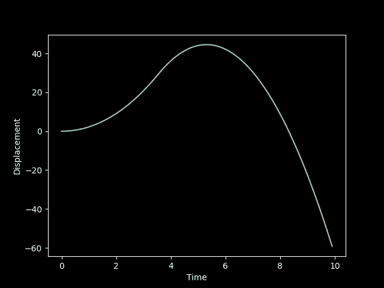
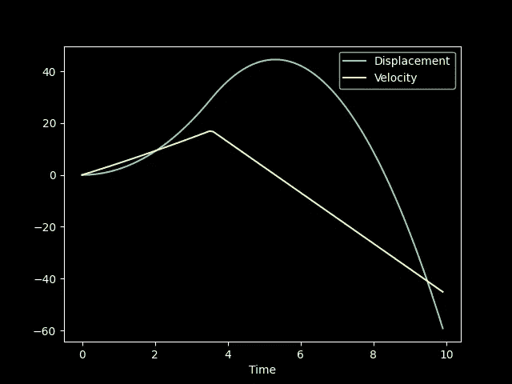
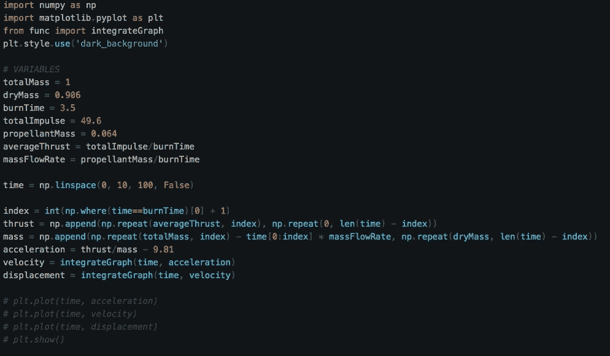
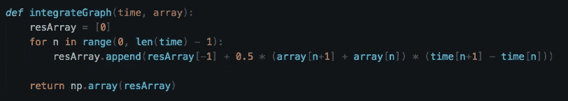

# 用 Python 制作火箭模型的简单飞行模拟

> 原文：<https://medium.com/geekculture/making-a-simple-flight-simulation-for-model-rockets-in-python-3cf946043a77?source=collection_archive---------6----------------------->


Photo by [SpaceX](https://unsplash.com/@spacex?utm_source=medium&utm_medium=referral) on [Unsplash](https://unsplash.com?utm_source=medium&utm_medium=referral)

模型火箭是一个令人敬畏的爱好，作为一个太空爱好者，我不断尝试做一些与此相关的事情。其中之一就是进行飞行轨迹模拟。我目前正在开发一个完整的飞行模拟库，我想我会和大家分享这段代码。所以让我们开始吧！

# 介绍

这个代码只适用于飞行高度低于 1 千米的火箭。这是因为我不想在方程式中加入阻力，让事情变得非常复杂。此外，在整个代码中，我们将使用国际单位制。我使用的是 Python 3.7.3，但是你可以使用任何支持 matplotlib 和 numpy 的版本。

# 代码

让我们从选择一些值开始。我认为发动机的总质量(湿重)为 1 千克。我只是随机选择了这个值，但是如果你有一个真正的火箭，你必须称重。此外，我决定使用 Estes F15 电机，因为我认为这是最适合这个模拟。我要做的是，电机所需特性的变量。

```
totalMass = 1
dryMass = 0.906
burnTime = 3.4
totalImpulse = 49.6
propellantMass = 0.064
```

接下来，我将计算质量流率，发动机使用推进剂的速率，以及平均推力。为了简单起见，我假设它们都是常数。然而，即使您决定添加那些变量如何随时间变化，这段代码也将工作。

```
averageThrust = totalImpulse/burnTime
massFlowRate = propellantMass/burnTime
```

现在，我将创建一个时间数组，其中包含我们需要的不同时间戳。因为燃烧时间精确到小数点后一位，所以我们的时间戳也必须精确到小数点后一位。但是，如果你愿意，你可以提高精确度。

```
import numpy as np
time = np.linspace(0, 10, 100, False)
```

“linspace”将给出一个从 0 到 9.9 的数字数组。您可以查阅 numpy 文档来了解更多关于 linspace 的信息。现在我有一个时间轴。

是时候记一些基础物理了。为了得到位移，我们需要速度，为此我们需要加速度。如果我们要从加速度中求出速度，就需要求出曲线下的面积。这是基本的整合。因为这是一个图形，我们可以很容易地用梯形法求出图形下的面积。我们先做推力的排列。

```
index = int(np.where(time==burnTime)[0] + 1)thrust = np.append(np.repeat(averageThrust, index), np.repeat(0, len(time) - index))
```

这将生成一个数组，在燃烧时间之前，该数组的值为平均推力，但在燃烧时间之后，该数组的值仅为 0。现在，我们必须计算质量如何随时间变化。

```
mass = np.append(np.repeat(totalMass, index) - time[0:index] * massFlowRate, np.repeat(dryMass, len(time) - index))
```

我们在这里做了同样的事情。现在我们可以通过将推力数组除以质量数组，然后从整个数组中减去 9.81(重力加速度)来得到加速度的图形。

```
acceleration = thrust/mass - 9.81
```

接下来让我们画一个加速度对时间的曲线图。

```
import matplotlib.pyplot as plt
plt.style.use('dark_background')plt.plot(time, acceleration)
plt.ylabel("Acceleration")
plt.xlabel("Time")
plt.show()
```



这是我得到的图表。基于你最初的价值观，你可能会得到不同的东西。y 轴是加速度，x 轴是时间。

现在是时候创建一个为我们做集成工作的函数了。我将为此创建一个单独的 python 文件，然后将该文件导入 main.py。

我将新文件命名为“func.py”。让我们从导入 numpy 开始:

```
import numpy as npdef integrateGraph(time, array):
    pass
```

为了积分，我们必须知道梯形法则。基本上，图中两点之间的面积就是梯形的面积。这里有一个例子:



如果以 x 轴为基线，考虑 2 个相邻点，可以看到形成的形状是一个梯形。公式为 0.5 *平行边数总和*高度。平行边的总和将是相邻点的 y 值的总和，而高度将是这些点之间的时间差。不过，在一个大小为 100 的数组中这样做是很棘手的。我将使用一个 for 循环来遍历数组。因为相邻点之间的面积只会给我加速度的变化，我会把总加速度也加到方程中。

```
resArray = [0]for n in range(0, len(time)-1):
    resArray.append(
        resArray[-1] + 0.5*(array[n+1] + array[n])*(time[n+1] -
        time[n])
    )return np.array(resArray)
```

我已经将初始值默认为 0，但是可以根据情况改变。该函数将返回一个包含积分值的数组。

在 main.py 文件中，让我们导入这个函数，并用它来计算速度。

```
from func import integrateGraph
velocity = integrateGraph(time, acceleration)
```

让我们画出速度图。

```
plt.plot(time, velocity)
plt.ylabel("Velocity")
plt.xlabel("Time")
plt.show()
```



你的图表可能看起来不同，但这应该是一般的形状。现在我们可以对速度图进行积分，得到位移图。

```
displacement = integrateGraph(time, velocity)plt.plot(time, displacement)
plt.ylabel("Displacement")
plt.xlabel("Time")
plt.show()
```

你应该会得到这样一个图表:



这个图形穿过 x 轴的那一刻，意味着我们已经触地。你可以绘制多个参数来分析不同的事物。

```
plt.plot(time, displacement)
plt.plot(time, velocity)
plt.legend(["Displacement", "Velocity"])
plt.xlabel("Time")plt.show()
```



这个图显示了速度和位移。您可以添加标签以使图表更容易理解。

# 结论

今天就到这里吧。这个代码不是很先进，没有考虑到很多事情，如阻力和发射角度。这并不意味着不能添加它们。例如，可以通过从用户处获得角度并将推力阵列乘以角度的正弦(如果角度是从水平方向测量的)或角度的余弦(如果角度是从垂直方向测量的)来考虑发射角度。您可以使用代码来更好地理解您的数据。例如，如果您想要速度的总变化，而不是在积分步骤后将值存储在数组中，您可以将这些值相加。

我希望你喜欢这个博客！我写关于编程和空间的博客，如果你喜欢这些话题，请在这里关注我。

感谢阅读！

下面是完整的代码:



main.py



func.py