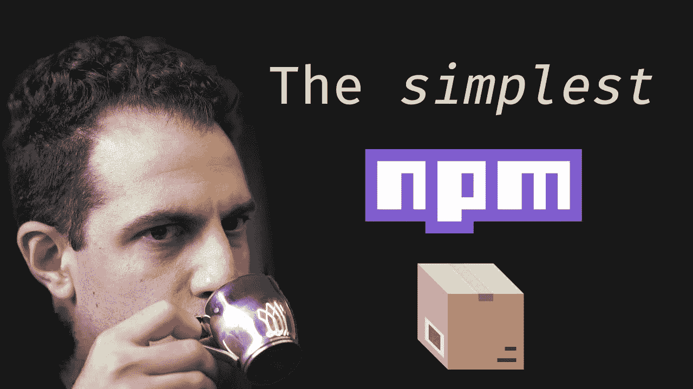

# 用 React & TypeScript 制作用户界面库

> 原文：<https://medium.com/geekculture/making-a-ui-library-with-react-typescript-b0c7908951fc?source=collection_archive---------2----------------------->

## 这比你想象的要简单，甚至可以离线完成。

[Accompanying video](https://www.youtube.com/watch?v=vSxoV1KUF-A)

在这个项目中，我们将创建一个可以想象的最简单的 UI 库。它将使用 React 和 TypeScript 编写，并作为一个包在 NPM 上发布。

# npm 初始化

创建一个空项目并运行`npm init`。出现提示时，输入要求的信息。

接下来，安装任何必要的依赖项。对于我的项目，我需要的只是反应和打字稿。

# tsconfig

在存储库的根目录中，添加一个`tsconfig.json`文件。我总是[推荐去重复工作](/weekly-webtips/stop-messing-with-tsconfig-92718ac36df4)，这意味着使用`@tsconfig/recommended`。我的`tsconfig.json`文件是这样的:

```
{
  "extends": "@tsconfig/recommended/tsconfig.json"
}
```

虽然这对`tsconfig`来说是一个很好的开始，但是看看所有不同的选项，选择你认为最适合你的项目的选项。在我的例子中，我使用 React，所以我需要设置`jsx`编译器选项。

## jsx 保留

TypeScript 附带三种`jsx`模式:

*   保护
*   反应
*   反应自然

我将使用“preserve ”,因为我正在创建一个将在其他地方使用的库，我不想像下面这样转换成 JS

```
❌    <div/> ➡ React.createElement("div") 
```

# 制作 UI 组件

接下来，我将用一个简单的组件(`src/Button.tsx`)创建`src/index.ts`，它不做任何事情。

```
export const Button = () => null;
```

并从我的`index.ts`文件中导出组件:

```
export * from "./Button"
```

# 样式组件

我需要一种样式化组件的方法，顾名思义，`[styled-components](https://styled-components.com/)`是一个使用类似 [SASS](https://sass-lang.com/) 的语法来生成 React 组件的库。这是我喜欢经常使用的东西。我要安装`styled-components`和它的类型库

```
npm i styled-components
npm i -D @types/styled-components
```

然后，我用这种样式化的按钮组件语法替换了我的按钮功能组件

```
export const Button = styled.button``
```

除了下面的代码之外，这个样式化的按钮组件实际上没有什么不同:

```
export const Button = (props) => <button {...props} />
```

当你开始顶嘴的时候，它会变得更有力量。在这种情况下，我只是做一个简单的例子，只是让背景颜色为绿色:

```
export const Button = styled.button`
  background-color: green
`
```

# 制作包装

令人难以置信的是，我们已经创建了我们的第一个 UI 库。UI 库并不是真正有用的东西，除非你把它做成一个包。首先，打开`package.json`并更改`main`字段以查看`src`目录:

```
"main": "src/index.ts",
```

其次，需要打包的内容在`package.json`中指定:

```
"files": ["src/**/*"],
```

`src/**/*`是一个 [glob](https://en.wikipedia.org/wiki/Glob_(programming)) 模式，它匹配`src`目录中的所有内容。接下来我们要做的是运行`npm pack`命令，这将把所有内容压缩到一个归档文件中，它代表了当用户运行`npm install`时将交付给他们的内容。这是在生成的 tar zip 文件`coradion-ui-1.0.0.tar`中:

```
[src
| Button.tsx
| index.ts
package.json](https://en.wikipedia.org/wiki/Glob_(programming))
```

虽然我们的存储库中还有一些东西，但是唯一打包的是`src`目录和`package.json`文件。有一些东西是默认包含的，比如`package.json`和一个自述文件。我们没有自述文件，所以现在让我们在项目`README.md`的根目录中添加一个:

```
# @Coradion/ui
This is a readme
```

当我再次运行`npm pack`命令时，包内现在有一个自述文件:

```
[src
| Button.tsx
| index.ts
package.json](https://en.wikipedia.org/wiki/Glob_(programming))
README.md
```

# NPM 链接

要测试一个包而不将其发布到 NPM 包存储库，使用`npm link`命令。在您的包内运行:

```
npm link
```

在将要使用您的包的项目中运行相同的命令，但是使用包的名称:

```
npm link @coradion/ui
```

在我们的项目 node_modules 文件夹中，你可以看到我们有一个名为`@coradion`的新文件夹，它有一个名为`ui`的 bin 文件

现在可以将包导入到您的项目中，如下所示:

```
import { Button } from "@coradion/ui"
```

# 为什么其他的包都这么复杂？

看看像 [Material UI](https://mui.com/) 这样的库，有大量的文件和依赖项。仅主 package.json 就有 227 行，包含 117 个依赖项！

即使看工装，他们也有 [Lerna](https://lerna.js.org/) 、 [Rollup](https://rollupjs.org/guide/en/) 、 [TypeScript](https://www.typescriptlang.org/) 和 [Webpack。很容易看到所有这些复杂性，并假设创建自己的包是困难的。然而，这篇文章中所创造的是一个可疑的简单的功能包的例子，其复杂性只是一小部分。](https://webpack.js.org/)

Material UI 和其他类似的库需要支持广泛的环境。@coradion/ui 只需要支持 React + TypeScript 环境即可。所有操作、转换和翻译的责任都留给了使用 UI 库的项目。

在下一篇文章中，我将把这个包发布到 NPM 包存储库中，并通过 GitHub 动作实现自动化。

# TL；速度三角形定位法(dead reckoning)

我从一个新项目开始，使用 TypeScript、ReactJS 和样式化组件创建了一个 UI 库(只有一个基本组件)。我还制作了一个基本的 NPM 包，可以在本地用来测试 UI 库。

*最初来自:*

 [## 用 React & TypeScript 制作用户界面库

### 在这个项目中，我们将创建一个可以想象的最简单的 UI 库。它将使用 React 和…

www.bayanbennett.com](https://www.bayanbennett.com/posts/making-a-ui-library-with-react-and-typescript) 

thumbnail