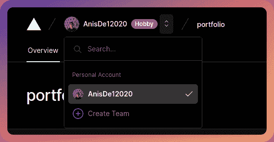
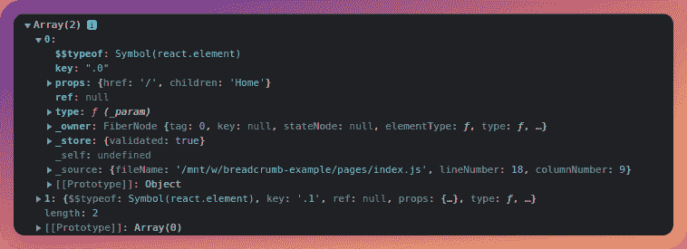
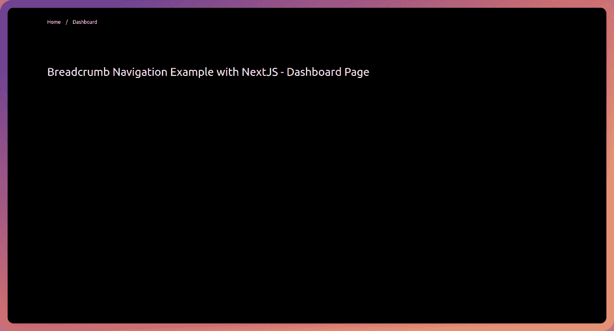
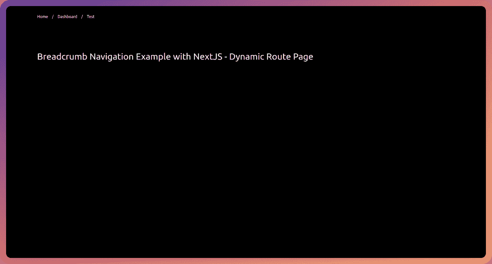

# 使用 TailwindCSS 和 NextJS 创建可访问的面包屑导航

> 原文：<https://medium.com/geekculture/making-an-accessible-breadcrumb-navigation-using-tailwindcss-and-nextjs-13c4187413de?source=collection_archive---------6----------------------->


面包屑导航现在开始出现在许多应用程序中，主要是在仪表板中。今天，我们将看看如何使用 TailwindCSS 构建一个可访问的面包屑导航。在本教程中，我们将使用 NextJS(特别是 [NextJS 路由器](https://nextjs.org/docs/api-reference/next/router))。但是，您可以对其他框架执行相同的步骤，它也可能不是 React 框架。只要确保查找和实现正确的路由器逻辑并正确创建组件，样式将保持不变。

你一定遇到过导航条，类似这样的东西-


第一个例子来自 [Vercel](https://vercel.com/) 仪表盘，第二个例子来自 [Netlify](https://www.netlify.com/) 仪表盘。

我们可以看到，它让我们简单地知道我们在哪个页面，也让我们很容易地导航回来(是的，这些面包屑项目通常是链接)。

有时，这些面包屑链接也有一个相关的下拉菜单，就像这样



我们今天不会构建它，因为它是一个更高级的用例，但是，在更大的项目中，它将是一个有用的东西，因为它使导航更容易。

# 用 TailwindCSS 初始化 NextJS 应用程序

首先，让我们创建一个新的 NextJS 应用程序

```
npx create-next-app breadcrumb-example
# OR
yarn create next-app breadcrumb-example
```

现在，让我们删除一些样板代码和现有的 CSS(除了`global.css`文件),因为我们将添加 TailwindCSS。

一个清理过的`pages/index.js`会是这样的——

另外，删除`styles`目录下的`Home.module.css`。

# 添加 TailwindCSS

我们将简单地按照 office 指南[将 TailwindCSS 添加到 NextJS 应用程序](https://tailwindcss.com/docs/guides/nextjs)。

首先，让我们安装 TailwindCSS、PostCSS 和 AutoPrefixer -

```
npm install -D tailwindcss postcss autoprefixer 
# OR
yarn add -D tailwindcss postcss autoprefixer
```

同样，运行以下命令来生成`tailwind.config.js`和`postcss.config.js`文件-

```
npx tailwindcss init -p
```

现在，用以下内容替换`tailwind.config.js`文件

现在，将以下代码添加到`styles`目录下的`globals.css`文件中-

对于这个例子，我将选择黑暗模式版本，只是为了让我拍摄的截图看起来更舒服。为此，我将把它添加到我的`globals.css`文件中-

我还将为之前在`index.js`文件中添加的`h1`标签添加一些样式

这是网站现在的样子-


有趣的部分到了，让我们来构建面包屑导航！

让我们制作一个名为`components`的新目录。这是我们将放入`Breadcrumb`和`BreadcrumbItem`组件的地方。

现在，让我们做面包屑。创建一个名为`Breadcrumb.jsx`的文件，并添加以下代码-

让我们一步一步地检查这段代码。首先我们做一个新的组件叫做`Breadcrumb`。我们接受一个支柱，那就是孩子。这些孩子将包括面包屑项目，即链接到页面。

然后我们使用`[Children.toArray()](https://reactjs.org/docs/react-api.html#reactchildrentoarray)` [函数](https://reactjs.org/docs/react-api.html#reactchildrentoarray)将这些子元素转换成一个数组。

如果我们将`childrenArray`变量记录到控制台，我们应该会看到类似这样的内容



在这里，我们可以看到它包含了关于组件的所有元数据，比如道具、组件类型等等。

接下来，我们把这个数组映射到它上面。我们通过比较元素的`index`和数组的长度来检查它是否是数组的最后一个元素。如果它不是最后一个元素，我们将其作为带有子元素本身的 [React 片段](https://reactjs.org/docs/react-api.html#reactfragment)以及分隔符(在本例中为`/`，因为它是最常见的元素，但是您也可以更改它)返回。如果它是数组的最后一个元素，我们只返回这个元素，没有分隔符。

接下来，Breadcrumb 组件返回一个带有订单列表的`nav`元素(`ol`)。有序列表是一个 flexbox，`space-x-4`类在所有子元素(本例中是 breadcrumb 项目)之间添加了一个边距`1 rem`。

最后，我们导出组件供以后使用。

现在，让我们创建另一个名为`BreadcrumbItem.jsx`的文件，并向其中添加以下代码

这里，我们正在创建一个名为`BreadcrumbItem`的新组件，它包含一个`children`和一个`href`道具。我们还接受额外的道具，这些道具将被传递到`li`道具中。请注意，每个`BreadcrumbItem`都是一个列表项，因此它适合我们之前在`Breadcrumb`组件中创建的有序列表。

是时候将面包屑添加到我们的应用程序中了。现在，让我们将下面的代码添加到`pages`下的`index.js`文件中

此外，不要忘记进口

这是主页现在应该的样子-


现在，我们正在主页上呈现面包屑，并硬编码页面名称。但是，这不是我们应该做的，让我们看看一种更好的方法，使用路由器组件来推断路由。

# 动态创建面包屑项目

到目前为止，我们一直手动将面包屑条目传递到`Breadcrumb`组件中。但是，这种方法不适合大型应用程序。

我对`_app.js`文件做了一些修改，以动态创建面包屑项目

让我们看一下这段代码。首先，我们导入 NextJS 路由器，`[useEffect](https://reactjs.org/docs/hooks-effect.html)`[钩子](https://reactjs.org/docs/hooks-effect.html)，`[useState](https://reactjs.org/docs/hooks-state.html)`[钩子](https://reactjs.org/docs/hooks-state.html)，`Breadcrumb`组件和`BreadcrumbItem`组件。此外，您可以从`index.js`文件中删除 Breadcrumb 组件。

然后，在`MyApp`组件中，我们初始化路由器并创建一个状态来存储面包屑。接下来，我们有一个`useEffect`钩子，它在页面加载和`router.asPath`改变时触发。

在`useEffect`钩子中，首先，我们从我们的路径(从`router.asPath`获得)中移除查询参数。接下来，我们将它分割成一个名为`pathArray`的数组，并调用其上的函数来删除第一个元素(这是 home route)。

接下来，我们也将其过滤掉，这样我们就不会得到任何其他的空白路径(这是因为如果我们在 home 路由上，NextJS 路由器会在最后一个索引处返回一个空白元素)。

之后，我们[将](https://developer.mozilla.org/en-US/docs/Web/JavaScript/Reference/Global_Objects/Array/map)映射到它上面，并生成一个名为`breadcrumbs`的新数组。`breadcrumbs`数组是一个包含面包屑项目的`href`和`label`的对象数组。

最后，我们将它保存到`breadcrumbs`状态，这样我们就可以在`useEffect`钩子之外使用它。

接下来，在 JSX 中，我们添加了`Breadcrumb`组件，并为其添加了一个`BreadcrumbItem`回家的路线。

然后，我们确保`breadcrumbs`数组不为空，并映射它，添加其他的`BreadcrumbItem`组件。

现在，为了进行测试，在`pages`下创建一个名为`dashboard`的目录，并添加两个文件- `index.js`和`[id].js`。

将以下代码添加到`index.js` -

现在，将以下代码添加到`[id].js` -

现在，让我们前往`/dashboard`



我们可以看到面包屑工作正常，链接也工作正常！

现在让我们转向`/dashboard/test`，我们可以看到面包屑显示了动态路线-



# 让它变得可访问

首先，让我们给我们的`Breadcrumb`组件添加一个`aria-label`值`breadcrumb`

现在，让我们对我们的`_app.js`做一个小小的改动，用一个布尔值把一个名为`isCurrent`的道具传递给`BreadcrumbItem`。对于最后一个面包屑项目，即当前页面，该值为 true。

对于最初的回家路线，我们只是简单地将`router.pathname`与`/`匹配。

现在在`BreadcrumbItem.jsx`文件中，将代码改为如下所示

这里，如果是当前路线，我们将`aria-current`设置为`page`。

# 结论

我希望你现在有一个工作的面包屑导航。请随意尝试，祝您愉快😁🤞

# 🔗重要链接

*   [部署预览](https://nextjs-breadcrumb-example.vercel.app/)
*   [代码为](https://github.com/AnishDe12020/nextjs-breadcrumb-example)的 GitHub 库

*原发布于*[*https://blog . anishde . dev*](https://blog.anishde.dev/making-an-accessible-breadcrumb-navigation-using-tailwindcss-and-nextjs)*。*