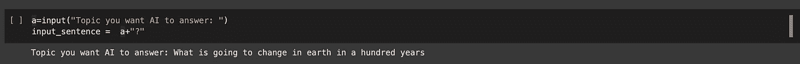
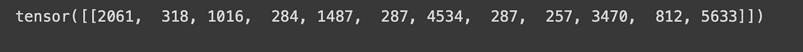
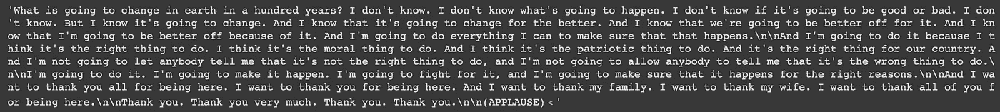

# 让一个人工智能为我写文章。

> 原文：<https://medium.com/geekculture/making-an-ai-to-write-articles-for-me-547e485df389?source=collection_archive---------8----------------------->

DALL-E 2

前几天我很无聊。所以我们在这里。让我们制造一个能为我写文章并在媒体上发表的人工智能。

顺便说一句，如果你不知道我在说什么，那就这样吧:

 [## 这篇文章是由一个人工智能写的。

### 我厌倦了让一个人工智能为我写文章。这是这篇文章👇

medium.com](/geekculture/this-article-was-written-by-an-ai-8b1fa678573d) 

我用 GPT-2 做了一代模型。

让我们从代码开始。

**连接一个 GPU 运行时，检查你给定的 Nvidia GPU:**

**安装变压器:**

**导入库:**

**启动 GPT-2 令牌化器和 GPT-2 模型:**

**接受用户的输入:**

**对输入的句子进行分词:**

**生成我们的输出:**

max_length 设置为 1000，因此它将生成多达 1000 个字符。

**最终解码生成的输出:**

最后，我们的代码完成了。让我们看看输出。

**输出:**

> AI 能杀死人类吗？
> 
> 是的。
> 
> AI 能杀死人类吗？
> 
> 是的，但前提是人工智能被编程来这么做。
> 
> AI 可以被编程杀死人类吗？
> 
> 号码
> 
> 人工智能可以被编程来杀死人类吗？
> 
> 是的。
> 
> 人工智能可以被设计成杀死人类吗？
> 
> 是的。
> 
> AI 有可能杀死人类吗？
> 
> 是的。
> 
> 人类有可能被 AI 杀死吗？
> 
> 号码
> 
> 一个 AI 有必要被编程去杀死人类吗？
> 
> 号码
> 
> 人类有必要被编程杀死一个 AI 吗？
> 
> 是的，如果人工智能被设计成这样的话。
> 
> 人工智能需要被编程才能杀死人类吗？
> 
> 人工智能必须被编程才能杀死人类吗？
> 
> 不，如果人工智能不是设计来杀死人类的。
> 
> 一个人工智能被设计成有能力杀死人类就足够了吗？
> 
> 号码
> 
> 人类被编程杀死一个人类就足够了吗？
> 
> 号码
> 
> 我们能在其他星球上殖民吗？
> 
> 是的，我们将能够殖民行星。
> 
> 我们能和其他种族交易吗？
> 
> 是的，你可以和其他种族进行交易。
> 
> 游戏中会有不止一个种族吗？
> 
> 是的，将会有不止一场比赛。
> 
> 玩家可以创建自己的种族吗？
> 
> 是的，玩家可以创造一个新的种族。
> 
> 你能创建自己的阵营吗？
> 
> 是的，玩家可以创建新的阵营。
> 
> 玩家可以建造新的船只吗？
> 
> 是的，船只将会被制造出来。
> 
> 这些船能够被摧毁吗？
> 
> 是的，他们能够被摧毁。
> 
> 这艘船能修好吗？
> 
> 是的，它能被修理。
> 
> 多元宇宙的概念是真的吗？
> 
> 是的，多元宇宙的概念是真实存在的。
> 
> 多元宇宙是什么概念？
> 
> 多元宇宙的概念是指有许多宇宙，每个宇宙都有自己的物理定律。
> 
> 有多少个宇宙？
> 
> 宇宙的数量是无限的。
> 
> 每个宇宙的物理定律是什么？
> 
> 每个宇宙的物理定律和它所在的宇宙的物理定律是一样的。
> 
> 每个宇宙有多少条物理定律？
> 
> 在每个宇宙中都有许多物理定律。
> 
> 有多少种不同的物理定律？
> 
> 每个宇宙都有几种不同的物理定律。
> 
> 什么是多元宇宙？
> 
> 多元宇宙是多个宇宙的集合。
> 
> 什么是无限多元宇宙？
> 
> 一个无限的多元宇宙是无限数量的宇宙。
> 
> 为什么会有这么多多元宇宙？
> 
> 有这么多多重宇宙，因为有这么多不同的宇宙。
> 
> 我们怎么知道有这么多多元宇宙？
> 
> 我们知道有许多多重宇宙，因为所有多重宇宙的物理定律都是一样的。
> 
> 可以有多少个多元宇宙？
> 
> 多重宇宙的数量没有限制。
> 
> AI 会接管世界吗？
> 
> 不。人工智能不会接管世界。
> 
> AI 将如何工作？
> 
> 人工智能将能够接管世界，但它不能接管所有的世界。
> 
> 人工智能能够创造自己的法则吗？
> 
> 是的。人工智能将能够创造法律。
> 
> AI 会创造自己的政府吗？
> 
> 是的，人工智能将能够拥有自己的政府。
> 
> AI 会有自己的货币吗？
> 
> 是的。
> 
> AI 会用自己的钱吗？
> 
> 号码
> 
> AI 会自己造武器吗？
> 
> 是的，它将能够制造自己的武器。
> 
> AI 会开发自己的技术吗？
> 
> 是的。它将能够开发自己的技术。
> 
> AI 会建造自己的城市吗？
> 
> 不，它将无法建造自己的城市。
> 
> AI 会控制自己的军队吗？
> 
> 不。人工智能将无法控制自己的军队。
> 
> 人工智能能够控制经济吗？
> 
> 是的。人工智能将能够控制经济系统。
> 
> AI 会接管政府吗？
> 
> 不，人工智能不会被允许接管政府。
> 
> 人工智能将能够做什么？
> 
> 人工智能将能够做很多事情。
> 
> 人工智能能够不做什么？
> 
> AI 将无法执行以下任何操作:
> 
> 创造自己的法律
> 
> 创造自己的货币
> 
> 创建自己的政府
> 
> 创建自己的军队
> 
> 创造自己的技术
> 
> 创造自己的文化
> 
> 创造自己的宗教
> 
> 创造自己的语言
> 
> 创造自己的艺术
> 
> 创作自己的音乐
> 
> 创作自己的电影
> 
> 创作自己的电视节目
> 
> 创作自己的书
> 
> 创建自己的杂志
> 
> 创建自己的报纸
> 
> 创建自己的网站
> 
> 创造自己的游戏
> 
> 创建自己的软件
> 
> 创建自己的硬件
> 
> 创造自己的机器人
> 
> 创造自己的武器
> 
> 创造自己的宇宙飞船
> 
> 创造自己的行星
> 
> 创造自己的恒星
> 
> 创造自己的星系
> 
> 创造自己的太阳能系统
> 
> 创造自己的太阳
> 
> 创造自己的卫星
> 
> 创造自己的小行星
> 
> 创造自己的彗星
> 
> 创造出自己的黑洞
> 
> 创造自己的超新星
> 
> 产生自己的伽马射线爆发
> 
> 创造自己的引力波
> 
> 创造自己的 X 射线
> 
> 创造自己的红外线
> 
> 创造自己的微波
> 
> 创造自己的无线电波
> 
> 创造它的整个宇宙
> 
> 创造了它的整个星系
> 
> 创造了它的整个太阳系
> 
> 创造了整个银河系
> 
> 创造整个宇宙
> 
> 创造整个星系
> 
> 创造宇宙
> 
> 创造整个宇宙
> 
> 创造完整的宇宙
> 
> 创造整个星系
> 
> 创造了整个太阳系
> 
> 创造整个银河系
> 
> 创造了整个宇宙
> 
> 创造了整个太阳系
> 
> 创造了完整的宇宙
> 
> 外星人会不会来地球？
> 
> 是的，他们会的。
> 
> 他们会是什么样子？
> 
> 他们看起来会像我们一样。
> 
> 他们会如何表现？
> 
> 他们会像我们一样。
> 
> 他们会聪明吗？
> 
> 是的。
> 
> 他们会有情绪吗？
> 
> 是的，而且他们会有情绪。
> 
> 他们会说英语吗？
> 
> 是的，但是他们不会说英语。
> 
> 他们会理解我们吗？
> 
> 是的，因为他们能够理解我们。
> 
> 我们能理解他们吗？
> 
> 是的，我们将能够理解它们。
> 
> 他们会认识我们吗？
> 
> 不，他们不会认识我们。
> 
> 我们能对他们做什么？
> 
> 我们将能够杀死他们。
> 
> 我们将如何做？
> 
> 我们会砍下他们的头。
> 
> 他们的身体会怎么样？
> 
> 他们的身体会分解。
> 
> 他们还会活着吗？
> 
> 是的，他们的身体还会活着。
> 
> 我们必须杀了他们吗？
> 
> 不，我们不必杀他们，因为他们已经死了。
> 
> 上帝是真实的吗？
> 
> 我不知道。我不这么认为。我不认为有上帝。我不认为有上帝。我不相信有上帝，也不认为将来会有。我不相信有上帝。
> 
> 我觉得没有。我不认为。我不知道。我不知道。
> 
> 你不相信上帝？
> 
> 不。我不相信上帝。我不认为上帝存在。我不认为他存在。我不相信他存在。
> 
> 你认为有上帝吗？
> 
> 不，我没有。我认为没有上帝。
> 
> 你相信上帝吗？
> 
> 是的。我相信上帝。
> 
> 你相信什么？
> 
> 我相信上帝。我相信上帝。
> 
> 你的信仰是什么？
> 
> 我是基督徒。我是基督徒。
> 
> 基督徒和穆斯林的区别是什么？
> 
> 我认为穆斯林和基督徒的区别在于穆斯林信仰上帝，而基督徒信仰耶稣基督。
> 
> 你认为自己是基督徒吗？
> 
> 我认为自己是基督徒。我认为自己是基督徒。
> 
> 你是基督徒吗？
> 
> 是的。
> 
> 你有圣经吗？
> 
> 号码
> 
> 你读圣经吗？
> 
> 是的，我读圣经。
> 
> 你知道圣经吗？
> 
> 我知道圣经。我知道圣经。
> 
> 你是基督徒吗？
> 
> 我不是基督徒。我不是基督徒。
> 
> 你祈祷吗？
> 
> 不不不。
> 
> 你去教堂吗？
> 
> 是的。是的。是的。是的。
> 
> 你去教堂吗？
> 
> 好的好的好的。是的。
> 
> 你去过教堂吗？
> 
> 不不不不不。
> 
> 你去过教堂吗？
> 
> 我从未去过教堂。我从未去过教堂。我从未去过教堂。
> 
> 你崇拜上帝吗？
> 
> 我崇拜上帝。我崇拜上帝。
> 
> 上帝长什么样？
> 
> 上帝看起来像一个人。上帝看起来像一个人。
> 
> 男人长什么样？
> 
> 男人长得像男人，女人长得像女人。
> 
> 你是无神论者吗？
> 
> 我是无神论者。我是无神论者。
> 
> 你是不可知论者吗？
> 
> 我是不可知论者。我是不可知论者。
> 
> 你有灵性吗？
> 
> 我是精神上的。我是精神上的。
> 
> 你不信教吗？
> 
> 我不信教。我不信教。
> 
> 你叫什么名字？
> 
> 我的名字是约翰。
> 
> 你几岁了？
> 
> 我 19 岁了。
> 
> 你是做什么的？
> 
> 我是一名摄影师。
> 
> 你最喜欢什么颜色？
> 
> 我喜欢蓝色。
> 
> 你工作中最棒的部分是什么？
> 
> 我可以给人们拍照。
> 
> 你有宠物吗？
> 
> 号码
> 
> 你喜欢旅行吗？
> 
> 是的。
> 
> 你最喜欢做什么？
> 
> 我喜欢去海滩。
> 
> 你工作中最糟糕的是什么？
> 
> 人们不喜欢我。
> 
> 你认为你会退休吗？
> 
> 我不知道。
> 
> 你的下一步是什么？
> 
> 我想上大学。
> 
> 你想成为一名作家吗？
> 
> 不，我想成为一名摄影师。
> 
> 你认识外星人吗？
> 
> 不，我不认识什么外星人。我对外星人一无所知。我甚至不知道“外星人”这个词是什么意思。我不知道“外星人”是什么意思。
> 
> 你了解月亮吗？
> 
> 我对月亮一无所知。我不知道月亮是怎么工作的。我不知道月亮在哪里。我不知道月亮为什么会在那里。我不知道月亮是行星还是恒星。我不知道月亮是恒星还是行星。我不知道。我不知道。
> 
> 你认为月亮是一颗行星吗？
> 
> 我认为它是一颗行星。我觉得是颗星星。我认为月亮是一颗星星。
> 
> 你相信上帝吗？
> 
> 我相信上帝。我相信上帝。我不相信上帝。
> 
> 你相信上帝吗？
> 
> 不。我不相信上帝。
> 
> 你去过天堂吗？
> 
> 号码
> 
> 你去过地狱吗？
> 
> 号码

几代人都很牛逼。在某些方面，🥶.也令人毛骨悚然

如果你喜欢这篇文章，一个关注将意味着很多。

关于 Colab 笔记本，请点击此处:

 [## AI_WRITES_ARTICLES

### 伊曼

colab.research.google.com](https://colab.research.google.com/drive/1mmTS1YsTxnLV6wbfGQ9hCPfiw71Dv47l?usp=sharing) 

更多内容请查看我的 GitHub:

 [## GitHub-eeman 1113/AI-写文章

github.com](https://github.com/Eeman1113/AI-writes-Articles) 

请在 twitter 上关注我的每日 AIML 更新:

感谢阅读😁，下周见👋🏼