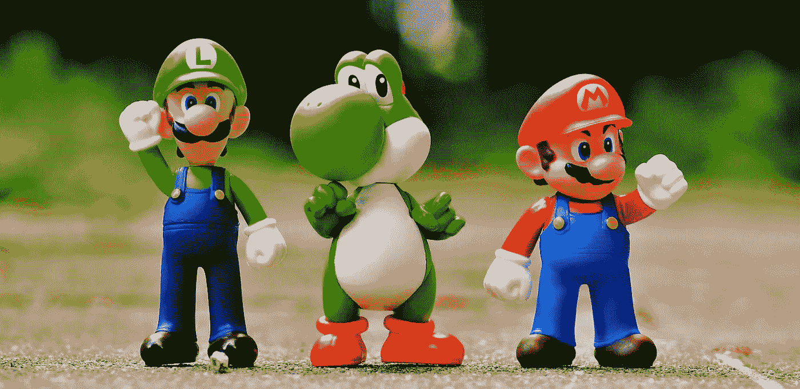
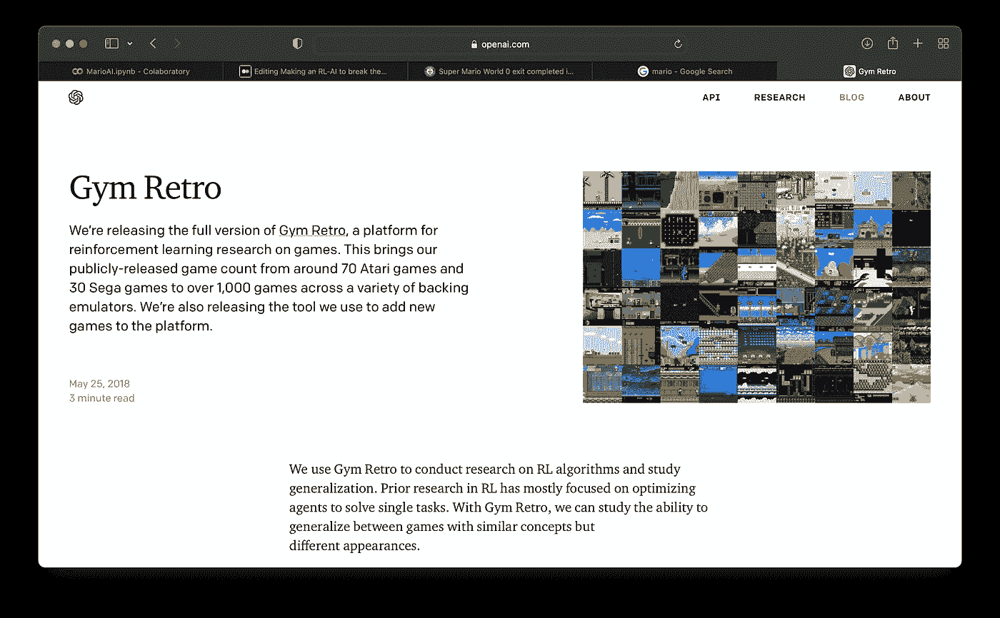
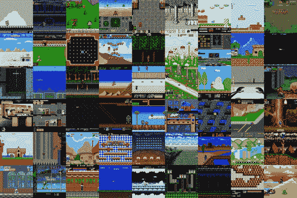
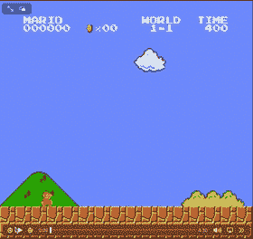
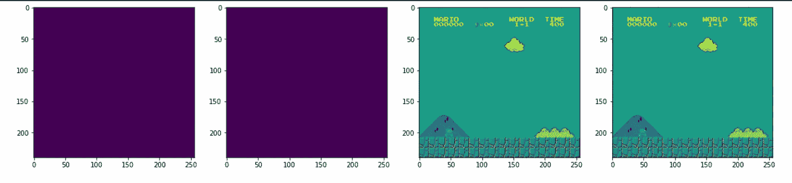
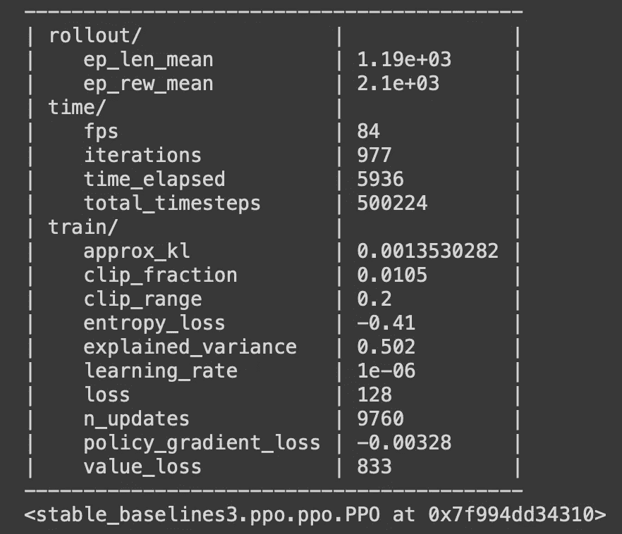
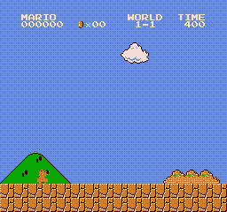

# 制作一个 RL-AI 来打破马里奥速度跑世界纪录。

> 原文：<https://medium.com/geekculture/making-an-rl-ai-to-break-the-mario-speed-run-world-record-bd406646d80?source=collection_archive---------6----------------------->

[Image credits](https://www.jotform.com/blog/the-evolution-of-mario/)

所以，我对游戏最古老的记忆之一是我在父母给我买的游戏机上玩马里奥。当我还是个孩子的时候，我就被它迷住了。尝试通过关卡，获得完美的跳跃对我来说就像是成就，尝试和尝试研磨最终的老板这些都是马里奥给我的美好回忆。所以前几天看到有人破了纪录，用 41.022 秒完成了[马里奥。然后我对自己说“我想知道我是否能让一个人工智能更快地完成它”，然后我意识到我在强化学习方面是个新手🙂。](https://twitter.com/gwr/status/1501935541339639815?s=21&t=sa41LMoz1ozzEu_6lxeB9Q)

所以，我做了一些研究，发现 OpenAI 有一种叫做[健身房复古](https://openai.com/blog/gym-retro/)的东西。

[https://openai.com/blog/gym-retro/](https://openai.com/blog/gym-retro/)

所以，它们基本上为开发者提供了训练强化学习人工智能的环境。它基本上类似于 python 中的游戏模拟器。

所以，现在我们有了环境。我开始学习如何制作 RL 模型，并发现了一个非常棒的 YouTube 频道，名为:[尼古拉斯·雷诺特](https://www.youtube.com/c/NicholasRenotte)。他有一些关于强化学习的很棒的视频，从他那里学了一些代码，做了很多研究后，我准备写这个。

**所以，首先让我们设置马里奥:**

让我们下载安装:

让我们看看进口货:

现在让我们安装一些依赖项:

我在 Google Colab 上，所以我需要制作一个虚拟屏幕来显示游戏，我们开始吧:

现在让我们实际设置游戏:

现在让我们开始游戏，并尝试随机功能:

For now its doing random actions

现在马里奥的设置完成了。

**现在让我们对环境进行预处理，以在其上学习 RL:**

让我们先安装 Pytorch:

让我们安装基线 RL 的东西:

让我们导入我们将需要的各种包装器:

让我们将包装器添加到环境中:

让我们看看各州的情况:

让我们看看预处理:

The Output

**现在让我们开始训练我们的 RL 模型:**

导入和安装模型:

让我们创建一个回调函数来保存训练好的模型:

让我们每 10000 步保存一次模型:

现在需要启动模型:

学习速度是非常重要的，太快或太慢的学习速度会导致人工智能什么也学不到。

现在让我们开始训练我们的人工智能:

所以我将步数设置为 500，000，这不足以完全训练 AI，但如果你有时间和 GPU，我建议将其设置为至少 1M->5M。

这个过程大约需要 2 个小时:

这是我得到的最终模型。我觉得只走 50 万步就很不错了。

**现在让我们使用这个模型并运行我们的游戏:**

**最后让我们看看输出:**

model_500,000 (the video was slowed down by me willingly its at 0.5x speed)

老实说，对于一个只有 500，000 步的模型来说，它的表现令人惊叹，如果它得到更多的训练，我相信它可以打破记录。

现在让我们来看看不同阶段的人工智能:

在第 100，000 阶段:

model_100,000

在阶段 250，000:

在 500，000 阶段:

现在你可以看到人工智能在不同阶段是如何改进自己的。

Ahhhh AI 太牛逼了，太好玩了。我想做更多 RL 的东西，所以请在下面评论我下一步应该做什么。

[如果你喜欢这篇文章，请在 medium 上关注我。老实说，这很有帮助。](/@eeman.majumder)

关于 Colab 笔记本，请点击此处:

 [## 马里欧艾

### Eeman_Majumder

colab.research.google.com](https://colab.research.google.com/drive/1d0Hn3Rj9xMQycTGNrEx8wI73zK9yofLs?usp=sharing) 

更多内容请查看我的 GitHub:

 [## GitHub-eeman 1113/马里奥-RL-AI

### github.com](https://github.com/Eeman1113/Mario-RL-AI) 

请在 twitter 上关注我的每日 AIML 研究动态:

感谢阅读😁，下周见👋🏼

别忘了在下面评论下一步我该做什么。