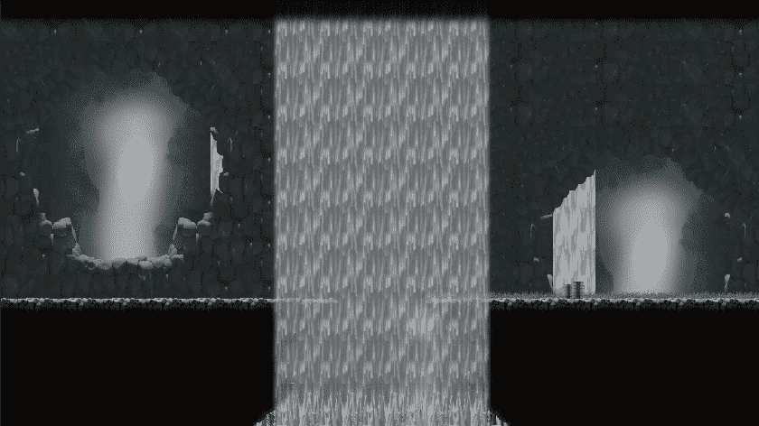
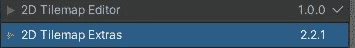
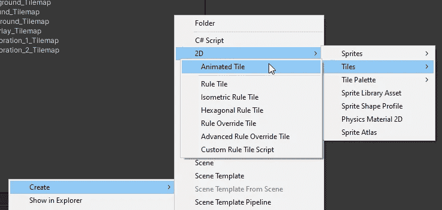
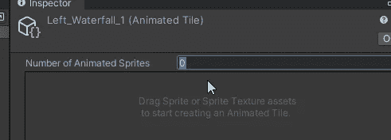
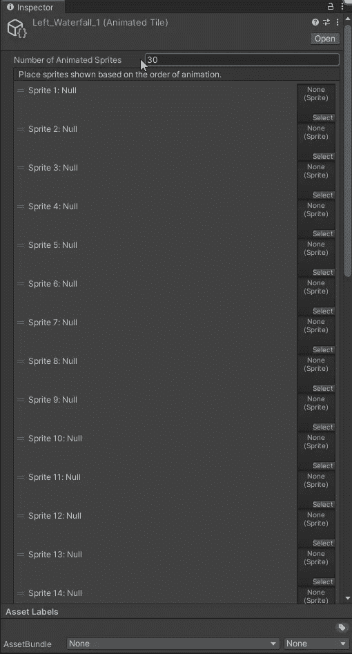
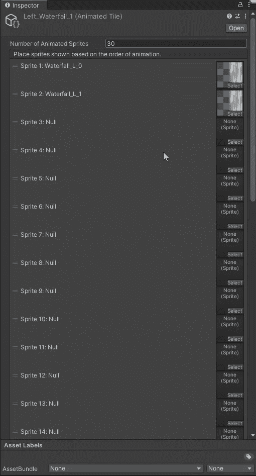
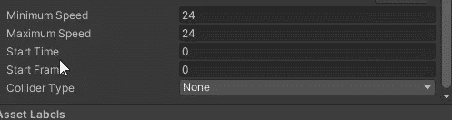
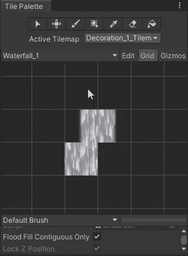
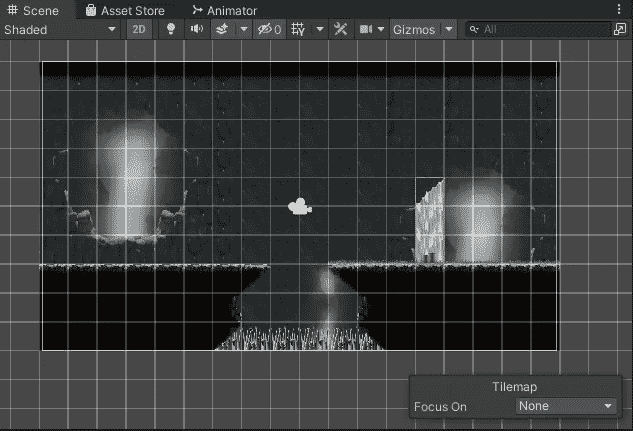
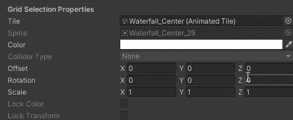

# 制作动画拼贴

> 原文：<https://medium.com/geekculture/making-animated-tiles-db0c49bebeb?source=collection_archive---------10----------------------->

**目标**:学习如何制作动画方块

在一个很酷的 2D 游戏中，我们需要包括令人惊叹但又复古的 VFX 和细节。其中，当然有移动的和动画的精灵。如果你有动画序列中的精灵，你可以很容易地创建**动画瓷砖**。

动画瓷砖可以像普通瓷砖一样绘制，但会根据它们包含的精灵集随时间而变化。制作它们很容易，但可能很乏味，而且效果很棒。我有一些瀑布动画的精灵(总共 30 个):让我们把它做成瓷砖吧！

首先，你必须确保你已经从包管理器窗口安装了需要的**包**:**2D tile map Extras**。

然后，2D 创建菜单将提供更多的选择，让我们创建一个动画瓷砖。

动画拼贴是**脚本对象**。一旦你创建了一个，你必须告诉**有多少个**精灵将组成动画，在我的例子中是 30 个。

现在是**繁琐的部分**:如你所见，当你选择 30 作为精灵的数量时，30 个占位符出现。你必须拖动每一个精灵，按顺序，一个接一个。或者使用选择按钮。无聊？只是你知道，我的瀑布有 3 个动画瓷砖:左，中，右画在垂直…

最后，但同样重要的是，你可以选择**动画速度**。这很有趣，因为你可以提供一个最小和最大的速度，在游戏时间，每个瓷砖将有一个在两个限制之间的随机速度。对于整洁的动画来说，比如瀑布，这可能是一个灾难，但是如果需要的话，这是你可以使用的另一个工具:想想树叶的动画贴图…

现在你可以添加你的瓷砖到一个新的调色板，并开始绘画！

另一件很酷的事情是在一个特定的磁贴地图中选择一些磁贴，并修改颜色属性中的参数:记住我们仍然在处理精灵！

例如，我改变了一点阿尔法通道，给一个大瀑布一个很酷的透明效果，让玩家透视，这意味着看到后面的层！

