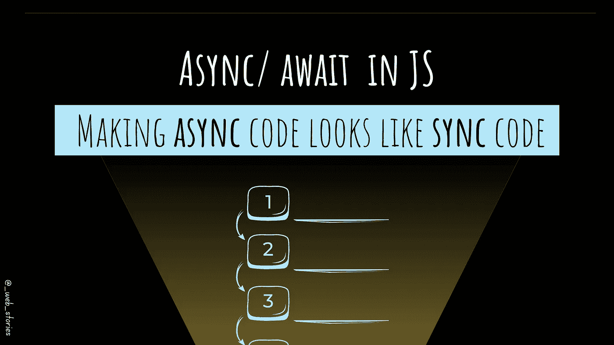

# 让异步代码看起来像 JS 中的同步代码

> 原文：<https://medium.com/geekculture/making-async-code-looks-like-sync-code-in-js-b0f5133e14ae?source=collection_archive---------2----------------------->

## JavaScript 中的异步/等待

By FAM

## 你好👋

到目前为止，你已经了解了关于回访和承诺的内容。现在，是时候学习用 JavaScript 进行异步编程的最新方法了:`**async/ await**`。

**今天的故事**是关于 JavaScript 中的异步编程。几年前，为了管理 JS 中的异步操作，开发人员…