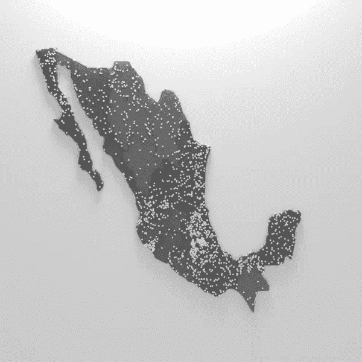

# 用搅拌机制作 choropleth 地图。

> 原文：<https://medium.com/geekculture/making-choropleth-maps-with-blender-4f8d2ada1321?source=collection_archive---------32----------------------->

在不同种类的数据中，地理数据是用途最广的一种。它可以对地理区域的大小和位置以及其他数据值进行编码。从投票数、人口、海拔和许多其他方面来看，使用地理数据来显示相关信息被广泛使用。随着皮埃尔·查尔斯·杜平男爵于 1862 年发现的最早的地图，乔洛佩斯地图…