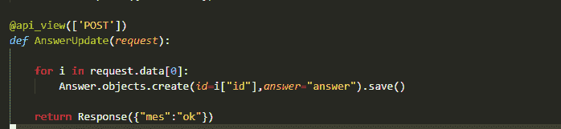
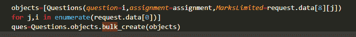
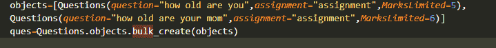
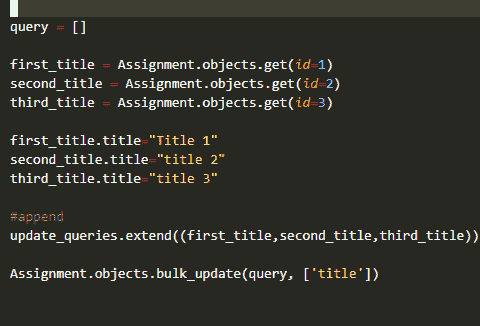
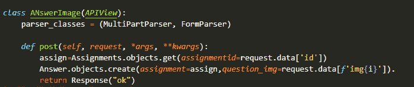
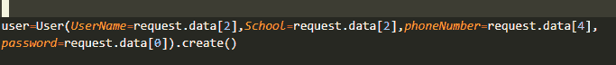
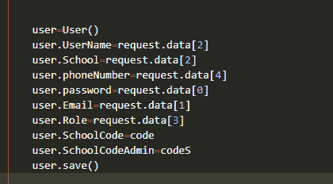

# 用简单的技巧让 Django 网站比以前更快

> 原文：<https://medium.com/geekculture/making-django-website-faster-than-before-just-using-simple-tricks-7cbe86df281?source=collection_archive---------11----------------------->

今天我们将学习一些非常简单的技巧，让你的 Django 网站比以前更快

大家好，

所以基本上我是一个 Django 开发者，在用 Django 制作网站时，我不喜欢的是有时数据库查询非常慢，最终导致网站运行缓慢，我们知道当我们的网站加载速度不够快时会发生什么。

那么我们能做些什么来让我们的网站加载得更快呢？

别担心，我在这里帮助你，今天我将告诉你 4 个简单的方法让你的 Django 网站变得更快。

所以让我们开始吧。

**1。使用 for 循环添加多个数据有点无聊:**

所以当我还是 Django 的新手时，为了在我用于循环的模型中添加多个数据点。

像这样:

但是你知道吗，这是一个非常缓慢的过程，会导致你的网站速度变慢。

那么添加多个数据点的最佳方法是什么呢？

只需使用 **bulk_create()** 这是一个数据库查询 API，可以一次创建多个数据点。

方法是:

这些代码片段是我做的一个项目的例子。

在这段代码中，我制作了一个问题模型列表，然后使用 bulk_create()并将该列表作为参数传递，以创建数据点。

你也可以这样做:

这是实现相同目标的更快的方法，相信我，我真的遵循了这个技巧，并从中受益匪浅。

现在让我们看看与普通循环有什么不同？

在正常的循环中，您将一个接一个地创建一个数据，这会导致后端负载增加，最终导致速度变慢，但是 bulk_create()会一次创建所有实例。

所以让我们进入下一个技巧。

**2。你为什么一个接一个地更新数据点？:**

和以前一样，Django 中有一个更新任何数据实例的功能。

您可以使用循环或只使用 bulk_update()来更新。

使用循环来更新任何数据点都非常慢，并且需要花费大量时间。

所以只需使用 bulk_update()。

所以可以像这样使用 bulk_update ():

这就是你可以一次更新多个数据点的方法，也可以减少服务器的负载。

让我们跳到下一个技巧。

**3。使用串行器上传图像:**

所以上传图片在 Django 中是非常重要的，但是正如你所知道的，图片非常重，所以上传它们是一个非常大的问题，特别是如果你使用的是 Django rest API，并且你有一个像 reactJS 这样的前端。

那么你能做些什么呢？

您可以使用 APIView 和解析器类来实现这一点，这是最快也是最简单的方法。

让我告诉你怎么做。

这是通过 API 上传图像的最佳方式。

APIView 中需要一个后置函数，这样就可以很好地工作了。

我知道有时候你会遇到视图集和序列化器，对于上传图片来说，这也是一个很好的方法，但是有时候会出现恼人的错误，所以我认为简单地使用 APIView 更好，它会帮助你避免恼人的错误。

序列化器总是很适合和 API 一起使用，因为它非常快。

**4。创建单个实例的最佳方式:**

因此，无论何时创建任何实例，都有两种方法可以做到这一点，让我向您展示这两种方法。

一种方法是简单地使用。像这样创建()。

显然，这是一个伟大的方法，但我发现一件事，而使用它。

当你有超过 5 个值的时候，这是一个非常慢的方法。您会发现仅仅创建一个实例就要花费大量时间。

有时，它甚至会抛出一些恼人的错误。

那么，创建单个实例的最佳方式是什么呢？

所以我们来谈谈另一种方法。

另一个方法看起来没什么问题，但是对于 5 个以上的值来说是很棒的。

方法是:

这是超过 5 个值的最佳方法

相信我，这是你见过的最伟大的方法。

它看起来很慢，但对于一个大项目来说很棒，更多的代码行并不意味着更复杂或处理更慢。

这四个技巧是我自己的实验结果，我让我的在线作业管理系统(只是为了练习)更快。

这些技巧是我 2 个月的常规练习和工作成果，所以不要忽视这一点，这些都是杰作。

谢谢，我的文章到此结束。

。在 Instagram 上关注我:【https://www.instagram.com/aviar.org_/ 

可以买我的代码:[这里是链接](https://imojo.in/schoolassignment)