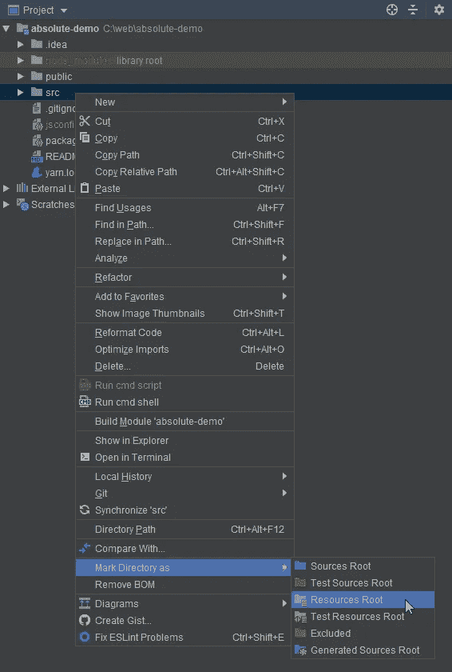
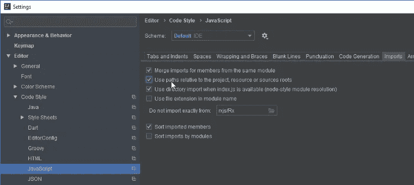
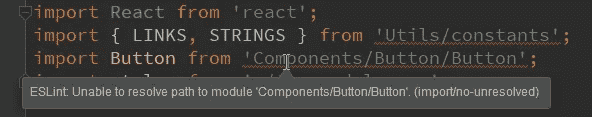

# 使用绝对导入使生活更简单——在 Javascript 和 Typescript 中反应

> 原文：<https://medium.com/geekculture/making-life-easier-with-absolute-imports-react-in-javascript-and-typescript-bbdab8a8a3a1?source=collection_archive---------2----------------------->

我们习惯于导入这样的文件`../../../Components/Dashboard/Profile`,这在很长一段时间内都是相当标准的。但是管理所有这些`../`是一项相当艰难的工作。假设我想更改文件或文件夹的位置。等等。我应该那样做吗？不会打碎什么东西吗？这些问题突然袭击了我们。
现在**绝对导入**来拯救我们了，我们现在可以以这种形式`Components/Dashboard/Profile`导入文件，而不会与`../`发生冲突，我们不关心两个文件的相对位置。我们只关心文件相对于项目根目录的位置。这简化了大量导入的工作。让我们来看看我们到底该怎么做。


# 绝对进口

绝对导入已经在 [create react app v3](https://github.com/facebook/create-react-app/releases/tag/v3.0.0) 中启动。让我们回顾一下绝对重要的几个好处，如果你仍然不相信的话，跳过这一部分。

## 利益

*   没必要和`../../../`争论。只关心你的代码😃(这是一个任务了)
*   您可以直接从组件中复制/粘贴代码，并在其他任何地方使用它，而无需对导入进行任何更改。
*   由于绝对定位，您可以轻松定位导入的文件或组件。
*   使代码更简洁。
*   使代码编写更容易。

这份清单足以适应绝对进口😛

## 开始

根据 [create-react-app Docs](https://create-react-app.dev/docs/importing-a-component/) ，我们可以通过在我们的项目根目录中配置一个`jsconfig.json` / `tsconfig.json`(对于 typescript 项目)文件来在我们的 react 项目中使用绝对导入。如果您在项目中使用 TypeScript，那么您已经有了一个`tsconfig.json`文件。

如果在 **JS** 下工作，在你的项目根目录下添加一个`jsconfig.json`文件，内容如下:

如果您使用的是 TypeScript，那么您的项目根目录中已经有了一个`tsconfig.json`文件。您可以在项目的`tsconfig.json`文件的`compilerOptions`中配置`baseUrl`设置，以开始使用绝对导入。文件内容如下所示:

在上面的文件中，我刚刚在我的`compilerOptions`中添加了一个值为`src`的`baseUrl`设置，与最初生成的`tsconfig.json`相比，没有任何变化。

## 将相对进口转换为绝对进口

我们已经将项目配置为使用绝对导入，现在让我们使用它。

这是一个没有绝对导入的文件

我们只需要从进口中去掉`../../../`。现在文件看起来像这样

🔥一切都结束了。我们已经成功地在 React 应用程序中配置和使用了绝对导入。

现在我们已经将项目配置为支持绝对导入，我们可以导入位于`src/components/Button.js`的模块，如下所示:

```
*import* Button *from* 'components/Button';
```

[create-react-app 文档到此结束](https://create-react-app.dev/docs/importing-a-component/)。但是还有别的事情要做。

我们已经将 React 应用程序配置为使用绝对导入。但是我们也需要配置我们的代码编辑器。

# 在 WebStorm 中配置

WebStorm 假设绝对路径在`node_modules`中(根据 Node.js 规则)，所以我们必须告诉它我们正在使用绝对导入。

`Right-click`进入`src`文件夹，选择`Mark Directory as`并点击`Resource Root`。



Mark src directory as Resources Root

*   接下来选择**首选项** - > **编辑器** - > **代码样式**->**JavaScript**->**导入**并勾选**使用相对于项目、资源或源根的路径**然后点击`**Apply**`。



# VS 代码

VS 代码中不需要做任何修改。它将自动从`jsconfig.json` / `tsconfig.json`文件中导入配置。

# 埃斯林特

CRA 在他们的 ESLint 设置中有一套非常简单的规则，并对为什么会这样有一些强烈的看法。我们通常使用类似 Airbnb 的 ESLint 配置来设置 ESLint。

如果你这样做了，你很快就会发现 Airbnb 使用了 [eslint-plugin-import](https://github.com/benmosher/eslint-plugin-import) ，它会检查未定义的导入，并会给出如下错误:



您可以在 ESLint 配置中使用`settings`属性来解决这个问题，告诉它您的路径可能是相对于`src`的:

EsLint Config

注意，你不需要为此安装任何 npm 包，这个`settings`块就足够了。

对于 Typescript，您应该使用上面的扩展设置来解析 ts 中的导入。

## 真的值得吗

绝对导入使组件更加可读和干净。有些情况下，如非常密切相关的组件，相对进口更有意义，而绝对进口可能是矫枉过正。但总的来说，绝对进口带来的好处大于坏处。因此转向绝对进口可能是值得的一步。

# 结论

我希望你已经发现这是有用的。感谢您的阅读。

如果你觉得这个博客有用，你可以[请我喝杯咖啡](https://www.buymeacoffee.com/onlyoneaman) ☕️😃