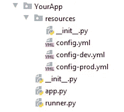

# 使更多到文件的相对路径工作

> 原文：<https://medium.com/geekculture/making-more-yo-relative-path-to-file-to-work-fbf6280f9511?source=collection_archive---------21----------------------->

# 而不用担心当前的工作目录(Python)。

如果您有一些使用相对路径的脚本或应用程序，并且您想从另一个目录调用它，该怎么办？让事情变得更复杂。也许你的“外部”代码也使用*相对*路径，但是*相对*到另一个目录。在这里，我将描述如何让所有这些工作的秘诀。

假设您编写了一些脚本或应用程序，打包并安装为 YourApp(也就是说，它安装在 site-packages 或 venv 中)。大概是这样的:



`app.py`的代码:

**注意:**这里我使用的是 *init_app_conf* 模块。你可以在这里阅读。

通常，在脚本/应用程序的`main()`函数的末尾有以下几行:

它们被设计成当文件作为脚本被调用时，将调用转发给`main()`函数，通常是从放置`app.py`的目录(`cd YourApp`)中调用，类似这样的调用叫做:`python app.py`。

现在，*想从另一个目录调用* `*app.py*` *(或者是* `*main()*` *函数)怎么办？*

如果您有类似于第 17 行的代码，它将会失败。其本质问题在于我的代码使用*相对*路径，所以**假设我的工作目录与** `**app.py**` **文件**相同。

另一种方法可能是提供一些`runner.py`文件，如下所示:

注意，这个文件也没有:

最后。

它基本上调用由`FixRelCwd`上下文管理器修饰的`app.py` `main()`函数。我将在下面回到`FixRelCwd`。

现在，在一些不相关的目录中，您应该有这样的内容:

这就是`main`的“真实”方法。如果你想在`app.py`或`main()`函数之前或之后放一些额外的代码。你可以把它放在第 15 行和第 17 行。

[在这里](/analytics-vidhya/integrating-pythons-logging-and-warnings-packages-7ffd6f65e02d)你可以阅读我的故事，它描述了我配置日志的方式。

[在这里](/@alex_ber/making-relative-path-to-file-to-work-d5d0f1da67bf)你可以阅读关于`[*mains*](https://github.com/alex-ber/AlexBerUtils/blob/master/alexber/utils/mains.py)` 模块中的`[*fixabscwd()*](https://github.com/alex-ber/AlexBerUtils/blob/master/alexber/utils/mains.py#L12)`功能或者[制作相对路径文件来工作](/@alex_ber/making-relative-path-to-file-to-work-d5d0f1da67bf)。

简单地说，除了第 2 行和第 16 行，这是典型的`main()`函数。我想调用安装在`YourApp`包中的`app.py`脚本/应用程序。具体来说，执行以下代码:

```
*python -m pip uninstall --yes* YourApp
*python setup.py sdist bdist_wheel
python -m pip install --find-links=./dist* YourApp
```

所以，因为我们安装了`YourApp`包，所以我们可以导入(的包装器，为什么它是包装器很重要将在下面说明)`main()` 函数，并在适当的时候定期调用它(如果我们愿意，我们可以在它之前和/或之后添加一些代码)。

让我们快些应用程序，我们有什么。我们有`YourApp` 脚本应用程序。它被安装到站点包或 venv 中。它有带`main()`函数的`app.py`文件，该文件执行一些计算。我们有一些由`FixRelCwd`上下文管理器修饰的`main()` 函数的`runner.py` 。而我们有一些“真实”文件具有如上`main()`的“真实”功能。

所以，真正的权力在`FixRelCwd.`

# `FixRelCwd` 如何工作？

`FixRelCwd`是*上下文管理器。它需要 *relPackage* 和可选的*记录器*。临时将当前工作目录改为安装 *relPackage* 的目录。如果没有指定*记录器*，那么将使用一些默认的记录器。*

如果在 REPL 或 IPython 笔记本中调用这个函数，它什么也不做。

这个函数没有从冻结的 python 脚本(使用 py2exe 冻结)中测试过，但是它应该可以工作(不做任何事情)。

基本上，它首先存储`os.chdir`以备后用，然后在 *relPackage* 模块中寻找`__file__`属性，从那里获取目录并为其设置 cwd(通过调用`os.chdir`)。

在退出时，它恢复`os.chdir,`,这样您的“外部”代码可以照常运行。

源代码你可以在这里找到。它是我的 AlexBerUtils 项目的一部分。

您可以从 PyPi 安装 AlexBerUtils:

`python3 -m pip install -U alex-ber-utils`

关于如何安装的更多详细说明，请参见此处的。

# 另请参见:

*   [集成 Python 的日志和警告包](/analytics-vidhya/integrating-pythons-logging-and-warnings-packages-7ffd6f65e02d)。
*   `[*mains*](https://github.com/alex-ber/AlexBerUtils/blob/master/alexber/utils/mains.py)` 模块中的`[*fixabscwd()*](https://github.com/alex-ber/AlexBerUtils/blob/master/alexber/utils/mains.py#L12)`功能或[制作文件的相对路径来工作](/@alex_ber/making-relative-path-to-file-to-work-d5d0f1da67bf)。
*   `[*mains*](https://github.com/alex-ber/AlexBerUtils/blob/master/alexber/utils/mains.py)` 模块中的`[*fix_retry_env*](https://github.com/alex-ber/AlexBerUtils/blob/master/alexber/utils/mains.py#L237)*()*` 函数或[Make path to file on Windows works on Linux。](https://alex-ber.medium.com/make-path-to-file-on-windows-works-on-linux-402ed3624f66)
*   `[*mains*](https://github.com/alex-ber/AlexBerUtils/blob/master/alexber/utils/mains.py)` 模块中的`[FixRelCwd()](https://github.com/alex-ber/AlexBerUtils/blob/master/alexber/utils/mains.py#L263)`功能或[使更多到文件的相对路径工作](https://alex-ber.medium.com/making-more-yo-relative-path-to-file-to-work-fbf6280f9511)
*   `[*mains*](https://github.com/alex-ber/AlexBerUtils/blob/master/alexber/utils/mains.py)` 模块中的`[GuardedWorkerException()](https://github.com/alex-ber/AlexBerUtils/blob/master/alexber/utils/mains.py#L295)`函数或[异常从另一个进程](https://alex-ber.medium.com/exception-propagation-from-another-process-bb09894ba4ce)传播
*   `[*files*](https://github.com/alex-ber/AlexBerUtils/blob/master/alexber/utils/files.py)` 模块中的`[join_files()](https://github.com/alex-ber/AlexBerUtils/blob/master/alexber/utils/files.py#L9)`功能或[加入文件](https://alex-ber.medium.com/join-files-cc5e38e3c658)。
*   [*stdLogging*](https://github.com/alex-ber/AlexBerUtils/blob/master/alexber/utils/stdlogging.py) 模块，或[我的 stdLogging 模块](https://alex-ber.medium.com/stdlogging-module-d5d69ff7103f)