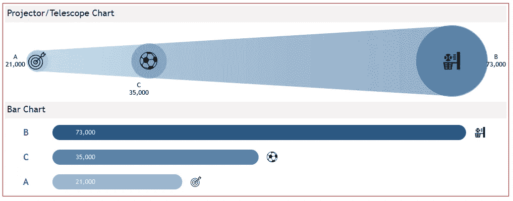
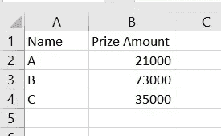
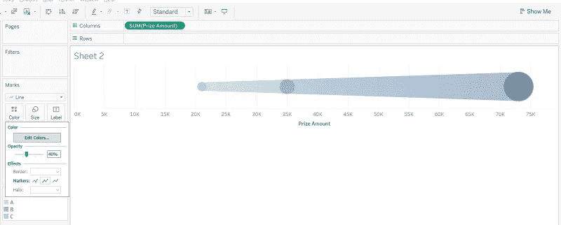
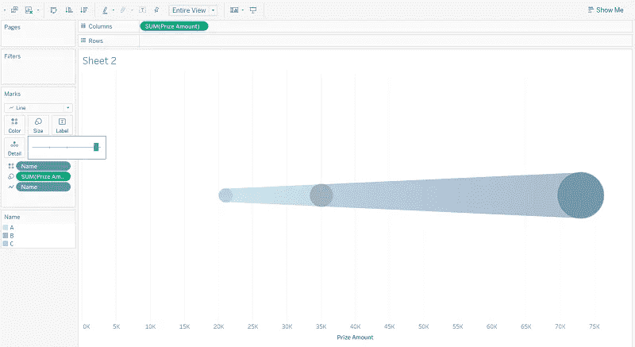
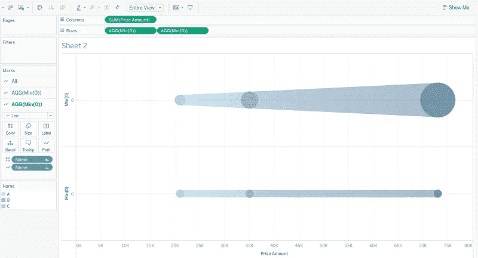
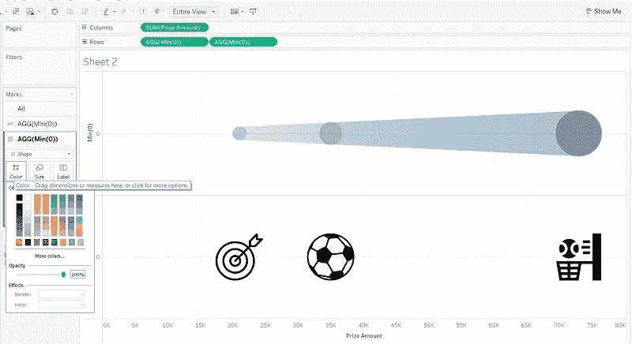
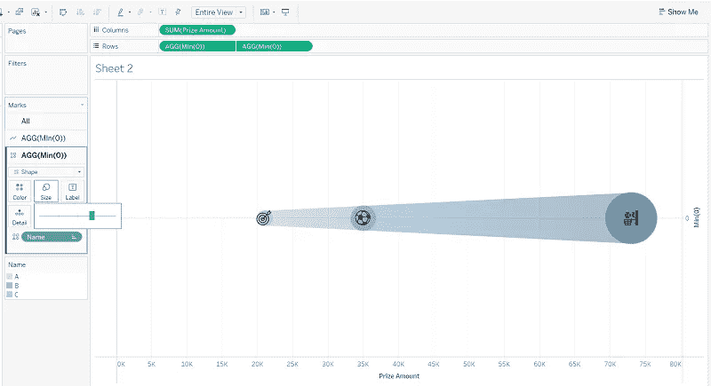
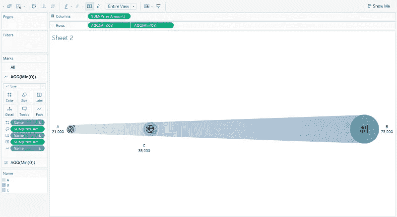
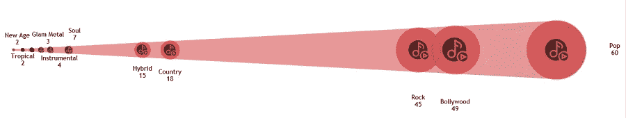
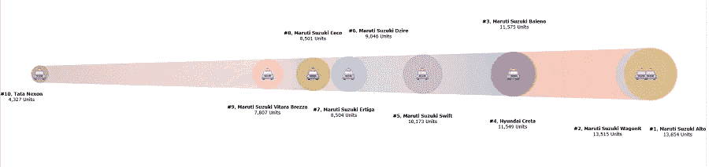

# 投影仪/望远镜图表的制作及其与 Tableau 中条形图的对比

> 原文：<https://medium.com/geekculture/making-of-a-projector-telescope-chart-and-its-contrast-with-bar-charts-in-tableau-a3c1ce69ca51?source=collection_archive---------17----------------------->

Projector/Telescope Chart with Bar Chart (Pic by Author)

几天前，我正在处理一个基于我个人音乐收藏的数据集。我在摆弄各种选项，比如条形图或折线图，但我的目标是做一些不同的事情。然后，当我在纸上移动尺寸和度量时，我看到一个图形正在成形。现在，让我们称之为投影仪或望远镜图表。但是如果你以前看过这张图，并且知道它有一个不同的名字，请在评论区告诉我，这样我就可以在以后的参考中得到纠正。

所以，让我们开始怎么做吧。

我们将首先制作一个虚拟数据集，其中一列显示一个运动员的姓名，另一列显示这个人赢得的奖金数额<refer fig="">。</refer>

Fig 1 (Pic by Author)

将奖金金额放在分栏和马克卡的大小标签中。将标记卡中的下拉值从自动更改为线。在标记卡的颜色选项卡和路径选项卡<refer fig="">中放置名称字段。</refer>

Fig 2 (Pic by Author)

将“颜色”标签中的不透明度设置为 40%，将标记设置为全部。您可以根据自己的选择调整不透明度值。这个想法是减轻颜色，以便能够查看圆圈<refer fig="">。</refer>

Fig 3 (Pic by Author)

从列栏上方的下拉列表中，将图纸视图从标准视图更改为完整视图。并将标记卡中的尺寸增加到最佳水平<refer fig="">。</refer>

Fig 4 (Pic by Author)

您可以根据自己的喜好为所有名称设置颜色。但是现在我会坚持使用蓝色的阴影:阴影越深，亮度越高。

现在，让我们把事情变得更有趣。假设 A、B、C 在某项体育比赛中获得了奖金数额，我们要展示这项运动。

因此，在行栏中，双击并键入 **MIN(0)** 两次。在 AGG(MIN(0))的第二个标记卡中，从尺寸选项卡<中删除字段 SUM(奖金金额),参见图 5 >。

Fig 5 (Pic by Author)

在同一标记卡中，将下拉列表从“线条”更改为“形状”。然后将“名称”字段拖到“形状”上。我已经收集了各种运动的图标，因此，对于每个名称，我将选择一个运动图标。此外，从颜色选项卡中删除名称，并将颜色选项卡的不透明度增加到 100% <refer fig="">。</refer>

Fig 6 (Pic by Author)

现在右击并选择上面的行栏上的 AGG(MIN(0))上的“双轴”，并调整运动图标<refer fig="">的形状大小。</refer>

Fig 7 (Pic by Author)

接下来，采取措施清理床单。删除网格线、零线和轴记号。右键单击奖金数额的编辑轴，取消选中“包括零”选项，稍微展开图表。从工具提示中移除标题和不需要的字段，并包含标签<refer fig="">。</refer>

Fig 8 (Pic by Author)

你的图表现在准备好了。

**图表用法及与条形图的对比**

我在两个不同的场景中使用了这个图表。在第一种情况下，我用它来显示我的音乐收藏的流派。这里，最小值是 1，所以图表看起来像一个圆锥体<refer fig="">。</refer>

Fig 9 (Pic by Author)

在第二个案例中，我用它显示了 2021 年 7 月印度销量最高的 10 款汽车。我想避免传统的图表来显示排名和比较，因此我决定使用这个图表<refer fig="">。</refer>

Fig 10 (Pic by Author)

为了让您有一点了解，我在仪表板中放置了一个条形图和这个图表，如标题上方的主图所示。请在评论区说出你的想法，看看哪个更吸引你，或者两者都有自己的立场。

如果你对圆边条形图感到疑惑，请阅读我之前的 [*p* ost](https://priya-yogendra.medium.com/bar-chart-with-round-edge-s-in-tableau-f45c5362520a) *。*

我认为这张图表很好地反映了相对于篮子中其他人的排名和位置。但是，这里我想讨论的一点是，这个图表可以使用的上下文。到今天为止，我不确定我们是否可以在正式的环境中使用它。在半正式或非正式的上下文中使用它来清楚地描述等级和职位是可行的:只要没有太多的点被绘制出来，给它一个杂乱的外观。你有什么看法？再次，请在评论中分享。如果您能想到我们可以使用此图表的任何其他正式或非正式场景，也请分享。

注意:

1.不要忘记放置文字和图例，解释读者将从图表中学到什么(关键信息)，以及如何解释图表。明确陈述—“数据点标记反映了彼此之间的价值和位置。数据点的实际值是标记(圆圈)的面积。包围的两条线只是视觉引导”。更好的方法是，将它放在一个文本文件中，然后使用显示/隐藏按钮。为了让你更好的理解:包围的线条减少了认知负荷，让用户和创建者更容易理解/指出所有数据点的相关性。我坚信应该减轻观众的认知负荷。

2.计算机科学博士 Franck Lebeau (@_Kcnarf)强调指出，圆盘(圆圈/标记)的面积应以对数方式增长，而不是以线性方式增长。虽然他是正确的，但在每个人都可以轻松复制的图表出现之前，他建议使用上下文图例(如上所述),因为无论何时使用该图表，它都会极大地限制错误的解释。