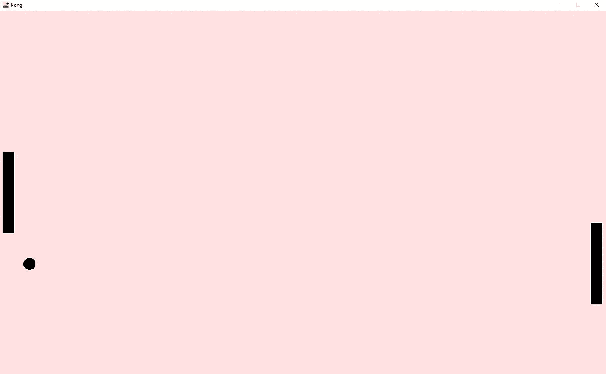

# 用 PyGame 制作 Pong

> 原文：<https://medium.com/geekculture/making-pong-with-pygame-19a632b882d?source=collection_archive---------2----------------------->


PyGame — pygame.org

PyGame 是一个非常通用的工具，用于 Python 的游戏开发。你可以用 pygame 做很多令人惊奇的事情，但是首先了解一些基础知识是很重要的。

为了做到这一点，我们将创建一个基本的 pong 游戏，它教授了 PyGame 的许多基础知识。

与编程中的任何事情一样，学习的最佳方式是实践，所以让我们直接进入其中

由于 PyGame 没有和 Python 一起安装，我们需要自己安装。为此，只需运行以下命令:

```
>>> pip install pygame
```

现在我们可以进入代码的真正内容了。在一个新的 python 文件中，首先导入 pygame:

之后，我们需要初始化游戏，设置高度和宽度。我们通过创建高度和宽度变量，然后将它们作为元组传递给 pygame 函数来实现:

如果你现在运行这个程序，你会看到一个空白的屏幕，标题是“pygame window ”,还有一个非常像素化的 pygame logo，然后它会立刻消失。那是因为剧本几乎一开始就结束了。要解决这个问题，创建一个`game_on`变量和一个`while True: pass`循环。我们稍后将编辑这些内容。如果你运行这个，你可能会注意到你实际上不能关闭窗口。首先，打开任务管理器，尽快杀死这个程序，因为它会导致你的电脑崩溃。要解决此问题(并使屏幕具有不同的颜色)，请使用以下方法:

它的作用是遍历当前事件中的每个事件，并检查其中一个事件是否是退出事件(即用户试图关闭窗口)。如果是，它将停止 while 循环。如果事件未退出，则更新显示屏。

在循环或`game_on`之前是游戏的真正核心。然而，理解游戏如何运作是关键。这个游戏有几个主要的机制:

1.  玩家必须能够移动他们的球拍
2.  CPU 必须自动跟踪球的位置并跟随它
3.  球必须在墙壁或球拍的侧面反弹(如果球碰到玩家一侧，记录玩家输了，CPU 一侧也一样)

为了实现这一点，我们需要跟踪球员的位置，球的位置，和 cpu 的位置。对于玩家，我把位置实现为从原始位置到现在位置的距离。至于其他的，我只是把它们实现为真正的位置。

我们还需要以下功能:

1.  player():在屏幕上显示播放器的踏板
2.  cpu():在屏幕上显示 cpu 面板
3.  ball():在屏幕上显示球
4.  calc_cpu():计算 cpu 应该去哪里
5.  calc_ball():计算球应该去哪里
6.  move_up():向上移动播放器挡板
7.  move_down():向下移动播放器挡板
8.  game_over():重置游戏并显示谁赢了

我们还需要游戏中每个物体的图标和图像

# 图标/图像

以下是我在游戏中使用的图标和图片


Window Icon — icon.png — 32x32 px


Ball Image — ball.png — 30x30 px


Paddle Image — player.png — 27x200 px

# 加载变量

我使用 pygame.display.set_caption 来设置标题，还加载了图像。在这之后，窗口应该有:


在顶端。看看你能否弄清楚其余的代码是如何工作的！

# 功能—我的天啊

我们需要实现 8 个功能，但前 3 个功能非常相似。我们只是使用 screen.blit 将图像加载到屏幕上。

接下来，我们需要实现 calc_cpu()和 calc_ball()函数。对于 calc_cpu()，我检查了 cpu 挡板的中心是否需要上下移动以匹配球的中心，然后相应地移动它。

对于 calc_ball，我只是移动了球，然后检查球是否撞到了一边，并分别计算了它的 x 和 y 动量。这有点复杂，因为它还需要检查球是否击中了球拍。

然后，game_over 函数相对简单:

之后，上移和下移的工作方式与 calc_cpu 类似，但是玩家控制方向

就是这样！我们需要的所有功能都被制造出来了

如果您现在尝试运行代码，将不会显示任何内容。这是因为我们需要更新 while 循环。我先放代码，再解释:

首先，我们检查玩家是否已经退出程序，类似于之前。之后，我们按下所有的键。然后，我们使用一个大的 if 链来查看玩家是否按了 w 或 s 键，或者玩家是否按了上/下箭头键。

然后，我们检查用户是否按了 5，在这种情况下，游戏关闭。

最后，我们按顺序运行大部分功能，然后更新屏幕。

这是最终代码的样子:

如果你试着运行代码，你应该有一个全功能的 pong 游戏。



本教程到此为止。如果你学到了一两件事，别忘了鼓掌！