# 理解 3300 万行 Instacart 数据:使用 Plotly 进行探索性数据分析

> 原文：<https://medium.com/geekculture/making-sense-of-33-million-rows-of-instacart-data-exploratory-data-analysis-using-plotly-3f0461a56811?source=collection_archive---------12----------------------->

Source: Zdnet.com

Instacart 是过去十年中最热门的硅谷初创公司之一，目前估值高达 390 亿美元。2017 年，他们举办了一场 Kaggle 竞赛，挑战数据科学家预测给定用户将重新订购哪些产品。为此，他们开源了一个数据集，其中包含来自 20 多万用户的 300 多万份订单的匿名信息。

理解数据的第一步是对数据集进行探索性的数据分析，并对其有一个粗略的了解。我们将使用 python 的 ***plotly*** 库进行数据可视化，还将使用 ***datapane*** 库使我们的 plotly 图表在这里的某些地方进行交互。

问题中的数据集可以从 [**Kaggle 网站**](https://www.kaggle.com/c/instacart-market-basket-analysis/data) 下载。它包含 6 个 CSV 文件，保存与订单、产品、部门和过道相关的数据。

请注意，我删除了 github gists 中与修饰图表相关的部分 plotly 代码。这是为了减少这个页面的大小(它已经太长了)。完整的代码可以在我的 [github](https://github.com/vijayv500/Instacart) 上找到。

导入所需的库:

将文件加载为熊猫数据帧:

找出数据帧的形状:

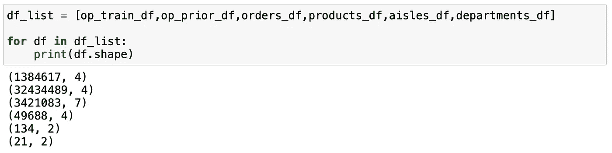

打印出数据帧的前几行可以让我们了解其中的内容:

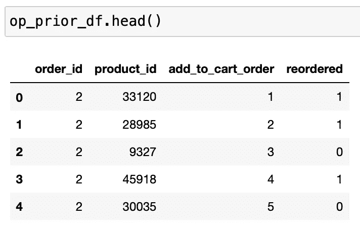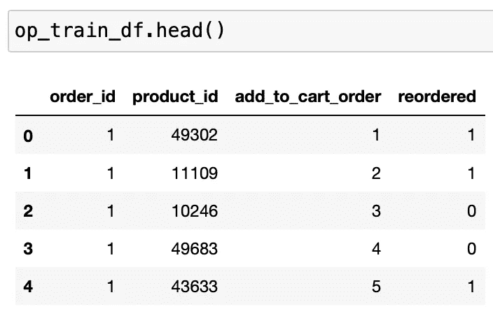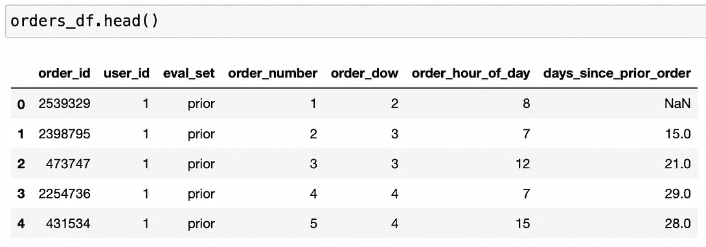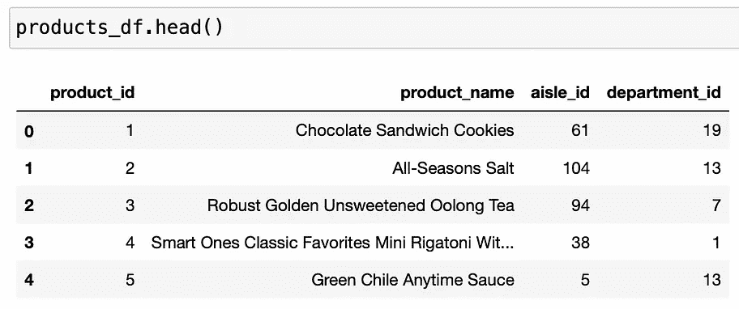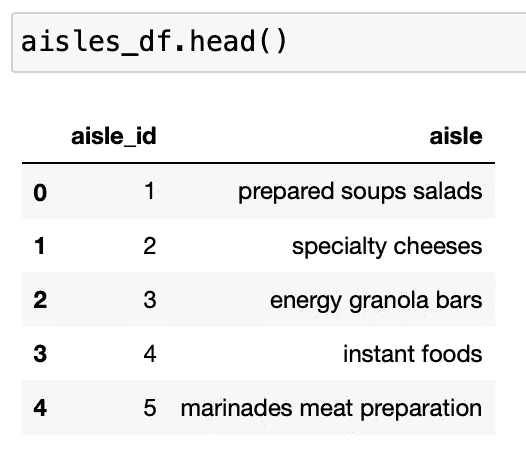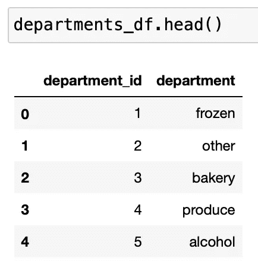

我们可以看到 ***orders_df*** 包含了 4 到 100 之间的用户订单数据。每个用户的最后一个订单被分成“训练”和“测试”集，用于预测再订购，其余的被分成“先前”集。在 ***op_train_df*** 和 ***op_prior_df*** 中给出了订单篮中的单个产品等订单的详细信息。与过道、部门和产品相关的信息在单独的数据框中提供。

## 订单数量:

让我们按一周中的某一天和一天中的某个小时来找出订单的数量。

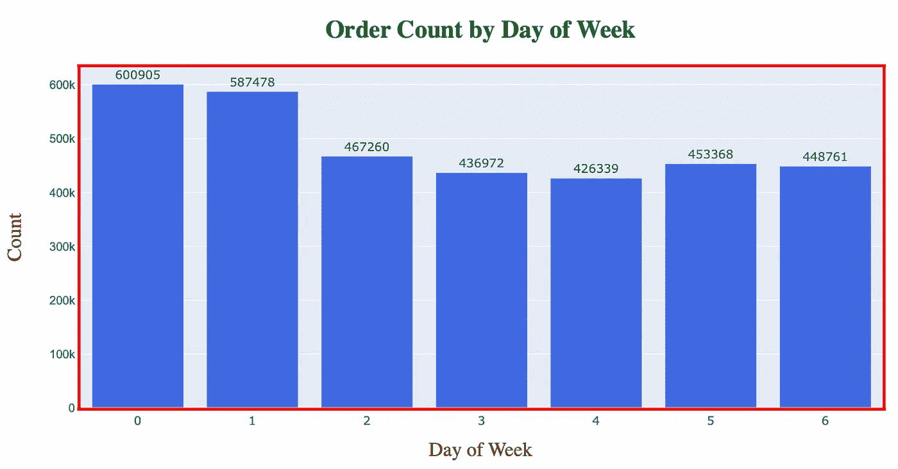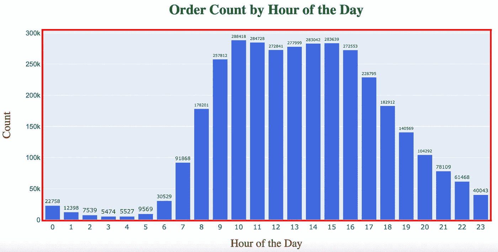

*   *从上面的图表中可以明显看出，第 0 天和第 1 天(令人惊讶的是没有关于它们是哪几天的信息)的订单数量比一周中的其他日子多。我们可以假设它们是周末——周六和周日。*
*   *大部分订单是在上午 9 点到下午 5 点(办公时间？).*

我们可以结合以上数据，对订单时间有更清晰的了解。这是通过使用 *groupby* 、 *aggregate* 和 *pivot* 功能实现的。

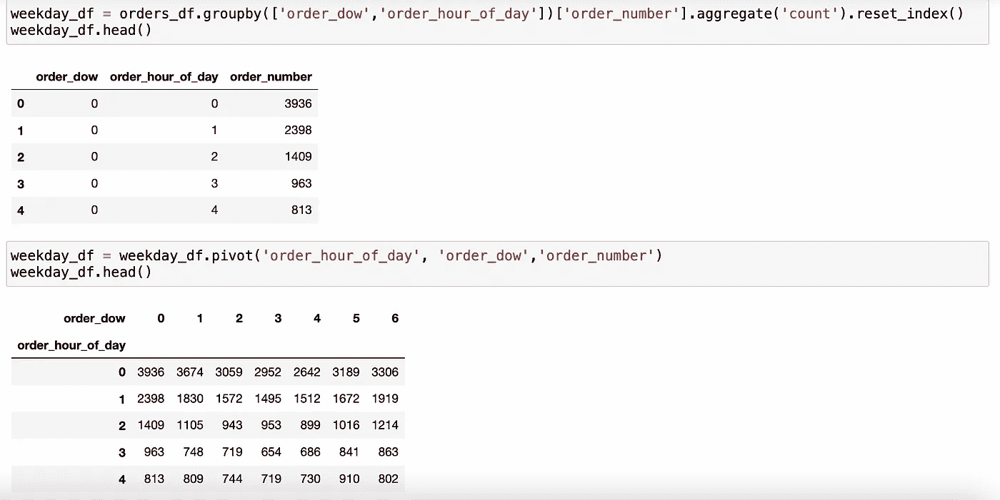

*   Instacart 最忙的时间是第 0 天(周六)的下午 1 点到 4 点。)和第 1 天上午 10 点— 11 点(周日？).

现在让我们将部门与一周中的某一天进行对比，看看订单数是如何变化的。

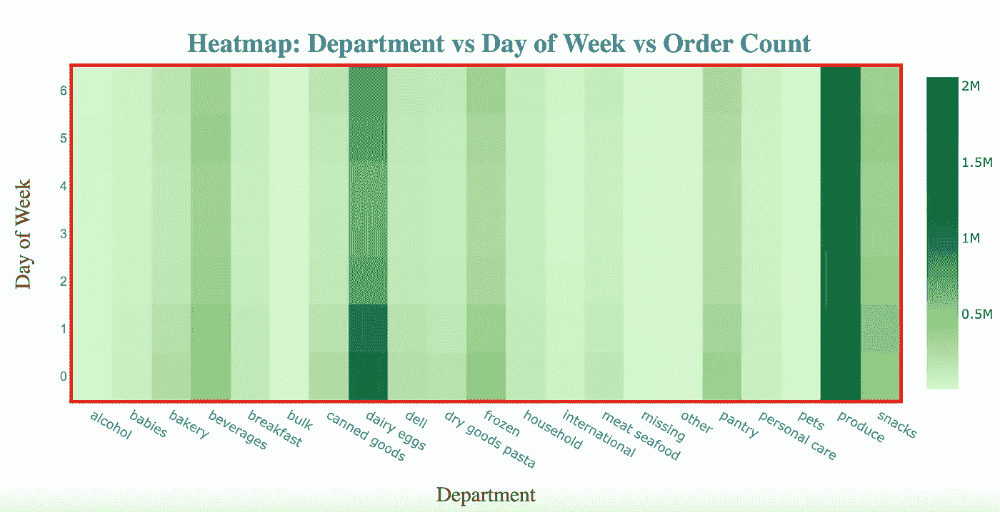

*   *很明显，乳制品、鸡蛋和农产品一周都很忙。*

## 每位客户的订单:

我们在数据集中有 4 到 100 个用户订单。让我们画出来，看看分布是什么样的。

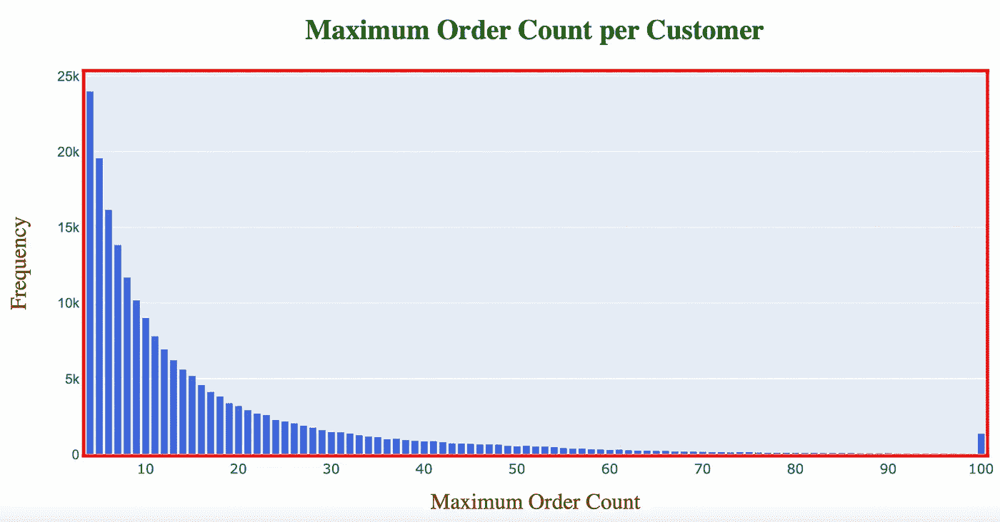

*   *大部分用户已经下了 10-20 个订单*

## 自上次订购后的天数:

在 ***orders_df、*** 中，给出了给定订单和用户的 ***'*** *自前一订单'*起的天数信息。让我们画出来，看看分布是什么样的。

*   *在上图中，我们可以看到 7°和 30°处的峰值。这表明大多数食品杂货购买是每周或每月进行的。*
*   *另一个峰值出现在 14 点，这意味着每两周会有大量购买。*

## 训练/测试/预先设置:

如前所述，在 ***订单 _df*** 中，订单(总数—3421083)分为训练、测试和优先三类。让我们找出确切的分手细节。

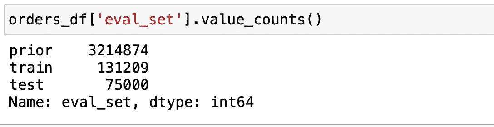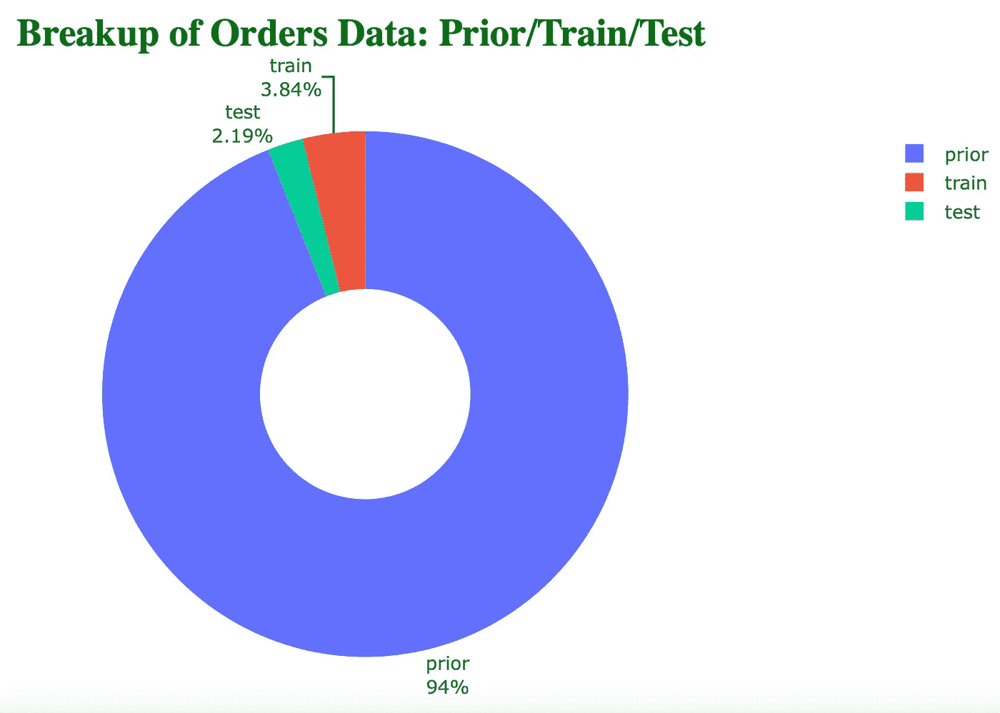

## 畅销产品、通道和部门:

现在我们将 ***op_train_df*** 和 ***op_prior_df*** 连接起来，然后将结果数据帧与 ***products_df*** 、 ***aisles_df*** 和***departments _ df***进行“内部”合并。产生的数据帧将有**3300 万+行**和 9 列。请注意，被归类为“测试”组的订单没有关于其中销售的单个产品的信息。所以这些数字不会反映在我们下面的计算中。

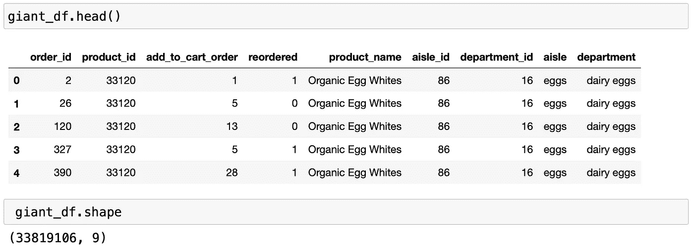

让我们来看看最畅销的产品及其通道和部门。

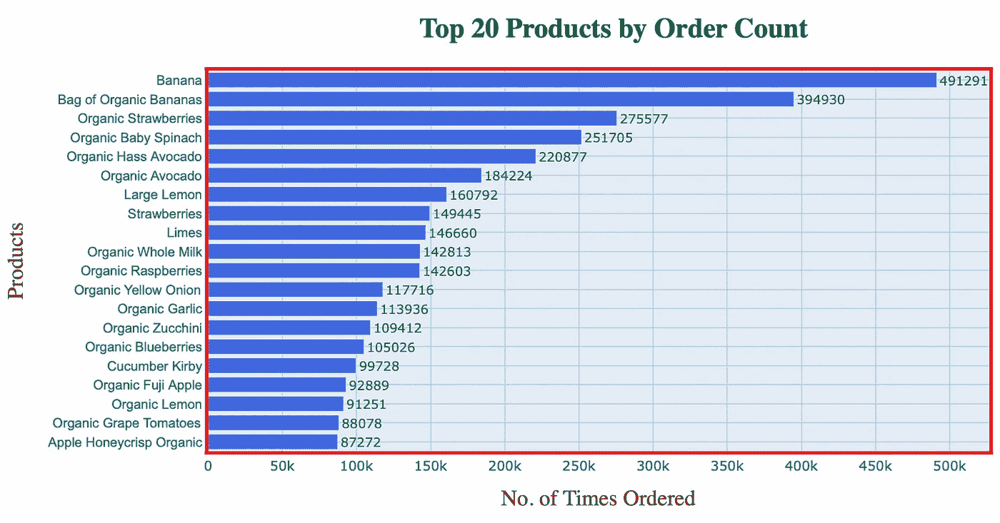

50 大产品的词汇云:

**Top Selling Products** — Bigger the font, more the order count

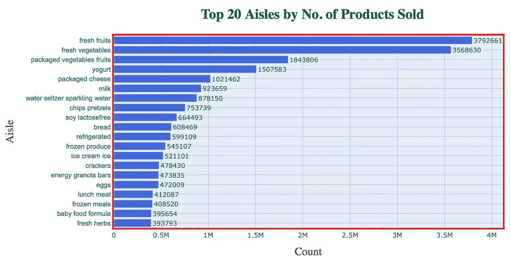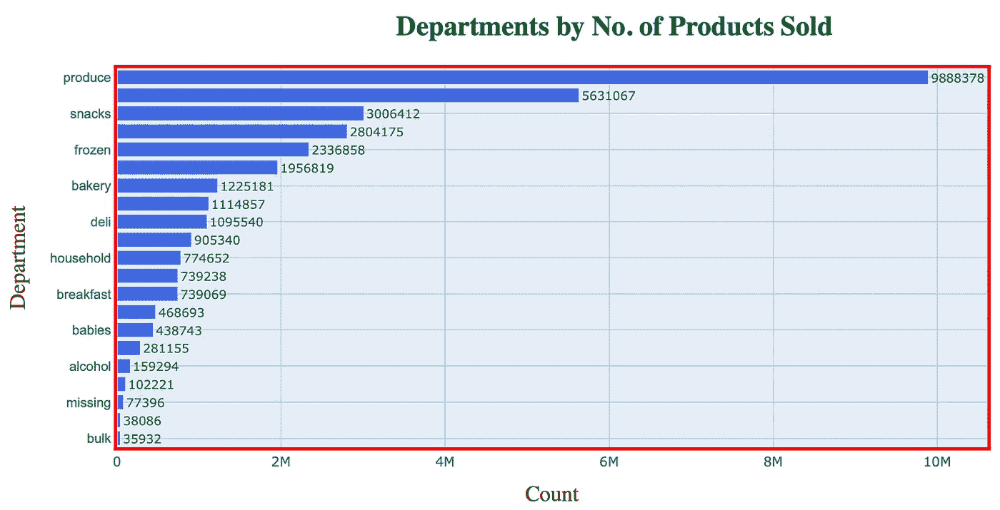

*   新鲜水果和蔬菜是最畅销的产品，有趣的是它们大部分是有机的。过道和部门图表反映了同样的趋势。

## 订单篮中的产品数量:

接下来，我们将计算订单篮中的产品数量。首先将*‘order _ id’*和*‘add _ to _ cart _ order’*组合在一起，并使用 pandas *aggregate* 函数选取给定 *order_id、*的*‘add _ to _ cart _ order’*的最高值，该值等于给定订单篮*、*中的产品总数。这种分布绘制如下。

*   *可以推断，订单篮子中 4–7 个产品最常见，峰值在 5 个产品。*

## 重新排序模式:

现在我们来看看重新排序模式。一个非常有趣的观点是“添加到购物车编号”如何影响产品是否会被重新订购。在下面找出答案。

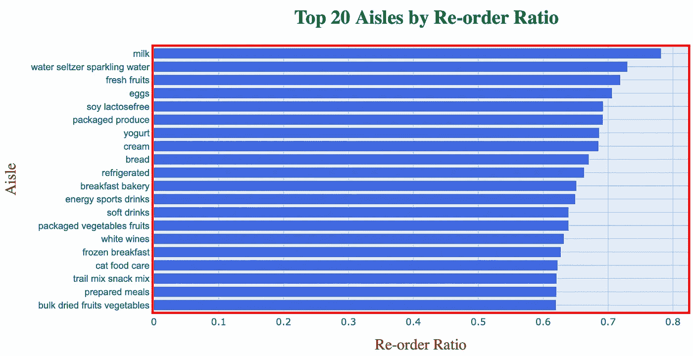

*   牛奶、水、新鲜水果和鸡蛋有 70%的机会重新订购。

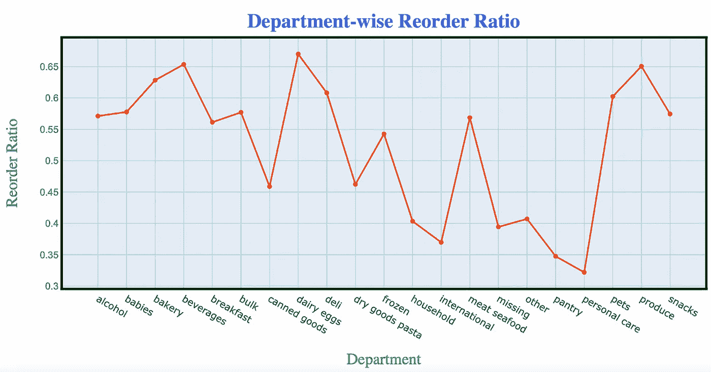

*   *再订购率高的通常嫌疑人是乳制品、鸡蛋、饮料和农产品部门，这并不奇怪。*
*   *个人护理用品排在最后，需要重新订购。这是显而易见的，因为与食品相比，化妆品不太可能被购买。*

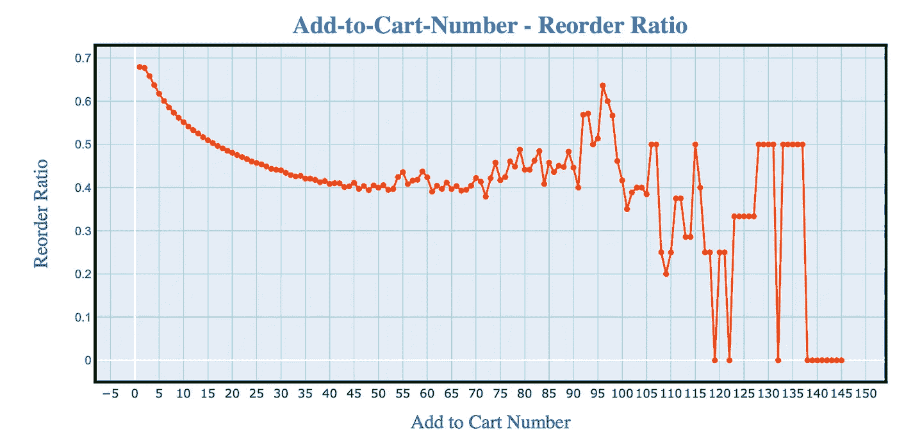

*   *最初放在订单篮中的产品更有可能再次订购。这对我们来说是显而易见的。*
*   *我们看到的一个有趣的模式是，放在订单篮子最后的产品也有很高的再订购百分比。这可能意味着这些产品被放在去收银台的路上或附近(Kinder Joy，Dairy Milk，Snickers 等)。就在收银台旁边。)*

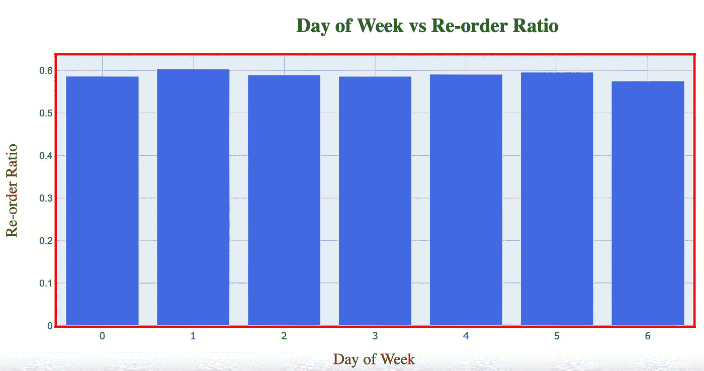

*   *再订购率似乎不会随着一周中的某一天而发生很大变化。*

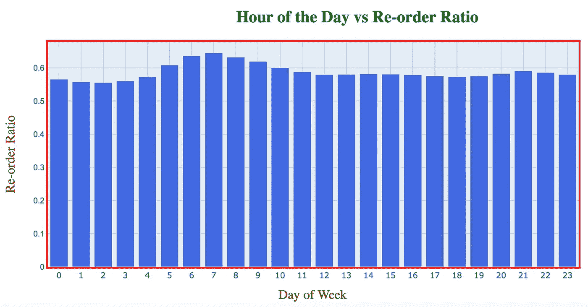

*   *即使在一天中的某个时间，再订购百分比也不会有太大变化。早上 6 点到晚上 8 点的轻微高峰表明产品可能来自乳制品鸡蛋部门。*

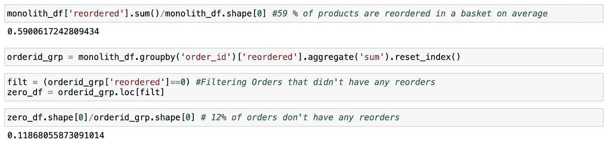

*   *订单篮中平均有 59%的商品是重新订购的。*
*   *12%的订单没有任何重新订购的产品。这也意味着 88%的订单重新订购了产品。*

以上分析的完整代码可以在我的 [*github*](https://github.com/vijayv500) 上找到。