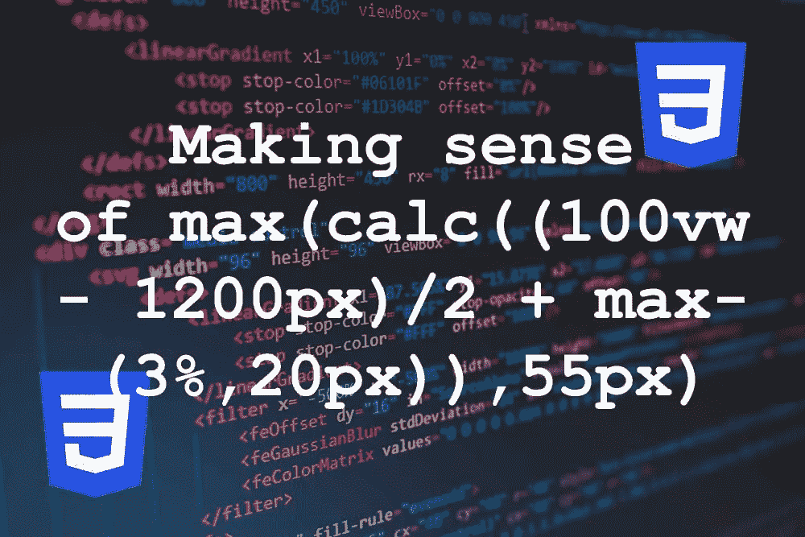

# 了解最大值(计算((100vw - 1200px)/2 +最大值(3%，20px))、55px)

> 原文：<https://medium.com/geekculture/making-sense-of-max-calc-100vw-1200px-2-max-3-20px-55px-e389e10c9e00?source=collection_archive---------12----------------------->

Try saying that 5 times fast.

从 2010 年第一次学 CSS 到现在，变化很大。当我开始的时候，上面说的很少是有意义的。然而今天，它不仅有意义，而且有效。最少，*居多*。

(我们这里说的是 CSS。)

当我从以前的开发人员那里继承了一个项目时，产生了上面这个怪物…