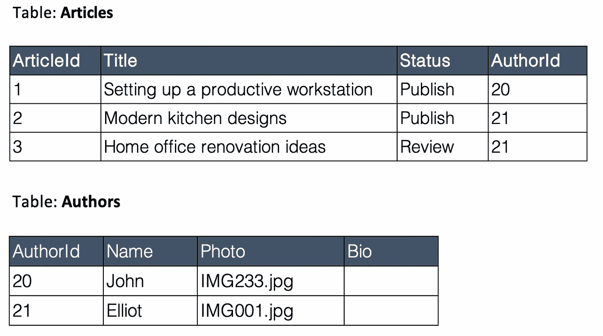
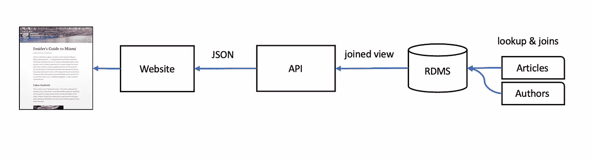
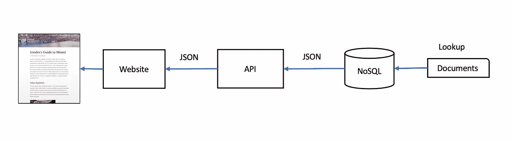
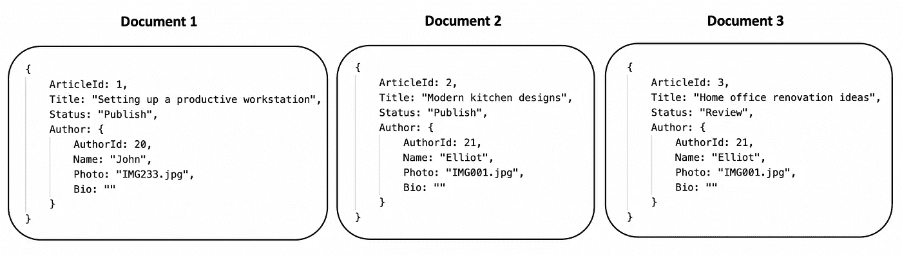
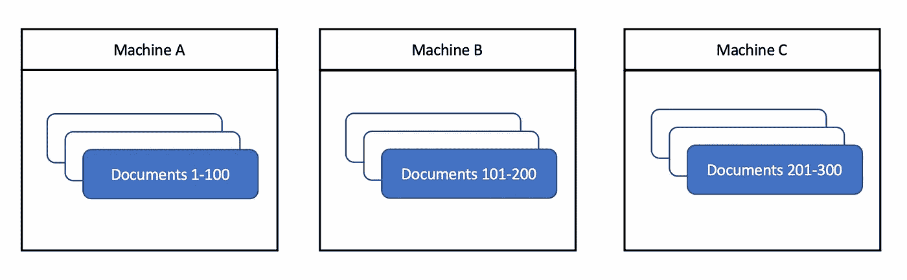

# 从关系数据库的角度理解 NoSQL

> 原文：<https://medium.com/geekculture/making-sense-of-nosql-from-a-relational-database-perspective-cf2b91ffa4d9?source=collection_archive---------23----------------------->

我知道。现在每个人都应该对 NoSQL 很熟悉了。然而，最近我不得不向一组工程师解释 NoSQL 数据库与关系数据库的不同之处，以及为什么在某些情况下它是首选的。

虽然许多开发人员已经体验过 NoSQL 实现，但仍有相当多的人是关系数据库方面的专家，但他们只是刚刚接触到非关系概念。

我决定在这里包括一些这样的例子，希望它能帮助任何来自关系数据库的人理解 NoSQL 数据库的底层数据结构和主要意图。

Photo by [Martin Adams](https://unsplash.com/@martinadams) via [Unsplash](https://unsplash.com/)

# 介绍

在互联网的早期，存储空间非常珍贵，互联网人口只有今天的一小部分。许多早期软件也是由公司开发供内部使用的，在这种情况下很少需要高性能、可水平扩展的数据存储。很多焦点都集中在数据一致性和存储优化上，这导致数据库规范化成为数据存储设计中的一个重要考虑因素。

从那以后，互联网上发生了很大的变化。存储比以前便宜得多，能够以即时响应和接近零的停机时间提供高流量服务现在是任何面向互联网的网站的期望。这种变化推动了非关系数据库的逐渐采用。

NoSQL 数据库旨在通过简化应用程序检索数据的方式来提高速度和可用性，并支持跨多台机器复制数据。也就是说，它也有自己的缺点。许多 NoSQL 数据库牺牲了关系数据库中常见的 ACID 事务(原子性、一致性、隔离性、持久性)。它们还可能需要额外的工作来适应新的应用要求。

在开发新的解决方案时，在决定使用哪种类型的数据库时，要考虑用途和用例。许多架构在其解决方案中集成了 SQL 和 NoSQL，以获得两者的最佳效果。

# 关系数据库数据结构

为了理解 NoSQL 数据库是如何工作的，让我们先快速比较一下关系数据库和非关系数据库是如何存储数据的。考虑一个典型的博客或文章网站的例子，比如 Medium。这里有两种类型的信息:文章和写文章的作者。

在关系数据库中，我们通常有两个表:文章和作者:

当读者查看网站上的文章时，数据库会连接这两个表，并将结果视图返回给调用应用程序，该应用程序通常是一个 API。由于 JavaScript Object Notation (JSON)是当今在 web 上表示结构化数据的事实上的标准，因此产生的数据将被解析成 JSON 并被发送到前端网站，该网站向读者显示文章和作者。

Data flow of an article website using relational database

虽然这是一个过于简化的例子，但是考虑一个真实的场景，其中有两个以上的表:帖子、作者、标签、类别、相关文章、评论等。再加上成千上万的记录，查找和连接这些表以服务读者的资源成本将是昂贵的，尤其是在高流量的网站上。

# NoSQL 数据结构

现在让我们想象一下，如果我们通过删除表连接并解析为 JSON 格式来简化上面的数据流。在这种情况下，API 将直接读取一个现成的 JSON，并将其响应给前端网站。这使得事情变得更快，并且是 NoSQL 数据库建立的基础。有了 NoSQL，数据流现在将是这样的:

Data flow of an article website using NoSQL database

在我们的示例中，相同的关系表在 NoSQL 数据库中显示时将如下所示。注意，关系数据库中的记录在 NoSQL 数据库中被称为文档。

“Records” in a NoSQL database are known as documents and is usually in JSON format.

# **性能和可靠性**

当我们将文章和作者合并为一个文档时，我们消除了这两个实体的连接。每个文档现在都是一个独立的实体，这使得跨不同的服务器放置它们变得很容易，因为文档之间没有关系。当我们的数据分布在多台机器上时，我们能够实现水平可伸缩性和高可用性。

Documents are spread across multiple machines in a NoSQL database

**水平可扩展性**

文档分布在多个服务器上，因此没有一台机器会耗尽存储空间或计算资源。这允许无限数据增长，同时适应来自您的网站的高速请求。

**高可用性**

同一组文档可以在不同的服务器上复制，以便在其中一台服务器停机时提供备用备份。

# NoSQL 的缺点

**应用特定数据**

在许多情况下，您需要根据应用程序的要求来设计文档的结构。虽然这优化了存储和性能，但也使它不如关系数据库灵活。构建一个新的应用程序通常意味着需要一组不同的特定于该应用程序的文档。

**维护**

考虑我们的文章网站示例，在我们的 JSON 文档中有文章和作者信息。现在假设需要在我们的文档中添加一个新的字段，比如作者简介。我们以前索引的所有文档都不包含这个字段，所以这意味着我们必须重新索引所有文档，以包含作者的简历。然而，如果信息是全新的，而以前的文档不需要包括它，则可以避免这种情况。

**存储大小**

您可能已经注意到，我们的作者信息在所有文档中都是重复的，因为许多文章可能有相同的作者。这意味着使用更多的存储空间，在设计架构时也要记住这一点，尤其是当数据库托管在按存储使用量收费的云服务上时。

**学习曲线**

与关系数据库不同，有几种类型的非关系数据库，包括键值和文档存储。在作为解决方案实施时，像 Elasticsearch 中的倒排索引这样的一些概念也很重要。虽然有不同的选择是一件好事，但它也带来了更陡峭的学习曲线。

# 摘要

NoSQL 数据库旨在通过简化数据检索和跨多个位置复制数据来提高性能、可扩展性和可用性。

存储机制与关系数据库有很大不同。记录在 NoSQL 数据库中被称为文档，通常以 JSON 格式存储，您的应用程序无需额外的连接和解析即可使用。

也就是说，它也有自己的缺点。通常必须在灵活性和存储空间之间进行权衡。在开发新的解决方案时，在决定使用哪种类型的数据库时，要考虑用途和用例。许多架构模式在其解决方案中结合了 SQL 和 NoSQL。