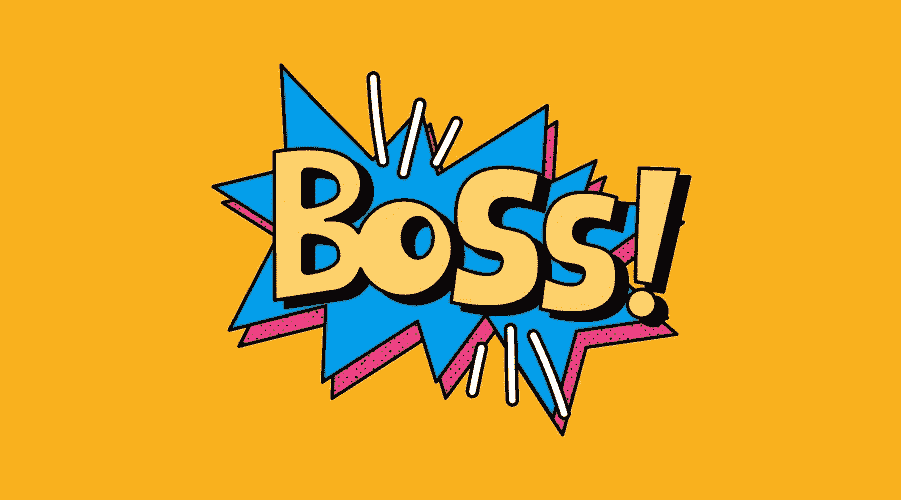
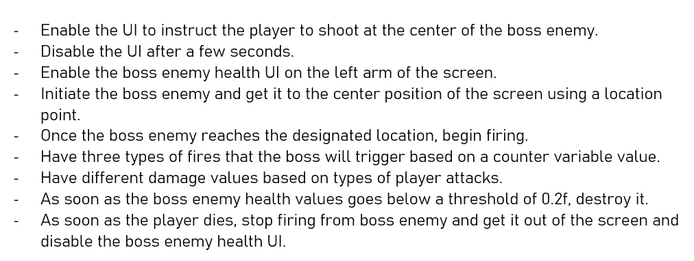
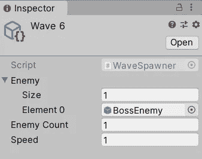
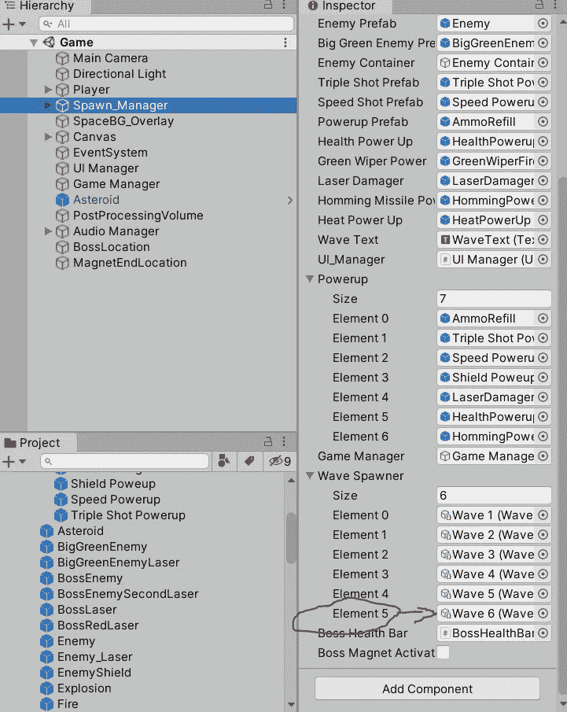
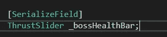
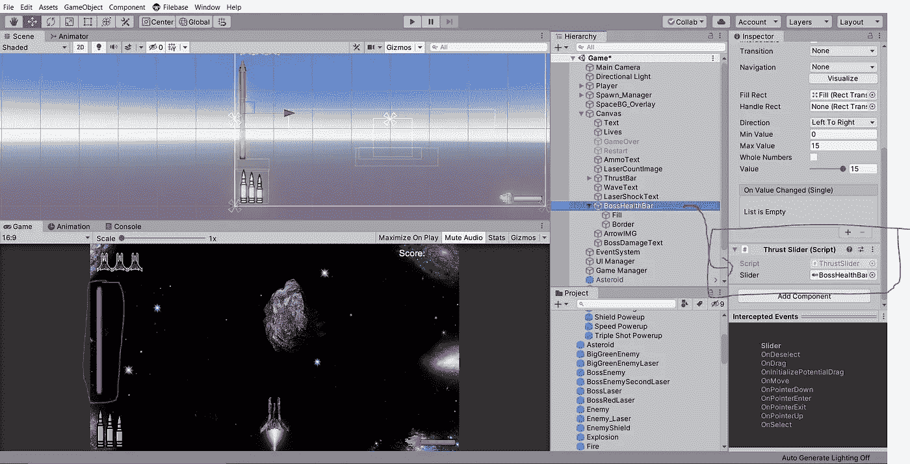
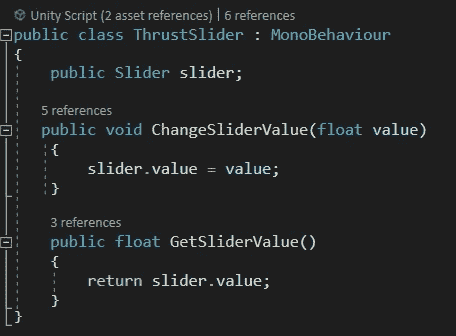
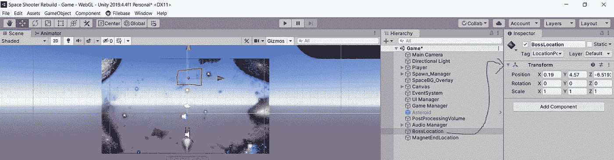
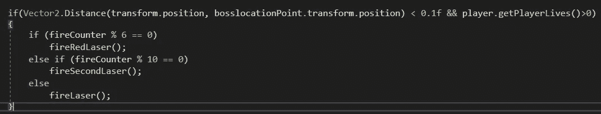

# 利用 UI 值在 Unity 中制造 BOSS 敌人波

> 原文：<https://medium.com/geekculture/making-the-boss-enemy-wave-in-unity-using-ui-value-8be66173e2ce?source=collection_archive---------39----------------------->



这里的练习演示了使用 UI 元素部署 boss 敌人波。

在完成这一部分时，我面临的最大挑战是在 spawn manager 中停止方法执行。在搜索了几个明显不起作用的选项后，我决定使用一个 UI 元素来成为这里的驱动程序。

下面是手头任务的基本伪代码。



这里的文章没有按照上面显示的顺序，因为在让这种机制像看起来那样简单地工作之前，需要将一些东西放在一起。

首先，让我们把敌人的波放在适当的位置。我正在添加另一个 wave 类型的脚本化对象。请阅读这篇[文章](https://samarthdhroov.medium.com/implementing-enemy-wave-system-part-2-9779da7ba674)以了解更多关于可脚本化对象的信息。

[](https://samarthdhroov.medium.com/implementing-enemy-wave-system-part-2-9779da7ba674) [## 实施敌波系统—第二部分

samarthdhroov.medium.com](https://samarthdhroov.medium.com/implementing-enemy-wave-system-part-2-9779da7ba674) 

1.  创建一个波对象的老板敌人，分配预置波和分配波的产卵经理没有失败。



Unity



Unity

boss 敌人预置带有标准组件，如碰撞器，刚体，音频源，动画，和一个专用脚本。

> **一旦产卵经理得到这波，它将转移到下一波，在这种情况下，不存在。所以，它会退出游戏。**
> 
> **因此，当玩家和老板之间的战斗正在进行时，必须有一个信号让种子管理者暂停。解决方案？**

2.Unity system 带有一个名为“WaitUntil()”的内置方法。该参数是一个委托，当该委托为真时，暂停结束，繁殖管理器可以转到下一个任务。简单:)

```
else if(item.tag=="Boss Enemy")
{yield return new WaitUntil(**() => EnemyDead()**);}**bool EnemyDead()**
{
if (_bossHealthBar.GetComponent<ThrustSlider().GetSliderValue() < 0.2f)
           return true;
       else
           return false;
   }
```

*   上面的 EnemyDead()方法根据 boss 敌人的最新生命值返回一个布尔值。
*   如果老板的生命值低于 0.2，实际上，可以认为老板已经死了。
*   在这里，_bossHealthBar 指的是附加了一个 ThrustSlider 组件的 UI 元素，该组件又有一个 GetSliderValue()方法。



C#



Unity



C#

3.要实现这一点，boss 脚本必须与这个 UI 元素对话。

```
ThrustSlider _bossHealthBar; //HealthBar reference variable.
private Player player; // Player Reference variable.void Start() // Getting hold of the bar's slider component.
   {
    _bossHealthBar = GameObject.Find("BossHealthBar").GetComponent<ThrustSlider>();if(GameObject.Find("Player")!= null) //Saves from Null Ref Exce.
       {
          player = GameObject.Find("Player").GetComponent<Player>();
       }
   }private void OnTriggerEnter2D(Collider2D collision) //Value changes.
   {
       float health = _bossHealthBar.GetSliderValue(); //Base value.

       if (collision.tag == "**Laser**")
       {
           **health -= 0.5f;** // Value Deduction.
           _bossHealthBar.ChangeSliderValue(health); // New value.
           player.AddScore(10); // Addition to the player score.
       }

       if(collision.tag == "**GreenLaser**")
       {
          **health -= 1.0f;** // Value Deduction.
           _bossHealthBar.ChangeSliderValue(health); // New value.
           player.AddScore(20); // Addition to the player score.
       }

       if(collision.tag == "**Missile**")
       {
          **health -= 1.5f;** // Value Deduction.
           _bossHealthBar.ChangeSliderValue(health); // New value.
           player.AddScore(30); // Addition to the player score.
       }
   }
```

# UI 元素就是这样成为最后一战的裁判的。

(虽然我不确定这种战斗的行业标准实现是什么，但我决定现在就提出这个。随着时间的推移，我肯定会找到更好的解决方案。)

3.让我们让老板开始，并移动到屏幕中心的预定位置，并准备发射。

*   创建一个空的游戏对象，并根据敌人预设的大小和偏好放置它。
*   为精确起见，请给该对象添加一个标签。



Unity

*   转到 boss 脚本并添加对该对象的引用。

```
GameObject bosslocationPoint;void Start(){transform.position = new Vector3(12.0f, 4.6f, 0); //**Initial Position**bosslocationPoint = GameObject.FindGameObjectWithTag("LocationPoints");
}void Update(){
transform.position = **Vector2.MoveTowards**(transform.position, bosslocationPoint.transform.position, moveSpeed * Time.deltaTime); // **New position**.
}
```

4.让我们生火吧。

```
void Update(){
if(Vector2.Distance(transform.position, bosslocationPoint.transform.position) < 0.1f && player.getPlayerLives()>0)
}
```

*   在这里，首先检查的是关于老板的职位。如果老板几乎到达定位点，消防协议将开始。
*   第二，以防玩家在战斗中死亡，boss 也应该停止射击。为此，玩家脚本有一个返回其最新生命计数的方法。

```
public int getPlayerLives()
   {
       return _lives;
   }
```

*   所以，只要玩家有 0 多条命，boss 就不要停火。

5.让我们通过使用一个计数器变量来确定启动顺序。

```
private int fireCounter = 1; // 0 became a trouble. So I chose 1.
```



C#

*   我认为这里的数学是不言自明的。
*   根据攻击的选择，可以设计三种不同的射击方法。

6.让我们摧毁老板。

```
if (_bossHealthBar.GetComponent<ThrustSlider>().GetSliderValue() < 0.2f)
{
DestroyAnimation();
}void DestroyAnimation()
   {
       bossAnimator.SetBool("OnBossDeath", true); //start explosion.
       explosionAudio.Play(); // Start Explosion sound.
       Destroy(this.gameObject, 2.5f); // Destruction after 2.5 Sec.
   }
```

7.让我们摧毁玩家，送走老板。

```
if (player.getPlayerLives() == 0)
{ 
    spawnManager.OnPlayerDeath(); // Spawn Mgr stops spawning.
    transform.Translate(Vector2.down * Time.time * 0.05f);
}

if (transform.position.y > 12.0f)
    Destroy(this.gameObject); 
//After the boss goes out of the screen, destroy it. 
```

本文不包括 UI 实现。

有了合适的 fire 方法和激活/停用的良好 UI 实现，手头的任务就应该完成了。

下面是最终结果:)

 [## BossEnemyWave.mkv

### 编辑描述

drive.google.com](https://drive.google.com/file/d/16LY-jjgg2htkCn9W3LdnX3_sCErH8Ruh/view?usp=sharing) 

非常感谢