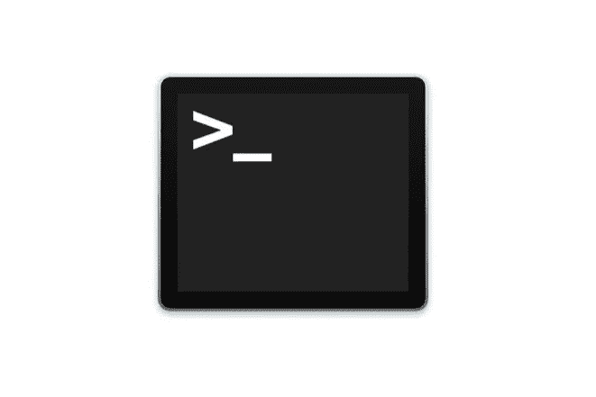

# 让码头更加整洁

> 原文：<https://medium.com/geekculture/making-the-dock-snappier-6537a6214ad?source=collection_archive---------7----------------------->

## 破解 macOS Dock 的自动隐藏会更快


如果你像我一样，你会隐藏屏幕上的所有东西，比如 Mac 上的菜单栏和 Dock，这样你就可以最大限度地利用屏幕空间，尤其是在只使用 MacBook 屏幕的时候。这时你会接触到 Dock 的隐藏和显示，有时会感觉有点“迟钝”。

> 这篇文章将为你提供一些定制 dock 动画的技巧，让你觉得 Dock 快了很多。



# 让我们打开终端。

首先，我们需要在你的 Mac 上打开终端；我们将运行一些命令来定制一些设置，否则您无法使用标准的“系统首选项”进行编辑

到 Launchpad 或打开 **Spotlight，** type ' **Terminal** ，'并打开。

## 消除 Dock 出现和消失的延迟

这一步将消除隐藏和显示 Dock 时动画开始所需的时间。

```
defaults write com.apple.dock autohide-delay -float 0
killall Dock
```

## 完全移除自动隐藏动画

运行以下命令将删除自动隐藏动画，并使停靠超快。如果你想要一个更快的动画并且不想让它完全消失，跳过这一步。

```
defaults write com.apple.dock autohide-time-modifier -int 0
killall Dock
```

## 减少自动隐藏动画

完全删除自动隐藏动画可能会使它看起来有点奇怪。这就是为什么我选择减少自动隐藏动画的长度。运行以下命令会将持续时间设置为 0.3 秒。您可以随意将 0.3 更改为您喜欢的任何其他值。

```
defaults write com.apple.dock autohide-time-modifier -float 0.3;
killall Dock
```


## 恢复 Dock 的默认行为:

如果您想恢复默认行为，请运行以下命令。它将恢复默认的 Mac 行为。

```
defaults delete com.apple.dock autohide-time-modifier
defaults delete com.apple.dock autohide-delay
killall Dock
```