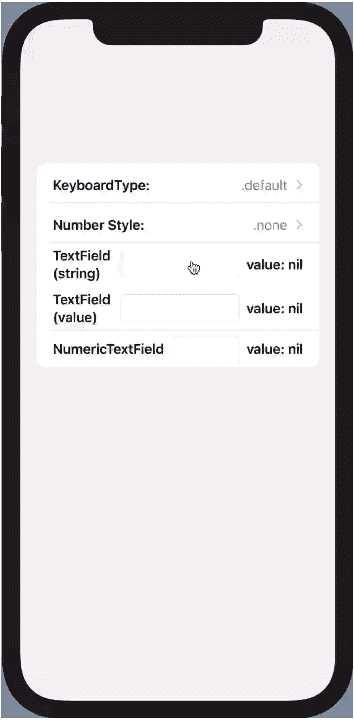
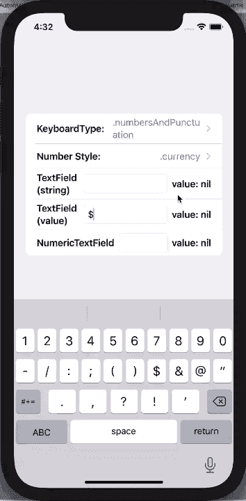

# 充分利用 SwiftUI 中的文本字段

> 原文：<https://medium.com/geekculture/making-the-most-of-textfields-in-swiftui-5fd80d612502?source=collection_archive---------7----------------------->

Photo by [Thiébaud Faix](https://unsplash.com/@thips?utm_source=unsplash&utm_medium=referral&utm_content=creditCopyText) on [Unsplash](https://unsplash.com/s/photos/text?utm_source=unsplash&utm_medium=referral&utm_content=creditCopyText)

SwiftUI 中的`TextField`是 goto `View`，用于捕获用户的自由输入。它可以很好地捕捉字符串，但是对于任何普通的 API 来说，都有一些限制和行为可能会让您措手不及，尤其是当您试图使用可选的和其他数据类型时。这篇文章将提供一些我学到的观察、提示和技巧，来帮助你有效地使用`TextField`。

*   *GitHub 上还有一个* [*样例 app*](https://github.com/jbadger3/TextFieldBehavior) *如果你有兴趣自己尝试代码的话。*
*   *使用 XCode 12.4 和 iOS 14 编写的代码*

# 绑定到可选字符串

如果您曾经试图将一个包含可选字符串的绑定传递给一个`TextField`，您将会得到一个粗鲁的编译器错误:“无法转换类型为‘Binding<String’的值？>'到预期参数类型'绑定<字符串>'。来自 UIKit 的这一点特别烦人，因为`UITextField`的`.text`属性是一个可选字符串。您可以将底层属性的性质从可选字符串更改为字符串，并更改底层代码来检查空字符串而不是`nil`，但是我不喜欢仅仅为了适应 UI API 调用而更改数据模型的想法。此外，当模型对象被序列化和移动时(可以说是名义上的，但却是真实的)，使用具体的字符串会造成内存分配、磁盘存储和网络流量的浪费。

一个更优雅的[解决方案](https://stackoverflow.com/questions/57021722/swiftui-optional-textfield/61002589#61002589)，我在 Stack Overflow 上发现的，是用一个 computed 属性来扩展`Optional`，该属性打开可选的并在遇到`nil`时提供一个默认值(在这种情况下是一个空字符串)。扩展如下所示:

请注意，getter 和 setter 可以在两个方向上正确转换。在 getter 中，当底层值为 nil 时，返回一个空字符串；在 setter 中，当`newValue`为空字符串时，底层值被设置为`nil`。

在 SwiftUI 中使用这个新属性就像`TextField(“my title”, text: $optionalString.boundString)`一样简单。您不需要改变您的数据模型，您得到了您想要的功能，并且您的代码仍然是漂亮和干净的。很酷吧？

# 关于行为和状态更新

`TextField`有两个主要的构造函数，它们在变量状态更新的方式和时间上起作用。我们大多数人都很熟悉，`TextField(title: StringProtocol, text: Binding<String>)`。当用户在键盘上键入时，使用此构造函数的文本字段以连续的方式更新它们的绑定字符串。

第二个构造函数，`TextField(title: StringProtocol, value: Binding<T>, formatter: Formatter)`允许你传递泛型值，这些泛型值由格式化程序在它们的原始类型之间来回转换，但是行为非常不同。当`.onCommit`被调用时，状态*仅*更新为界限值。换句话说，只有当按下 return 键(或等效键)时，格式化程序才会计算文本框中的当前字符串，并在成功时更新基础值。

这很容易导致一些令人沮丧的情况。如果你正在处理数字，并想使用相应的数字键盘，你会很快发现没有回车键，因此无法调用`.onCommit`。如果用户离开您的`TextField`而不是按回车键，变量状态也将保持不变。这似乎是一个相当大的缺点。不要像我一样浪费时间去寻找解决方法。使用一个普通的带字符串的`TextField`并使用`.onEditingChanged`和`.onCommit`闭包执行你自己的转换。更好的是，阅读下一节来学习如何使用`UIViewRepresentable`包装`UITextField`。

# 包装 UITextField 以处理数值

正如我在上一节提到的，使用数值的`TextFields`和相关的`Formatter`几乎是不可用的。数字键盘没有回车键，只有当`.onCommit`被调用时，状态才会更新…在这种情况下，这种情况永远不会发生。我们可以通过包装`UITextField`并遵循`UIViewRepresentable`协议来创建自己的处理数值的视图，而不是与 SwiftUI 争斗。每当视图失去焦点时，我们将使新视图更新其状态，为货币和百分比添加一些方便的格式，并在遇到无效输入时向用户显示警告。

我们的结构，我们称之为`NumericTextField`，看起来像这样:

与`TextView`类似，我们的 textfield 有一个`title`(占位符值)，一个到底层`value`(基本事实)的绑定，和一个`formatter`(负责在我们的存储值类型和字符串表示之间来回转换)。我们暂时不看我们的`Coordinator`，但是它将负责输入验证和更新我们的绑定`value`。为了符合`UIViewRepresentable`，我们的视图必须实现`makeUIView`和`updateUIView`。在`makeUIView`中，我们创建了一个`UITextField`，将委托设置为我们的`coordinator`，如果提供了标题，则设置文本字段的占位符文本。在返回新视图之前，我们还设置了其余的美学和键盘类型。在处理 SwiftUI - > UIKit 数据流的`updateUIView`中，我们使用协调器的`.textFor`方法将`UITextField`的文本设置为`value`的文本表示。最后一个函数`makeCoordinator`，返回我们的协调器的一个实例，传递一个到`value`、`formatter`的绑定，以及一个到存储错误消息的字符串的绑定。

现在让我们看看我们的协调器类:

协调器中的前两个函数是助手方法。`textFor<T>(value: T) -> String?`方法将我们的绑定`value`转换成一个字符串。我们看到它在`.updateView`中被使用。另一个方法`scrubbedText(currentText: String) -> String`，为格式化货币和百分比提供了一点额外的便利。当你选择`.currency`或者`.percentage`作为`numberStyle`的时候`NumberFormatter`这个职业是相当挑剔的。货币字符串必须以适当的货币符号作为前缀(例如美国的“1.00 美元”)，百分比必须有一个尾随的百分比符号(例如“5%”)。如果这些符号被省略，格式化程序总是返回`nil`，所以我们将使事情变得简单一点，如果它们丢失了，就将它们添加到输入字符串中。

接下来让我们跳到`UITextFieldDelegate`方法。这里我们只打算实现其中的两个。在按下回车键时调用的`textFieldShouldReturn`中，我们将退出 first responder 并返回 true。第二个方法`textFieldDidEndEditing`，每当文本字段失去焦点时就会被调用，这是我们的协调器将要做的最重要的工作。我们首先打开`UITextField`的`.text`可选属性，如果需要，使用`scrubbedText`函数擦除文本以确保它包含适当的前缀/后缀。然后，我们利用我们的格式化程序，使用`.getObjectValue`方法捕获我们对象的当前值。我应该指出，我们的`formatter`实际上是来自 object C 的`[Formatter](https://developer.apple.com/documentation/foundation/formatter/)`，它利用了指针，所以如果事情看起来没有通常那么快，这就是原因。接下来，我们通过查看`errorContainer`的值来检查我们的格式化程序是否返回了错误。如果发现错误，我们尝试将`UITextField`的`.text`属性设置为之前的`value`，如果失败，则设置为`nil`。然后，我们向用户显示一个警告，让他们知道他们提供了不正确的输入(完整代码请参见示例项目)。如果没有错误，我们尝试将`valueContainer`转换为我们的泛型类型`T`，并将`value`设置为`newValue`。

这很好地照顾了我们的新观点。您可以使用类似`NumericTextField<Double>(title: "Amount in dollars", value: $amountPaid, numberFormatter: currencyFormatter, keyboardType: .numbersAndPunctuation)`的东西来旋转新视图。

看起来不错！`NumericTextField`当它失去焦点时总是更新它的绑定值。此外，我们再也不用担心确保用户按下回车键来捕捉输入，我们可以使用任何有意义的数字键盘。

# 摘要

我第一次使用带有通用值的`TextField`和`Formatter`时，当我没有看到实时状态更新时，我感到困惑。虽然这是有意义的，因为许多`Formatters`需要一个完整的字符串来正确地解释它们的值(例如日期)，但是这使得 API 很难使用。我不确定我是否同意在`.onCommit`闭包中只提供状态更新的设计决策，因为我们看到这使得处理数值变得笨拙，如果不是不可能的话。在这种情况下，我们的解决方案是依靠 UIKit 来获得我们想要的行为。目前这是可以接受的，但是我是唯一一个有这种奇怪的驱动力尝试用 pure SwiftUI 写所有东西的人吗？无论如何，我希望我们能在 SwiftUI 的下一个版本中看到更多包含电池的`TextField`，这样我就能再次成为一个纯粹主义者。感谢阅读！